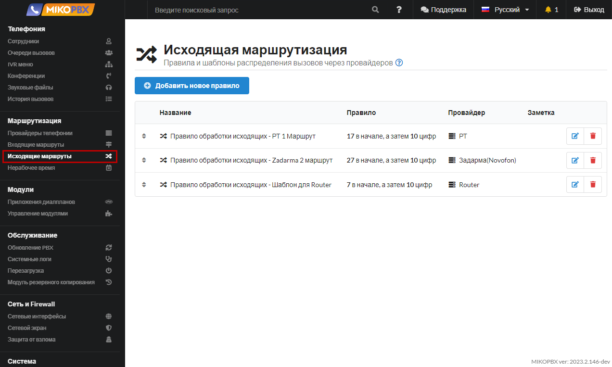
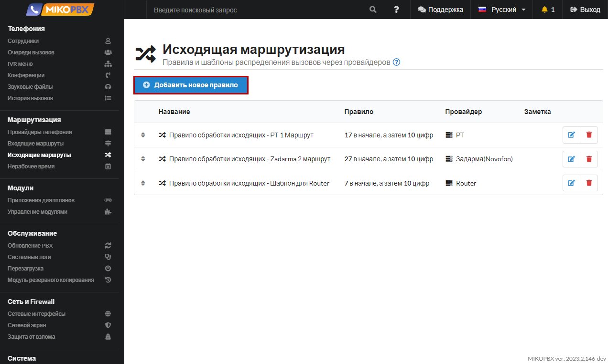
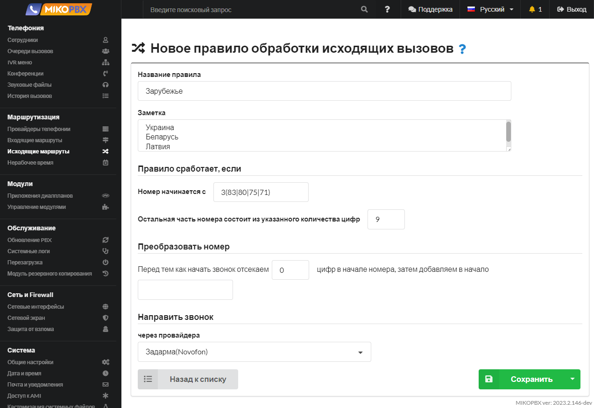

# Пример шаблона: звонки в другую страну (Украина, Беларусь, Латвия)


Звонки на номера:

* **383**XXXXXXXXX
* **380**XXXXXXXXX
* **375**XXXXXXXXX
* **371**XXXXXXXXX


1. Перейдите в раздел **Маршрутизация** → **Исходящие маршруты**

<figure><figcaption>
Раздел "Исходящие маршруты"
</figcaption></figure>

2. Создайте новое правило исходящей маршрутизации

<figure><figcaption>
Создание нового правила исходящей маршрутизации
</figcaption></figure>

3. Заполните параметры согласно шаблону снизу:

<figure><figcaption>
Шаблон для вызовов за рубеж
</figcaption></figure>


Теперь при звонке на любые номера, удовлетворяющие шаблонам: 383XXXXXXXXX, 380XXXXXXXXX, 375XXXXXXXXX, 371XXXXXXXXX вызов направится через провайдера **Задарма(Novofon)**.

