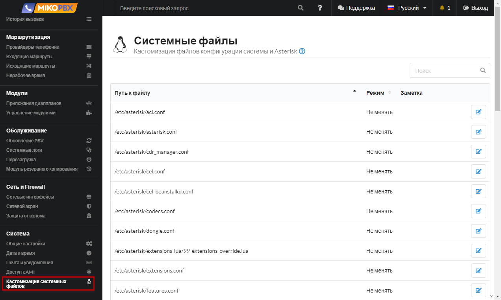
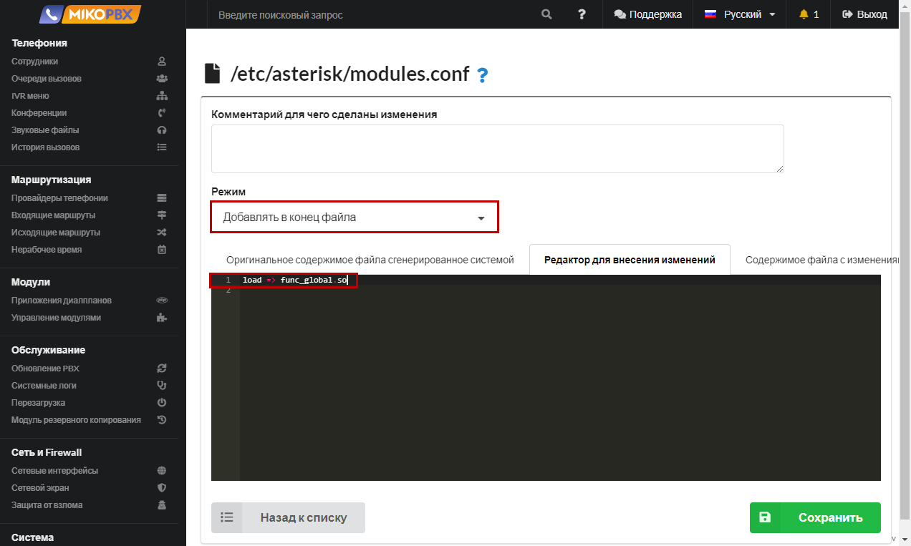
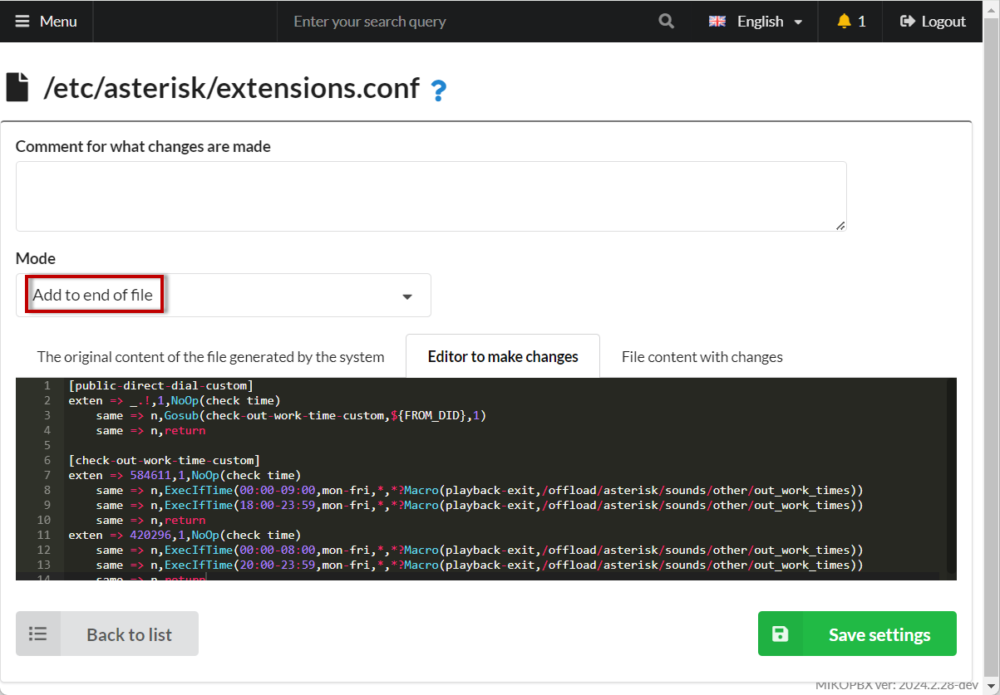

# Равномерное распределение исходящих

1. Перейдите в раздел [Кастомизация системных файлов](../../../manual/system/custom-files.md)

<figure><figcaption><p>Раздел "Кастомизация системных файлов"</p></figcaption></figure>

2. Откройте на редактирование **modules.conf**

<figure><figcaption><p>Файл Modules.conf</p></figcaption></figure>

3. Добавьте следующий код в конец файла:

```php
load => func_global.so
```

<figure><figcaption><p>Код для файла Modules.conf</p></figcaption></figure>

4. Откройте на редактирование файл **extensions.conf**

<figure><figcaption><p>Файл Extensions.conf</p></figcaption></figure>

5. Добавьте следующий код в конец файла:


```php
[all-outgoing-custom]
exten => _X!,1,NoOp()
    same => n,Set(NEED_RETURN=0)
    ; Описываем список провайдеров
    same => n,Set(PUSH(rrItem)=SIP-1601534775)
    same => n,Set(PUSH(rrItem)=SIP-1611151795)    
    same => n,Set(PUSH(rrItem)=SIP-1681205343)
    ; Максимальное количество одновременных звонков через линию
    same => n,Set(busyLevel=50)
    
    ; Проверка, есть ли провайдер в списке. 
    same => n,ExecIf($[ "${FIELDNUM(rrItem,\,,${PROVIDER_ID})}" == "0" ]?return)
    ; Если ID приоритетного провайдера определен, то сразу к проверке. 
    same => n,GotoIf($[ "${rrElement}x" != "x" ]?check)
    ; Инициализация массива
    same => n,Set(rrArray=${EMPTY})
    same => n,Set(i=${SHIFT(rrItem)})
    same => n,While(1)
    same => n,ExecIf($[ "${i}x" == "x" ]?ExitWhile())
    same => n,ExecIf($[ "${rrArray}x" != "x" ]?Set(rrArray=${rrArray},))
    same => n,ExecIf($[ "${GLOBAL(${i})}x" == "x" ]?Set(GLOBAL(${i})=0))
    same => n,Set(rrArray=${rrArray}${i}:${GLOBAL(${i})})
    same => n,Set(i=${SHIFT(rrItem)})
    same => n,EndWhile
    ; Поиск элемента с меньшим весом
    same => n,Set(rrArray=${SORT(${rrArray})})
    same => n,Set(rrElement=${SHIFT(rrArray)})
    same => n,While(1)
    same => n,ExecIf($[ $[${GROUP_COUNT(${rrElement})} < ${busyLevel}] ]?ExitWhile())
    same => n,ExecIf($[ "${rrElement}x" == "x" ]?ExitWhile())
    same => n,NoOp( ${rrElement} - is busy)
    same => n,Set(rrElement=${SHIFT(rrArray)})
    same => n,EndWhile
    same => n,NoOp(--- ${rrElement} ---)
    
    ; Проверка совпадает ли провайдер
    same => n(check),ExecIf($[ "${PROVIDER_ID}x" != "${rrElement}x" ]?Set(NEED_RETURN=1))
    same => n,ExecIf($[ "${PROVIDER_ID}x" != "${rrElement}x" ]?return)
    ; Увеличиваем счетчик
    same => n,Set(GLOBAL(${rrElement})=$[${GLOBAL(${rrElement})} + 1])
    ; Счетчик активных звонков через провайдера
    same => n,Set(GROUP()=${rrElement})
    same => n,return
```


<figure><figcaption><p>Код для extensions.conf</p></figcaption></figure>


В строках вида «**Set(PUSH(rrItem)=SIP-1601534775)**» перечисляются идентификаторы провайдеров, среди которых следует равномерно распределять исходящие. Идентификатор можно скопировать в адресной строке браузера при редактировании провайдера.\
В переменной «**busyLevel**» определяется максимально допустимое количество одновременных звонков через провайдера.



Для каждого провайдера потребуется описать исходящий маршрут. Шаблон в маршрутах должен быть одинаковым.

