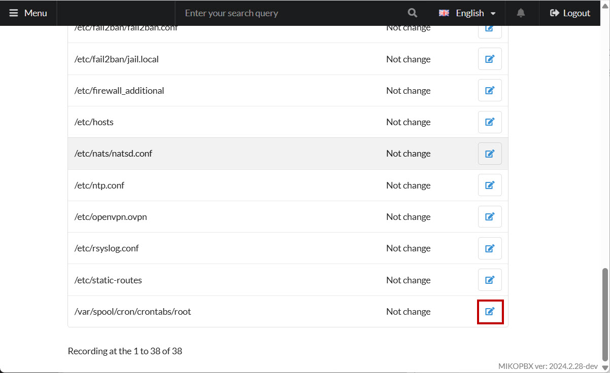
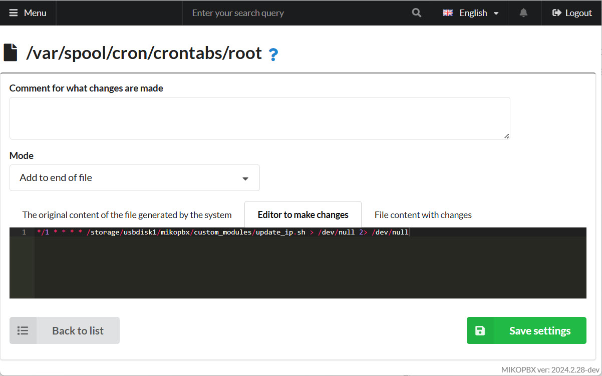

# Backup Internet and Provider Re-Registration

If your PBX is behind NAT and its public IP address changes, the PBX may not receive incoming calls until it re-registers with the provider, which by default can take 2–6 minutes.

## Create the IP Check Script

1. Connect using SSH into your MikoPBX (documentation about different ways to do that - [here](../troubleshooting/connecting-to-a-pbx-using-ssh/))
2. Create a new script file with this command:

```bash
cat > /storage/usbdisk1/mikopbx/custom_modules/update_ip.sh
```

The system will wait for input; paste the following script into the terminal:

```bash
#!/bin/bash
# File to store the previous IP
IP_FILE="/tmp/last_ip.txt"
# Command to retrieve the current public IP
CURRENT_IP=$(/usr/bin/curl -s https://checkip.amazonaws.com)

# Check if the file with the previous IP exists
if [ -f "$IP_FILE" ]; then
    LAST_IP=$(cat "$IP_FILE")
else
    LAST_IP=""
fi

# Compare the current IP with the previous IP
if [ "$CURRENT_IP" != "$LAST_IP" ]; then
    /bin/busybox logger -t 'UpdateIP' "IP changed: $LAST_IP -> $CURRENT_IP"
    echo "$CURRENT_IP" > "$IP_FILE"
    # Trigger an Asterisk command
    /usr/sbin/asterisk -rx 'pjsip send register *all'
fi
```

3. Press **CTRL+D** to finish.
4. Make the file executable:

```bash
chmod +x /storage/usbdisk1/mikopbx/custom_modules/update_ip.sh
```

## Schedule the Script

1. Go to the MikoPBX web interface → "**System"** → "**System file customization":**

<figure><figcaption><p>"System file customization" section</p></figcaption></figure>

2. Open the file: **`/var/spool/cron/crontabs/root`**

<figure><figcaption><p>"crontabs/root" file</p></figcaption></figure>

3. Append the following line to the end of the file:

```
*/1 * * * * /storage/usbdisk1/mikopbx/custom_modules/update_ip.sh > /dev/null 2> /dev/null
```

This schedule runs the script every minute to check for a changed public IP. If the IP has changed, it re-registers all providers.

<figure><figcaption><p>Editing file crontabs/root</p></figcaption></figure>


If the IP changes, you’ll see an informational log in `system/messages` stating the old and new IP addresses.

