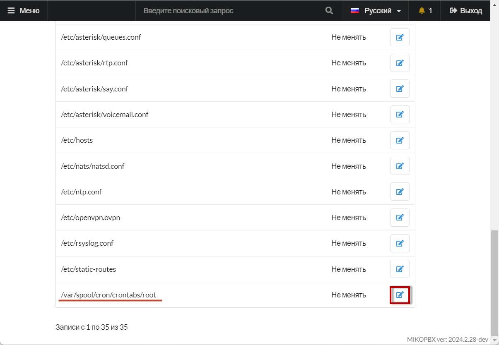
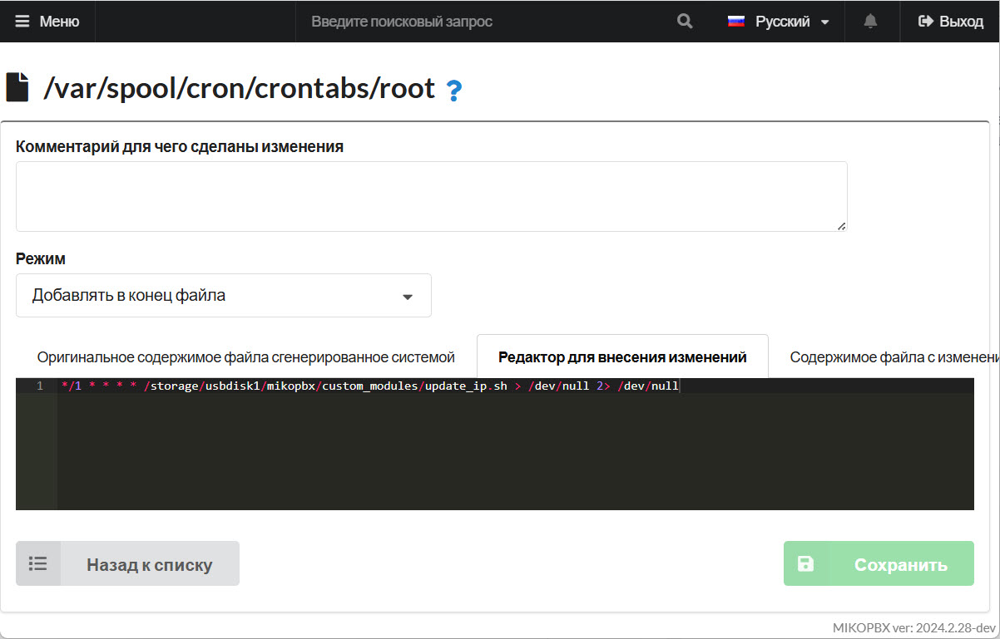

# Резервный интернет и перерегистрация провайдеров

Если АТС работает за NAT и серый публичный IP адрес изменился, то АТС не сможет получить входящий вызов пока не пройдет регистрация на стороне провайдера, по умолчанию это может занять от 2х до 6 мин.

## Создание скрипта проверки IP

1. Подключитесь к MikoPBX по протоколу SSH (документация о различных способах подключения — [здесь](../troubleshooting/connecting-to-a-pbx-using-ssh/))
2. Создайте новый файл скрипта командой:

```
cat > /storage/usbdisk1/mikopbx/custom_modules/update_ip.sh
```

Система запросит ввод с клавиатуры, вставьте содержимое скрипта:

```bash
#!/bin/bash
# Файл для хранения предыдущего IP
IP_FILE="/tmp/last_ip.txt"
# Команда для получения текущего IP
CURRENT_IP=$(/usr/bin/curl -s https://checkip.amazonaws.com)
# Проверка, существует ли файл с предыдущим IP
if [ -f "$IP_FILE" ]; then
    LAST_IP=$(cat "$IP_FILE")
else
    LAST_IP=""
fi
# Сравнение текущего IP с предыдущим
if [ "$CURRENT_IP" != "$LAST_IP" ]; then
    /bin/busybox logger -t 'UpdateIP' "IP изменился: $LAST_IP -> $CURRENT_IP";
    echo "$CURRENT_IP" > "$IP_FILE"
    # Выполнение команды Asterisk
    /usr/sbin/asterisk -rx 'pjsip send register *all'
fi
```

3. Нажмите `CTRL + D` для завершения ввода.&#x20;
4. Сделайте файл исполняемым:

```
chmod +x /storage/usbdisk1/mikopbx/custom_modules/update_ip.sh
```

## Планирование сценария перерегистрации

1. Перейдите в web-интерфейс MikoPBX -> "**Система**" -> "**Кастомизация системных файлов**":

<figure><figcaption><p>Раздел "<strong>Кастомизация системных файлов</strong>"</p></figcaption></figure>

2. Откройте для редактирования файл  `/var/spool/cron/crontabs/root` :

<figure><figcaption><p>Редактирование файла crontabs/root</p></figcaption></figure>

3. Добавьте задачу в конец файла  `/var/spool/cron/crontabs/root`&#x20;

```
*/1 * * * * /storage/usbdisk1/mikopbx/custom_modules/update_ip.sh > /dev/null 2> /dev/null
```

Теперь каждую минуту будет выполняться проверка на изменение публичного адреса, если адрем изменился, то будет выполнена перерегистрация всех провайдеров.&#x20;

<figure><figcaption><p>Планирование задачи</p></figcaption></figure>


В системном логе `system/messages` отобразиться информационное сообщение об изменении IP.&#x20;

