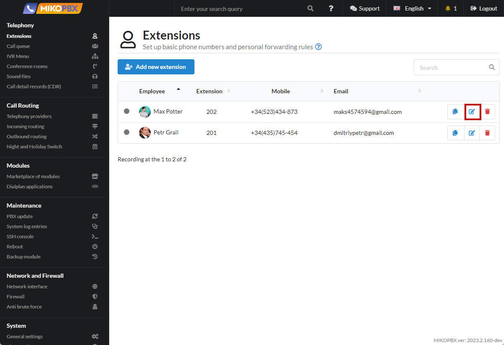
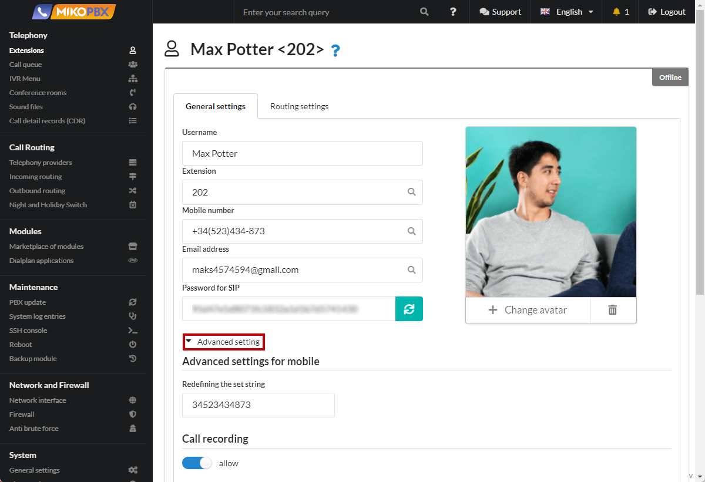

# Change the login name

When a new [Employee ](../../manual/telephony/extensions.md)is added to the PBX, a SIP account with a numeric internal number is created on the PBX. In some cases, for security reasons, it is necessary to change the name for authorization of this employee.

When configuring SIP Clients, you can often see two key parameters:

1. Username - usually equal to the account ID, in the case of MikoPBX equal to the internal number
2. Auth name - username for authorization. In the case of MikoPBX is equal to the internal number

To change the authorization name:

1. Open the employee's account for editing

<figure><figcaption><p>Section "Employees"</p></figcaption></figure>

2. Go to "**Advanced Settings**" → "**Advanced SIP Settings**"

<figure><figcaption><p>Advanced Employee Settings</p></figcaption></figure>

3. Add the following lines:

```
[auth] 
username = MIKO204
```

Instead of **MIKO204**, specify a name for authorization, it is advisable to use both letters and numbers

<figure><figcaption><p>Additional parameters</p></figcaption></figure>
