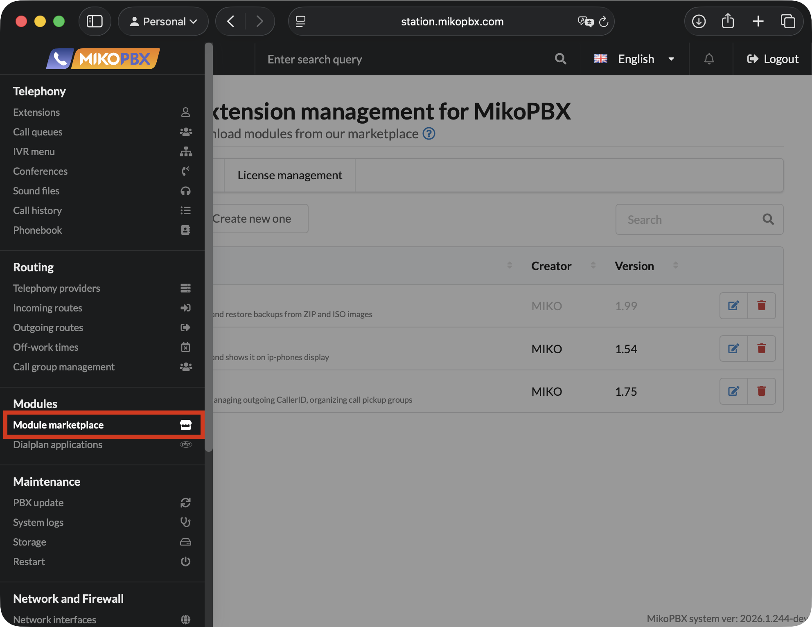
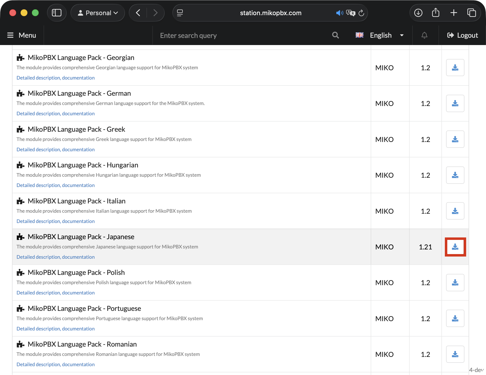
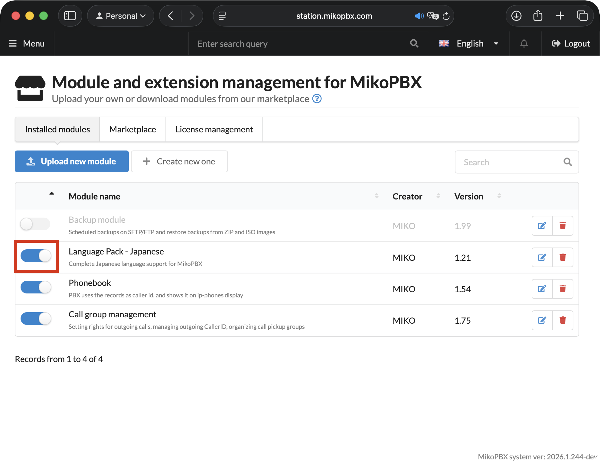
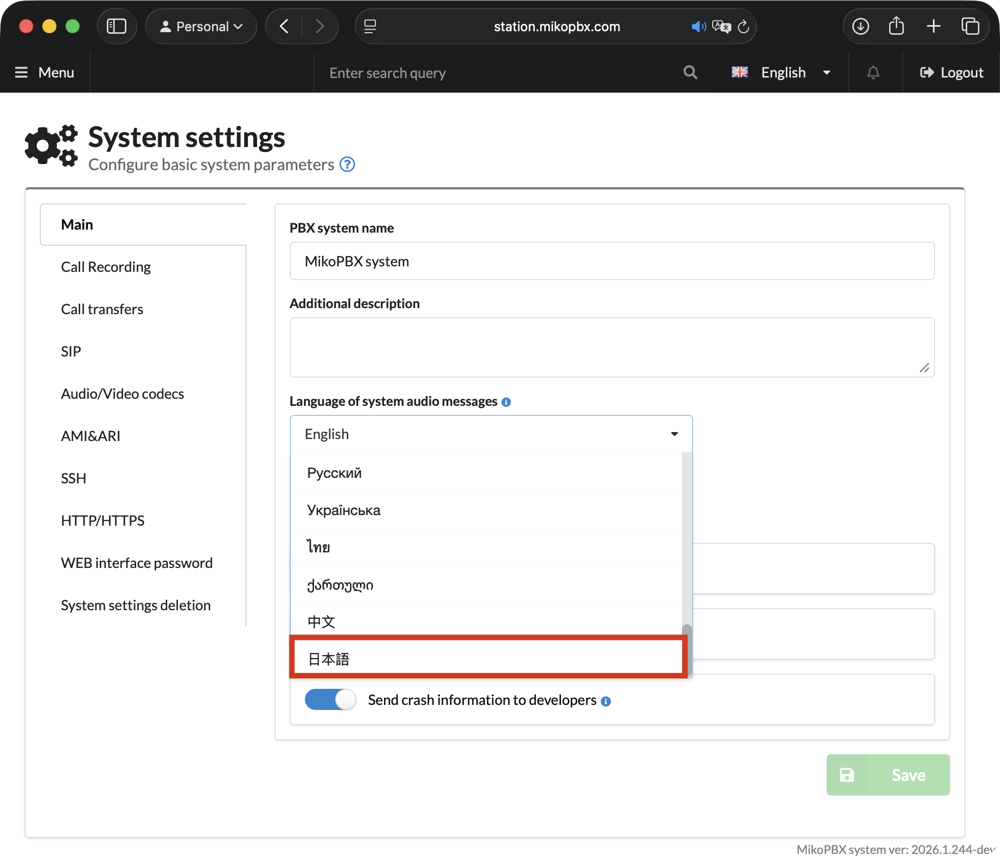

# Installing Language Packs

By default, MikoPBX ships with a limited set of languages for system messages. Language packs allow you to expand this set - adding voice files in the desired language and making them available for use in IVR menus, call queues, and other telephony elements.

This article walks through the installation of a language pack using Japanese as an example.

1. First, you need to register in the MikoPBX Marketplace. Instructions are available [here](../../manual/modules/licensing.md).
2. Go to **Modules** → **Module marketplace**.

<figure><figcaption><p>"Module marketplace" section</p></figcaption></figure>

3. In the **Marketplace** section, find the language pack you need (Japanese in this guide) and install it.

<figure><figcaption><p>Installing a language pack in the MikoPBX Marketplace</p></figcaption></figure>

After installation, the corresponding set of sound files will be downloaded to the disk at `/storage/usbdisk1/mikopbx/media/sounds/ja-jp` (for Japanese).

```bash
~# cd /storage/usbdisk1/mikopbx/media/sounds/ja-jp
/storage/usbdisk1/mikopbx/media/sounds/ja-jp# ls -la
total 84432
drwxr-xr-x  8 root root  135168 Apr 28 14:20 .
drwxr-xr-x 28 root root    4096 Apr 28 14:19 ..
-rw-r--r--  1 root root    9676 Apr 28 14:20 activated.alaw
-rw-r--r--  1 root root    9676 Apr 28 14:20 activated.g722
-rw-r--r--  1 root root    1980 Apr 28 14:20 activated.gsm
-rw-r--r--  1 root root    7000 Apr 28 14:20 activated.opus
-rw-r--r--  1 root root   19246 Apr 28 14:20 activated.sln
-rw-r--r--  1 root root     493 Apr 28 14:20 .activated.sound-meta
-rw-r--r--  1 root root    9676 Apr 28 14:20 activated.ulaw
-rw-r--r--  1 root root   19212 Apr 28 14:20 activated.wav
-rw-r--r--  1 root root    7928 Apr 28 14:20 added.alaw
-rw-r--r--  1 root root    7928 Apr 28 14:20 added.g722
-rw-r--r--  1 root root    1617 Apr 28 14:20 added.gsm
-rw-r--r--  1 root root    5797 Apr 28 14:20 added.opus
-rw-r--r--  1 root root   15748 Apr 28 14:20 added.sln
-rw-r--r--  1 root root     489 Apr 28 14:20 .added.sound-meta
-rw-r--r--  1 root root    7928 Apr 28 14:20 added.ulaw
-rw-r--r--  1 root root   15714 Apr 28 14:20 added.wav
-rw-r--r--  1 root root   52772 Apr 28 14:20 agent-alreadyon.alaw
-rw-r--r--  1 root root   52772 Apr 28 14:20 agent-alreadyon.g722
-rw-r--r--  1 root root   10890 Apr 28 14:20 agent-alreadyon.gsm
-rw-r--r--  1 root root   36010 Apr 28 14:20 agent-alreadyon.opus
-rw-r--r--  1 root root  105436 Apr 28 14:20 agent-alreadyon.sln
-rw-r--r--  1 root root     499 Apr 28 14:20 .agent-alreadyon.sound-meta
-rw-r--r--  1 root root   52772 Apr 28 14:20 agent-alreadyon.ulaw
-rw-r--r--  1 root root  105402 Apr 28 14:20 agent-alreadyon.wav
-rw-r--r--  1 root root   52748 Apr 28 14:20 agent-incorrect.alaw
...
```

### Activating the Language Pack

1. Go to the **Installed Modules** tab and enable the installed language pack module.

<figure><figcaption><p>Enabling a module with a language pack</p></figcaption></figure>

2. Go to **System** → **General settings**.

<figure><figcaption><p>"General settings" section</p></figcaption></figure>

3. On the **Main** tab, locate the **Language of system audio messages** field and select your language.

Click **Save**.

<figure><figcaption><p>Selecting a language for audio messages</p></figcaption></figure>

The Asterisk service will restart and the system message language will be updated accordingly.
