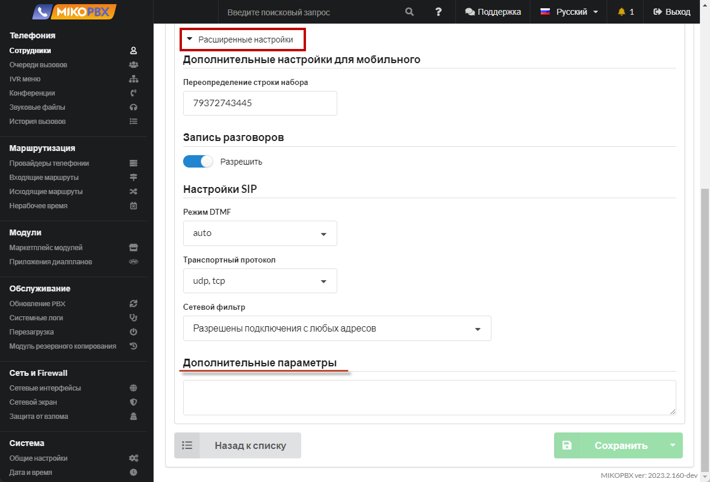
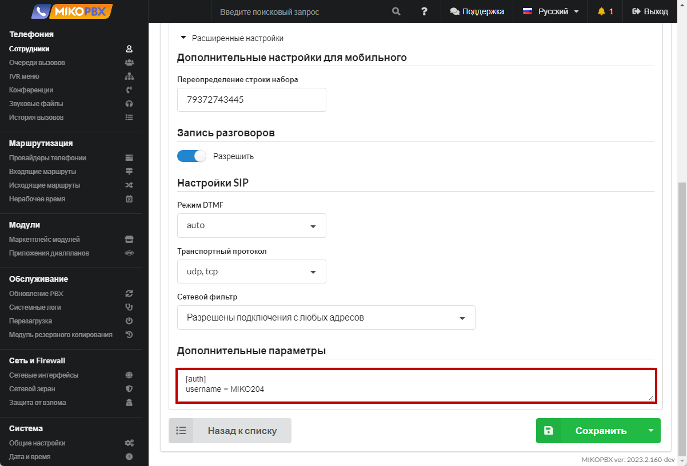

# Изменить имя для авторизации

При добавлении на АТС нового [Сотрудника](../../manual/telefoniya/extensions.md) на АТС заводится учетная запись SIP с числовым внутренним номером. В ряде случаев, в целях безопасности есть необходимость изменить имя для авторизации этого сотрудника.

При настройке SIP Клиентов часто можно увидеть два ключевых параметра:

1. **Username** - обычно равен ID учетной записи, в случае с MikoPBX равен внутреннему номеру
2. **Auth Username** - имя пользователя для авторизации. В случае MikoPBX равен внутреннему номеру

Для изменения имени авторизации:

1. Откройте учетную запись сотрудника на редактирование

<figure><figcaption><p>Раздел "Сотрудники" </p></figcaption></figure>

2. Перейдите к «**Расширенным настройкам**» → «**Дополнительные параметры SIP**»

<figure><figcaption><p>Расширенные настройки сотрудника</p></figcaption></figure>

3. Добавьте следующие строчки:

```php
[auth] 
username = MIKO204
```

Вместо **MIKO204** укажите имя для авторизации, желательно использовать и буквы и цифры

<figure><figcaption><p>Дополнительные параметры</p></figcaption></figure>

