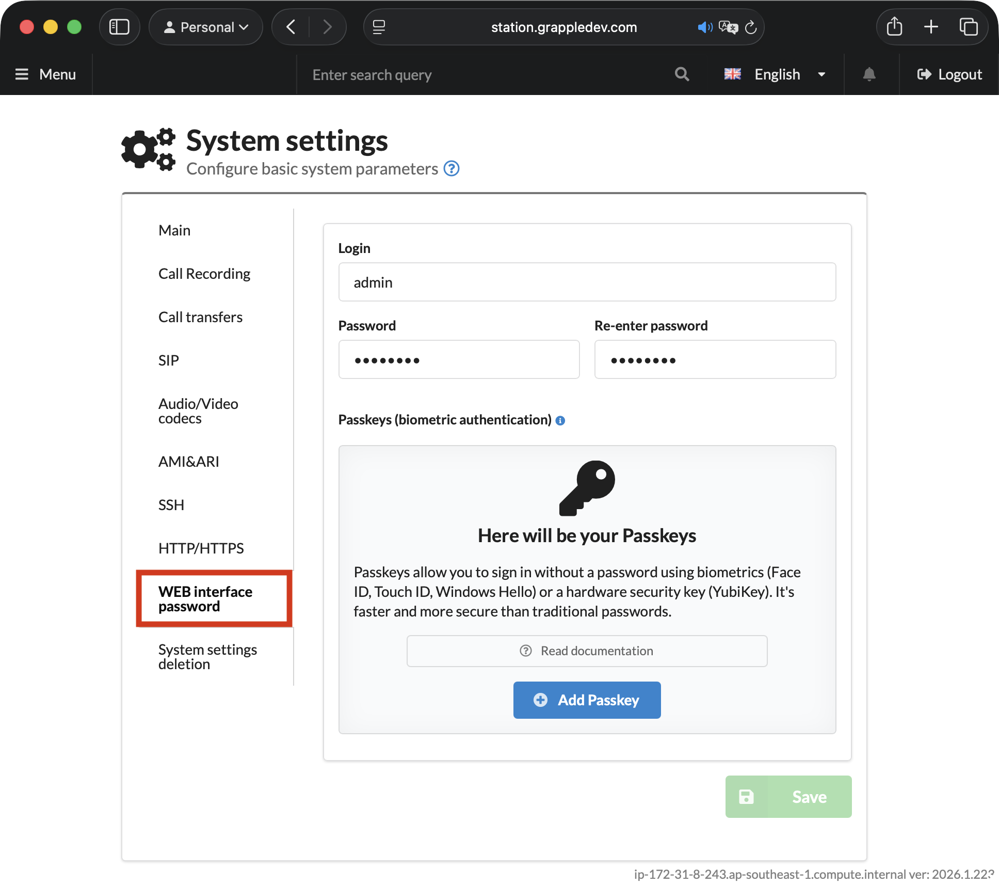

# Adding Passkeys

**Passkeys** are a modern passwordless authentication standard based on WebAuthn technology. They allow you to log in using biometrics or hardware security keys instead of a traditional password.

#### What are Passkeys?

Passkeys are cryptographic keys stored on your device that replace traditional passwords with a more secure technology. The private key never leaves your device — the server only stores the public key, which is useless to attackers.

Supported authentication methods:

* 📱 **Biometrics** — Face ID, Touch ID, Windows Hello
* 🔑 **Hardware keys** — YubiKey, Titan Key
* 💻 **Built-in methods** — Device PIN code

Advantages:

* Protection against phishing and data interception
* Fast authentication in 1–2 seconds
* No need to memorize passwords
* Unique keys for each site


Passkeys work in modern browsers: Chrome, Safari, Edge, and Firefox (2023 versions and newer). WebAuthn support on the device is required.


### How to add a Passkey?

1. Go to **"System" → "General Settings"** → **"WEB interface password"** tab.

<figure><figcaption>
The "WEB Interface Password" section in MikoPBX system settings
</figcaption></figure>

2. In the **Passkeys** block, click **"(+) Add Passkey"**.

<figure><figcaption>
Button for adding a new Passkey
</figcaption></figure>

3. Follow the browser instructions to register. For example:

* Setting up a Passkey on a MacBook with TouchID in Safari: you can click "More options" and choose between a fingerprint, a keychain in an authenticator app, and a physical key:

<figure><figcaption>
Choosing the authentication type for Passkey
</figcaption></figure>

After successful registration, the Passkey will appear in the list. On your next login, you can use it instead of a password.

<figure><figcaption>
Authorized Passkeys
</figcaption></figure>
