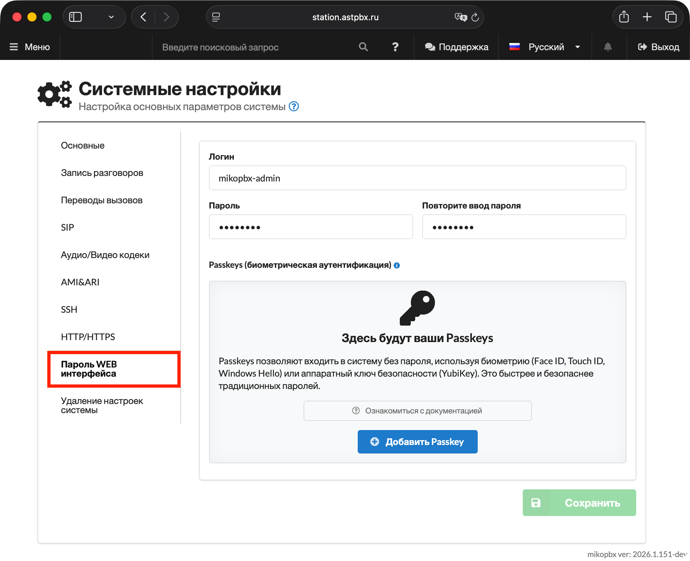
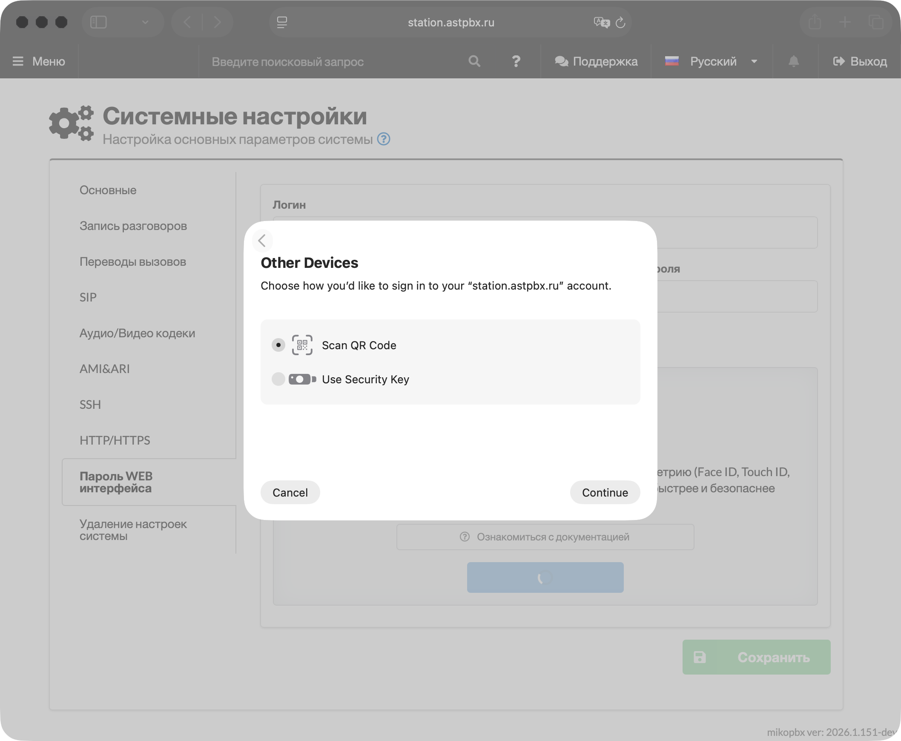
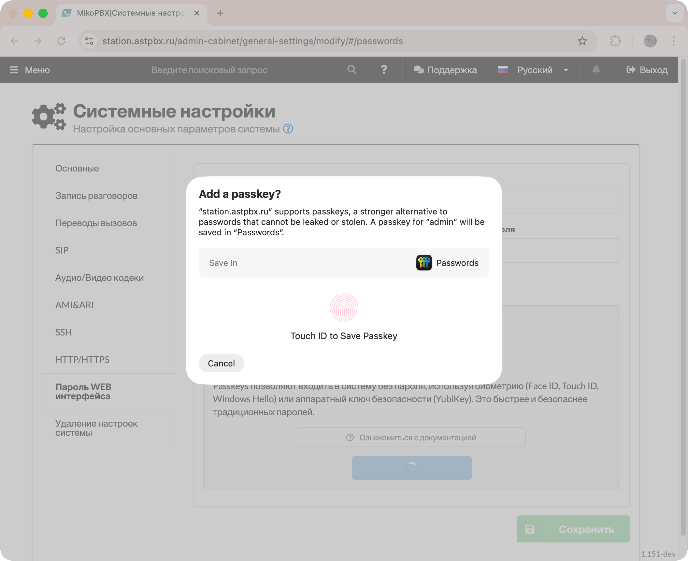
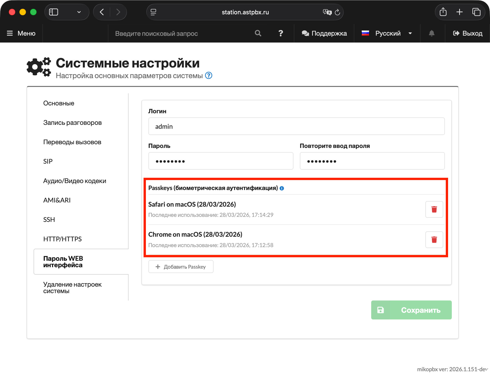

# Добавление Passkeys

**Passkeys** — современный стандарт аутентификации без паролей, основанный на технологии WebAuthn. Позволяет входить в систему с помощью биометрии или аппаратных ключей безопасности вместо традиционного пароля.

### Что такое Passkeys?

Passkeys — это криптографические ключи, которые хранятся на вашем устройстве и заменяют традиционные пароли более безопасной технологией. Приватный ключ никогда не покидает устройство — сервер хранит только публичный ключ, который бесполезен для злоумышленников.

Поддерживаемые методы аутентификации:

* 📱 **Биометрия** — Face ID, Touch ID, Windows Hello
* 🔑 **Аппаратные ключи** — YubiKey, Titan Key
* 💻 **Встроенные средства** — PIN-код устройства

Преимущества:

* Защита от фишинга и перехвата данных
* Быстрая аутентификация за 1–2 секунды
* Не нужно запоминать пароли
* Уникальные ключи для каждого сайта


Passkeys работают в современных браузерах Chrome, Safari, Edge и Firefox (версии 2023 года и новее). Требуется поддержка WebAuthn на устройстве.


### Как добавить Passkey?

1. Перейдите в раздел **«Система» → «Общие настройки»** → вкладка **«Пароль WEB интерфейса»**.

<figure><figcaption>
Раздел "Пароль WEB интерфейса" в системных настройках MikoPBX
</figcaption></figure>

2. В блоке **Passkeys** нажмите **«(+) Добавить Passkey»**.

<figure><figcaption>
Кнопка для добавления нового Passkey
</figcaption></figure>

3. Следуйте инструкциям браузера для регистрации, для примера:

* Настройка Passkey на MacBook c TouchID в браузере Safari: возможно нажать "More options" и выбрать между отпечатком пальца, связки ключей в приложении-аутентификаторе и физического ключа:

<figure><figcaption>
Выбор типа аутентификации с Passkey
</figcaption></figure>

* Настройка Passkey на MacBook c TouchID в браузере Chrome: возможно выбрать только использование Passkey с подтвержденим TouchID.

<figure><figcaption></figcaption></figure>

После успешной регистрации Passkey появится в списке. При следующем входе в систему можно использовать его вместо пароля.


Рекомендуем зарегистрировать несколько Passkeys на разных устройствах — это обеспечит резервный доступ, если одно из устройств окажется недоступно.


<figure><figcaption>
Авторизованные Passkeys
</figcaption></figure>
