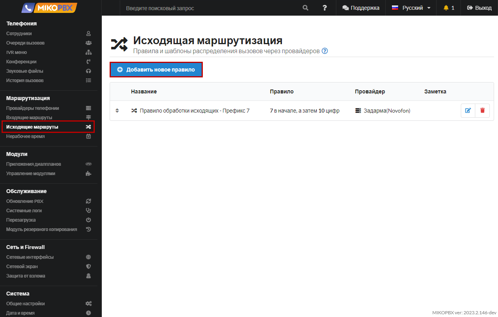
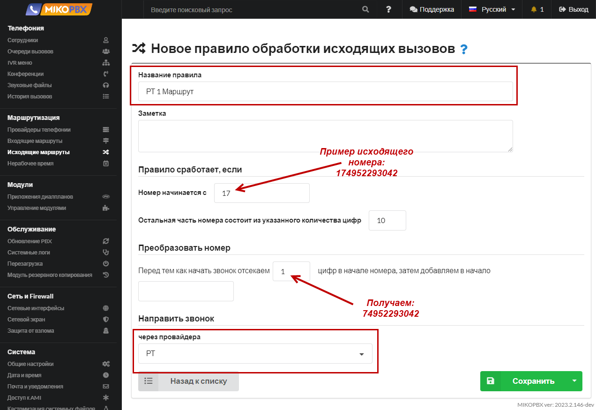
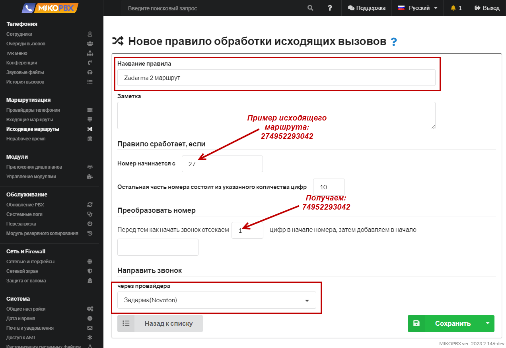
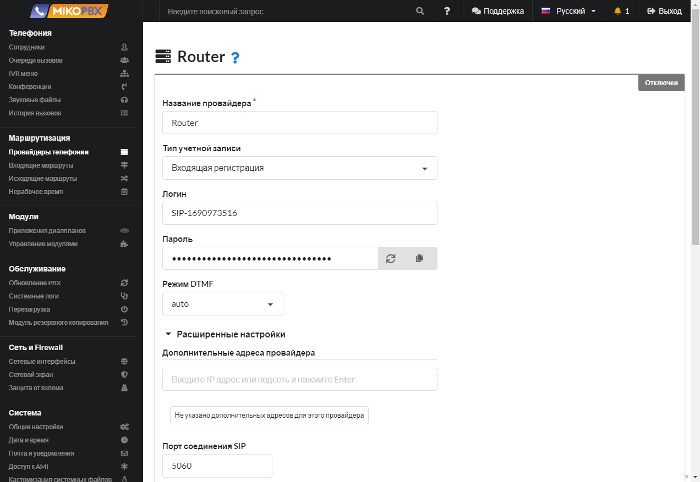
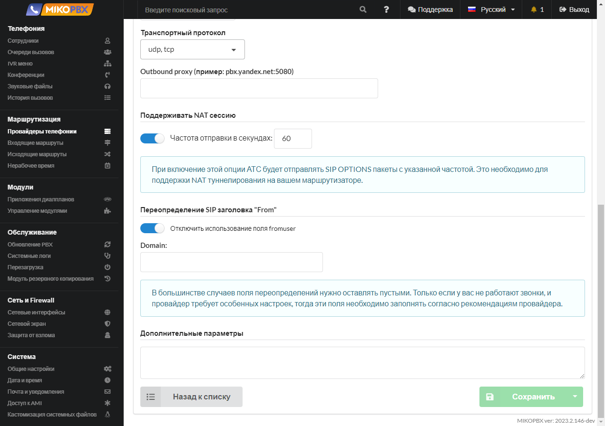
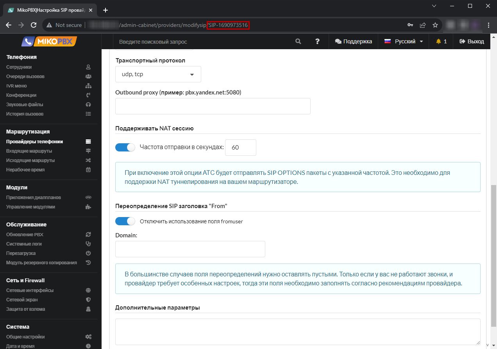
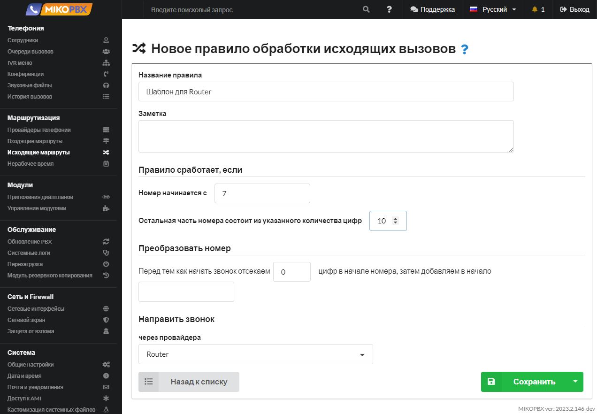
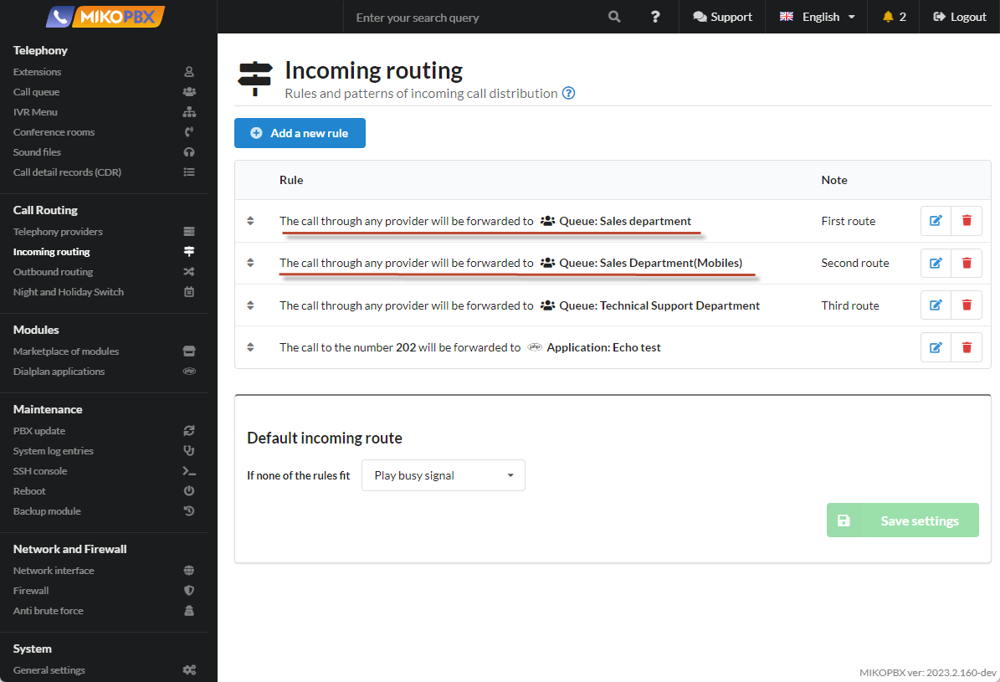
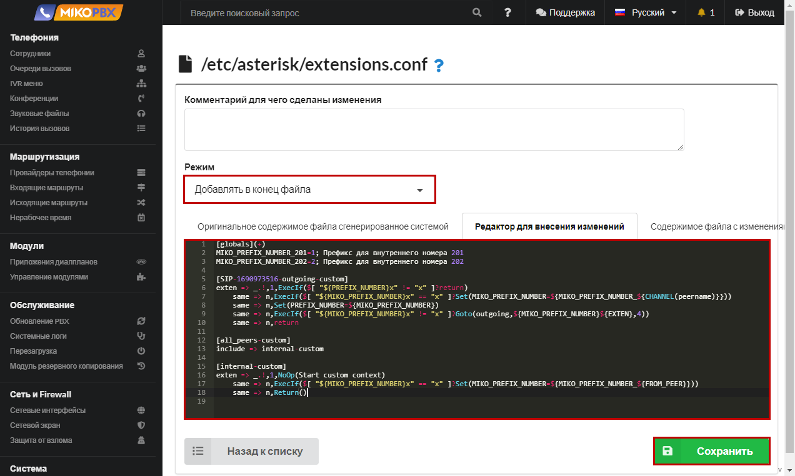

# Звонок через определенного провайдера

## Постановка задачи <a href="#postanovka_zadachi" id="postanovka_zadachi"></a>

В MikoPBX (_**Телефония → Сотрудники**_) настроены следующие учетные записи сотрудников:

<figure><figcaption><p>Раздел "Сотрудники"</p></figcaption></figure>

В MikoPBX настроены **два провайдера** (_**Маршрутизация → Провайдеры телефонии**_):

<figure><figcaption><p>Настроенные провайдеры</p></figcaption></figure>

Необходимо, чтобы:

1. телефон, подключенный к учетной записи **201** звонил только через **первого провайдера** **РТ**
2. телефон, подключенный к учетной записи **202** звонил только через **второго провайдера** **Задарма(Novofon)**.

Звонки во внешний мир (в город) через обоих провайдеров реализуются по **одинаковому исходящему правилу**: это десятизначный номер, начинающийся с 7. Схематично задачу можно изобразить следующим образом:

<figure><figcaption><p>Схема поставленной задачи</p></figcaption></figure>

## Решение <a href="#reshenie" id="reshenie"></a>

Направить звонки по определенному провайдеру можно, используя **префиксы исходящих шаблонов**.

* Звонки всегда будут идти через **первого провайдера**, если перед исходящим номером всегда добавлять **1**. Следовательно, если **201** абонент будет набирать исходящие номера с **префиксом 1**, то вызовы пойдут через первого провайдера.
* Звонки всегда будут идти через **второго провайдера**, если перед исходящим номером всегда добавлять **2**. Следовательно, если **202** абонент будет набирать исходящие номера с **префиксом 2**, то вызовы пойдут через второго провайдера.

Схематично это можно изобразить следующим образом:\


<figure><figcaption><p>Схема решения задачи</p></figcaption></figure>

Реализовать эту задачу можно двумя способами в MikoPBX:

1. Абоненты 201 и 202 всегда на телефоне будут добавлять определенные префиксы перед набираемым номером, т.е. если они хотят позвонить на номер 74952293042, они перед этим номером добавляют префикс 1 или 2, например 174952293042
2. Абоненты 201 и 202 **не набирают** специальные префиксы, за них это действие выполняет сама АТС.

### Первый способ <a href="#pervyj_sposob" id="pervyj_sposob"></a>

Первый способ реализации поставленной нами задачи предполагает, что абоненты 201 и 202 самостоятельно будут на телефоне набирать соответствующие префиксы перед набираемым номером. 201 абонент всегда перед номером будет добавлять 1, а 202 абонент - 2.

1. Для **первого** провайдера создаем исходящее правило. Переходим в раздел **Маршрутизация** → **Исходящие маршруты**. Добавляем новое правило

<figure><figcaption><p>Создание нового правила в разделе "Исходящие маршруты"</p></figcaption></figure>

2. Заполняем параметры как на скриншоте ниже:

<figure><figcaption><p>Параметры маршрутизации для первого провайдера </p></figcaption></figure>

3. Для **второго** провайдера Zadarma создаем исходящее правило. Переходим в раздел **Маршрутизация** → **Исходящие маршруты**. Добавляем новое правило как на скриншоте ниже:&#x20;

<figure><figcaption><p>Параметры маршрутизации для второго провайдера</p></figcaption></figure>

### Второй способ

Второй способ реализации поставленной нами задачи предполагает, что абоненты 201 и 202 **НЕ будут** на телефоне набирать соответствующие префиксы перед набираемым номером. За них это будет делать сама АТС!\
\
1\. Добавляем **исходящие правила** для первого и второго провайдера Zadarma, как описано в [первом способе](a-call-through-a-specific-provider.md#pervyj\_sposob). Настройки все идентичны.\
\
2\. В разделе **Маршрутизация** → **Провайдеры телефонии** добавьте третью учетную запись провайдера

<figure><figcaption><p>Создание новой учетной записи провайдера</p></figcaption></figure>

3. Заполняем параметры как на скриншоте ниже:

<figure><figcaption></figcaption></figure>

<figure><figcaption><p>Параметры Router</p></figcaption></figure>

4. Сохраните учетную запись и в адресной строке скопируйте ID данного провайдера.

<figure><figcaption><p>ID провайдера в адресной строке</p></figcaption></figure>

5. Добавьте **исходящее правило** для созданного провайдера. Все звонки по умолчанию мы будем направлять через данного провайдера, поэтому будьте внимательны при создании исходящего шаблона. Звонки через наших провайдеров можно осуществлять на номера, начинающиеся с 7, поэтому наш шаблон принимает вид:

<figure><figcaption><p>Параметры маршрутизации для Router</p></figcaption></figure>

6. Обратите внимание, **приоритет** исходящего правила для провайдера **Router** должен быть ниже всех!

<figure><figcaption><p>Приоритеты исходящей маршрутизации</p></figcaption></figure>

7. Переходим в раздел **Система** → **Кастомизация системных файлов**.

<figure><figcaption><p>Раздел "<a href="../../manual/system/custom-files.md">Кастомизация системных файлов</a>"</p></figcaption></figure>

&#x20;8\. Открываем для редактирования конфигурационный файл **extensions.conf**.

<figure><figcaption><p>Файл Extensions.conf</p></figcaption></figure>

9. Выбираем режим «**Добавлять в конец файла**». В окне редактирования вставляем следующие строки:&#x20;

```php
[globals](+)
MIKO_PREFIX_NUMBER_201=1; Префикс для внутреннего номера 201
MIKO_PREFIX_NUMBER_202=2; Префикс для внутреннего номера 202

[SIP-1690973516-outgoing-custom]
exten => _.!,1,ExecIf($[ "${PREFIX_NUMBER}x" != "x" ]?return)
    same => n,ExecIf($[ "${MIKO_PREFIX_NUMBER}x" == "x" ]?Set(MIKO_PREFIX_NUMBER=${MIKO_PREFIX_NUMBER_${CHANNEL(peername)}}))
    same => n,Set(PREFIX_NUMBER=${MIKO_PREFIX_NUMBER})
    same => n,ExecIf($[ "${MIKO_PREFIX_NUMBER}x" != "x" ]?Goto(outgoing,${MIKO_PREFIX_NUMBER}${EXTEN},4))
    same => n,return
    
[all_peers-custom]
include => internal-custom

[internal-custom]
exten => _.!,1,NoOp(Start custom context)
    same => n,ExecIf($[ "${MIKO_PREFIX_NUMBER}x" == "x" ]?Set(MIKO_PREFIX_NUMBER=${MIKO_PREFIX_NUMBER_${FROM_PEER}}))
    same => n,Return()
```

В выше приведенном фрагменте кода Вам необходимо составить правильное наименование контекста.\
Формат создаваемого контекста:

```
[ID-ПРОВАЙДЕРА-outgoing-custom]
```

**ID-ПРОВАЙДЕРА** - значение, которое вы сохранили на третьем шаге, описанном в данном способе. В нашем примере это **SIP-1690973516**

<figure><figcaption><p>Код для Extensions.conf</p></figcaption></figure>

**Сохраняем** изменения и возвращаемся обратно к списку конфигурационных файлов.

Таким образом для 201 и 202 учетных записей мы задали префиксы. Все исходящие звонки теперь будут проходить через требуемого провайдера.

### Маршрут "По умолчанию" <a href="#marshrut_po_umolchaniju" id="marshrut_po_umolchaniju"></a>

В ряде случаев, при описании входящих маршрутов необходимо направить вызов не на внутренний номер, а на мобильный номер сотрудника. В этом случае необходимо описать «Префикс по умолчанию», иначе могу возникнуть проблемы с обработкой таких вызовов.

При маршрутизации по DID номеру:

```php
[public-direct-dial-custom]
exten => _.!,1,NoOp(Start custom context)
    same => n,Set(__MIKO_PREFIX_NUMBER=2)
    same => n,Return()
```

Для **каждого** провайдера следует также описать контекст:

```php
[ID-ПРОВАЙДЕРА-incoming]
exten => _.!,1,NoOp(Start custom context)
    same => n,Set(__MIKO_PREFIX_NUMBER=2)
    same => n,Return() 
```

На этом настройка завершена!
