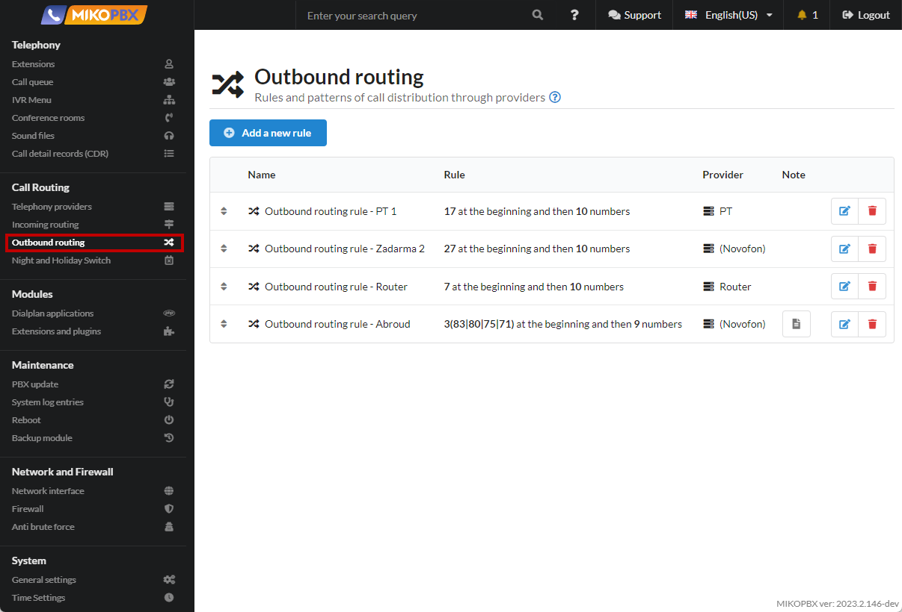
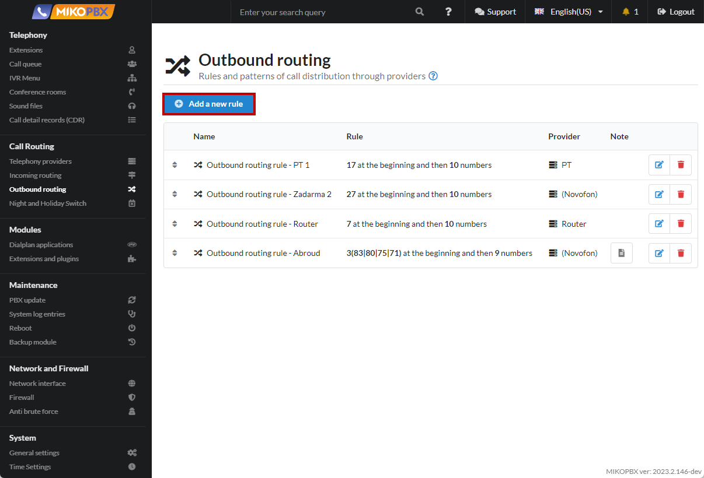
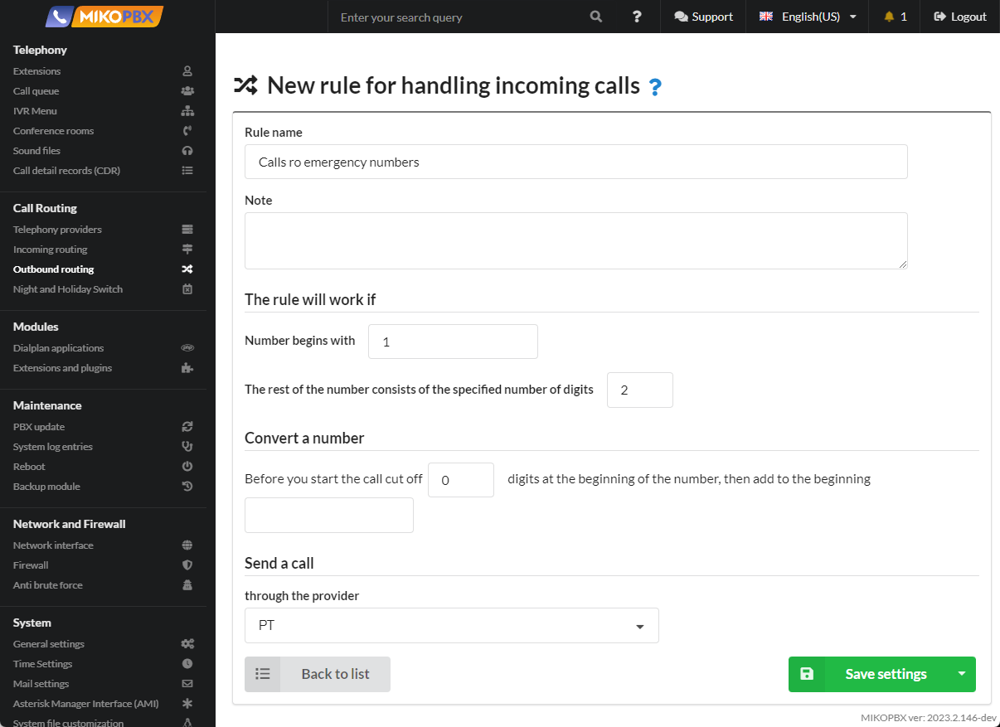

# Calls to emergency numbers


It is necessary to be able to call emergency numbers 112, 1xx


1. Go to the **Routing** → **Outbound routes** section.

<figure><figcaption><p>Outbound routing section</p></figcaption></figure>

2. Adding a new rule

<figure><figcaption><p>New rule</p></figcaption></figure>

3. Fill in the parameters as in the screenshot below:

<figure><figcaption><p>Parameters for emergency calls rule</p></figcaption></figure>

4. You direct calls to emergency numbers through an arbitrary provider. The provider **must support** dialing emergency numbers. The priority of this rule should be the highest, i.e. it should be described first in the list of created outgoing routes.

<figure><figcaption><p>Priority of outbound routing</p></figcaption></figure>

5. Go to **System** → S**ystem file customization**

<figure><figcaption><p>System file ccustomization section </p></figcaption></figure>

6. Open the **extensions.conf** configuration file for editing.

<figure><figcaption><p>extensions.conf file</p></figcaption></figure>

7. Set the "**Add to end of file**" mode. In the black window, add the following code snippet:

```php
[internal](+)
exten => _1XX,1,Goto(outgoing,${EXTEN},1)	
```

<figure><figcaption><p>Code for extensions.conf</p></figcaption></figure>

In the above code snippet, we described the rules for all three-digit numbers starting with 1. If you need to specify specific emergency numbers, then instead of the above code, you need to insert the following lines:

```php
[internal](+)
exten => 112,1,Goto(outgoing,${EXTEN},1)
exten => 101,1,Goto(outgoing,${EXTEN},1)
exten => 102,1,Goto(outgoing,${EXTEN},1)
exten => 103,1,Goto(outgoing,${EXTEN},1)
```
