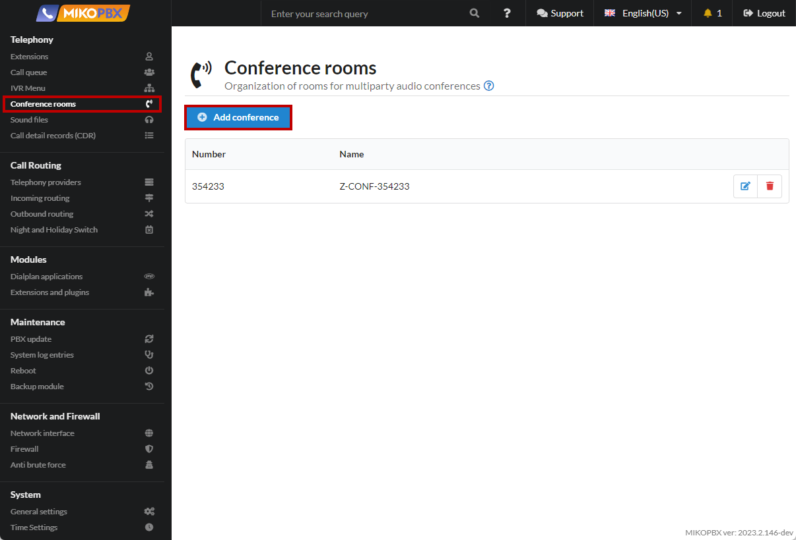
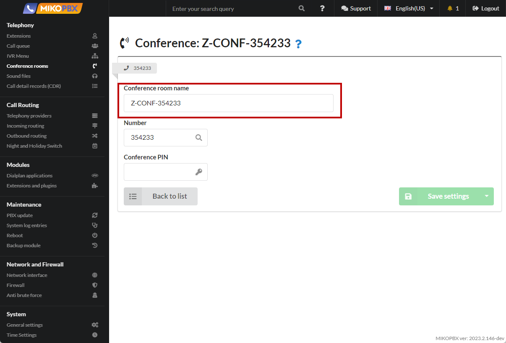
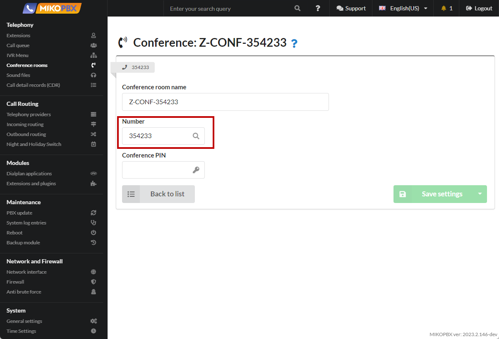
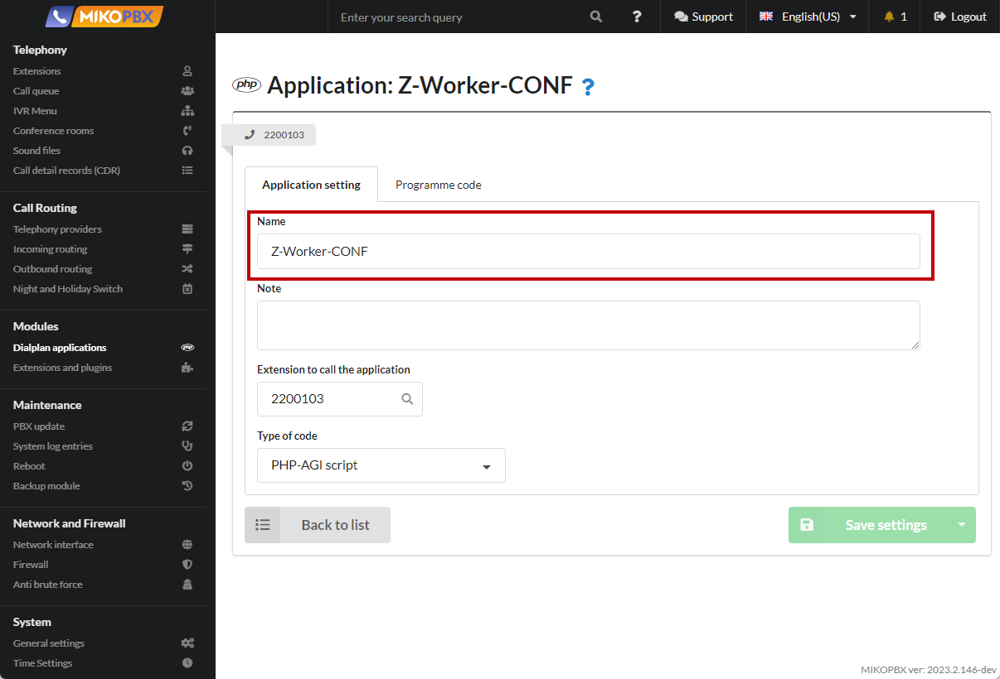
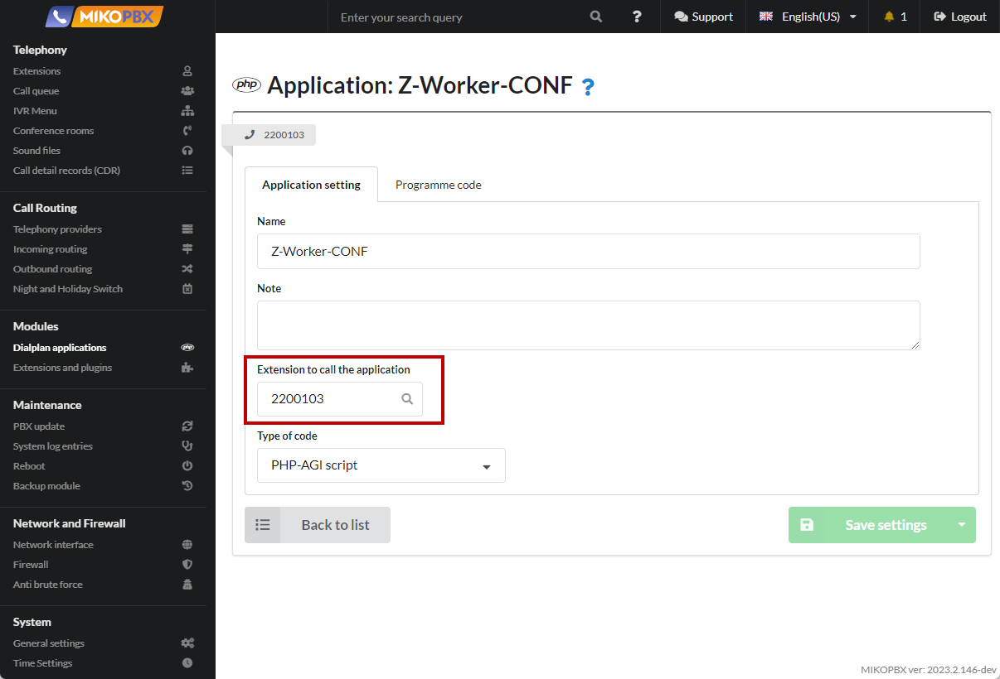
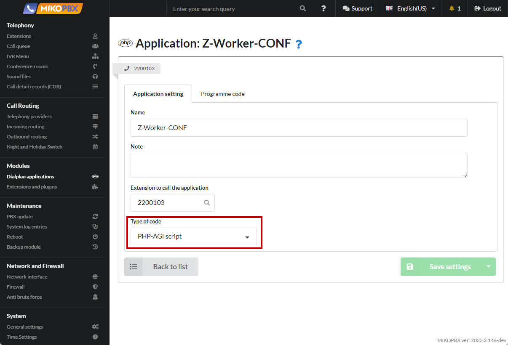
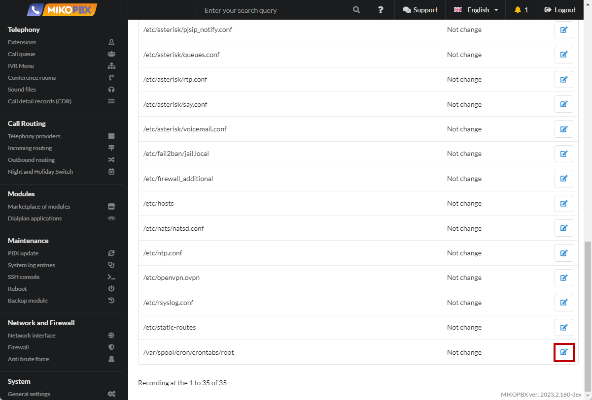
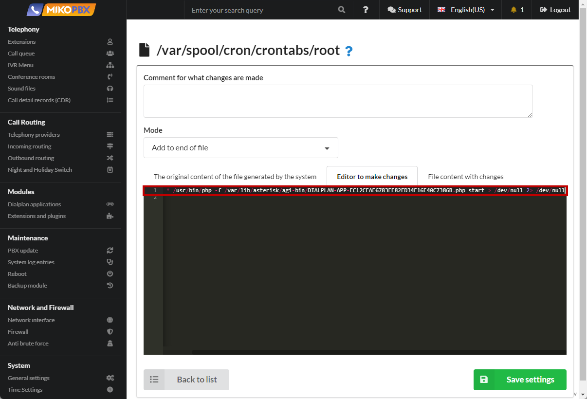

# Conference with a regular external subscriber

* Let's say a conference room with the number "**354233**" is configured on the PBX.&#x20;
* When calling an employee(s) to a conference, it is always necessary to connect an external subscriber.&#x20;
* When disconnecting employees from the conference, the external subscriber must be disconnected

This may be required to organize communication with an external (relative to MIKOPBX) conference. It will allow saving on outgoing calls (only one line will be occupied).

1. In the "**Telephony**" section, go to "**Conference**" and create a new conference.

<figure><figcaption><p>New Conference</p></figcaption></figure>

2. We will indicate the name of the room "**Z-CONF-354233**"

<figure><figcaption><p>Conference name</p></figcaption></figure>

3. We will indicate the internal number "**354233**"

<figure><figcaption><p>Conference number</p></figcaption></figure>

4. Let's describe the "**Dialplan Application**" (see [Dialplan Applications](../../manual/modules/dialplan-applications.md))

<figure><figcaption><p>New Dialplan Application</p></figcaption></figure>

5. Name "**Z-Worker-CONF**"

<figure><figcaption><p>Name of dialplan</p></figcaption></figure>

6. The number to call "**2200103**" (can be arbitrary)

<figure><figcaption><p>Number for dialplan</p></figcaption></figure>

7. Specify the code type "**PHP-AGI script**"

<figure><figcaption><p>Type of script </p></figcaption></figure>

8. Programme code:

<figure><figcaption><p>Code for dialplan</p></figcaption></figure>

```php
<?php

require_once 'Globals.php';

use MikoPBX\Core\System\Util;
use \MikoPBX\Core\Asterisk\AGI;
use \MikoPBX\Core\Asterisk\AsteriskManager;

function checkStartConf(){
    $Z_DTMF         = '354233';
    $Z_PROVIDER_ID  = 'SIP-1601534775';
    $Z_DST          = '37127776675';

    $am = new AsteriskManager();
    $am->connect();

    $confEmpty = true;
    $confChannelFound = false;
    $data = $am->meetMeCollectInfo($Z_DTMF);
    foreach ($data as $channelData){
        $value = $am->GetVar($channelData['Channel'], 'ZDTMF', null, false);
        if(!empty($value)){
            // This is the conference channel.
            $confChannelFound = true;
        }else{
            // There is an end user channel.
            $confEmpty = false;
        }
    }

    if($confChannelFound === false && $confEmpty === false){
        // You need to connect to an external conference.
        $am->Originate(
            'Local/'.$Z_DTMF.'@z-meetme',
            $Z_DST,
            'z-outgoing',
            '1',
            null,
            null,
            null,
            null,
            "__ZDTMF={$Z_DTMF},__ZPROVIDERID={$Z_PROVIDER_ID},__ZDST={$Z_DST}}",
            '0');

    }elseif ($confChannelFound === true && $confEmpty === true){
        $asteriskCmd = Util::which('asterisk');
        Util::mwExec("{$asteriskCmd} -rx 'meetme kick {$Z_DTMF} all'");
    }
}

$action = $argv[1]??'';
if($action === 'start'){
    $pid = Util::getPidOfProcess(basename($argv[0])." start$", getmypid());
    var_dump($pid);
    if(!empty($pid)){
        $killCmd = Util::which('kill');
        Util::mwExec("{$killCmd} {$pid}");
    }
    while (true){
        checkStartConf();
        sleep(3);
    }
}else{
    $agi = new AGI();
    $agi->answer();
    checkStartConf();
    $agi->hangup();
}
```

9. Edit the file "**/var/spool/cron/crontabs/root**" via the [System files Customization ](../../manual/system/custom-files.md)menu

<figure><figcaption><p>/var/spool/cron/crontabs/root file</p></figcaption></figure>

10. Adding the task to the end of the file:

<figure><figcaption><p>Code for Crontabs/root</p></figcaption></figure>

```php
*/1 * * * * /usr/bin/php -f /var/lib/asterisk/agi-bin/DIALPLAN-APP-EC12CFAE6783FE82FD34F16E40C7386B.php start > /dev/null 2> /dev/null
```

In this example, "**DIALPLAN-APP-EC12CFAE6783FE82FD34F16E40C7386B**" is the ID of the previously created application. The ID can be peeped in the browser address bar when editing the application.

11. We will describe additional contexts through the [Customization of system files](../../manual/system/custom-files.md) menu. We will edit the extensions.conf file.

<figure><figcaption><p>Extensions.conf file</p></figcaption></figure>

12. Add the following code to the end of the file:

```php
[z-outgoing]
exten => _X!,1,Ringing()
  same => n,Gosub(${ISTRANSFER}dial,${EXTEN},1)
  same => n,Dial(PJSIP/${EXTEN}@${ZPROVIDERID},600,${DOPTIONS}TKU(z-dial-answer)b(dial_create_chan,s,1))
  same => n,ExecIf($["${ISTRANSFER}x" != "x"]?Gosub(${ISTRANSFER}dial_hangup,${EXTEN},1))
  same => n,Set(pt1c_UNIQUEID=${EMPTY_VALUE})
  same => n,ExecIf($["${BLINDTRANSFER}x" != "x"]?AGI(check_redirect.php,${BLINDTRANSFER}))
  same => n,Hangup()

[z-dial-answer]
exten => s,1,NoOp(Answered send DTMF...)
  same => n,Gosub(dial_answer,${EXTEN},1)
  same => n,SendDTMF(${ZDTMF})
  same => n,return
	
[z-meetme]
exten => _X!,1,Answer()
  same => n,Meetme(${EXTEN},qdMTr)
  same => n,Hangup()
```

<figure><figcaption><p>Code for Extensions.conf</p></figcaption></figure>


When calling the conference number **354233**, an external subscriber with the number **37127776675** will automatically connect. As soon as the subscriber answers, the extension number **354233** will be dialed. As soon as all the "internal" participants have left the conference, the external subscriber will be disconnected.



The task in the crown is needed only for additional "protection", in fact it is a restart of the php script every minute

