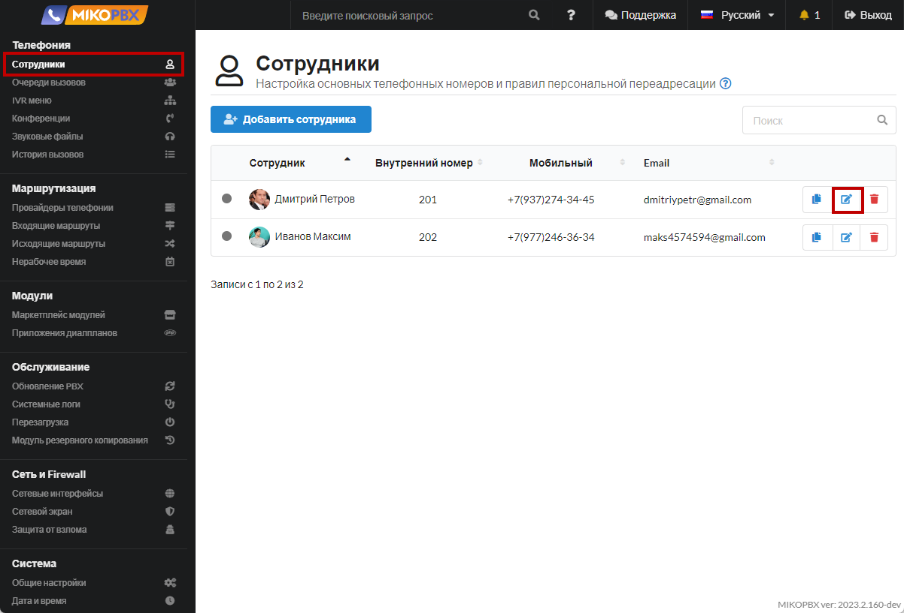
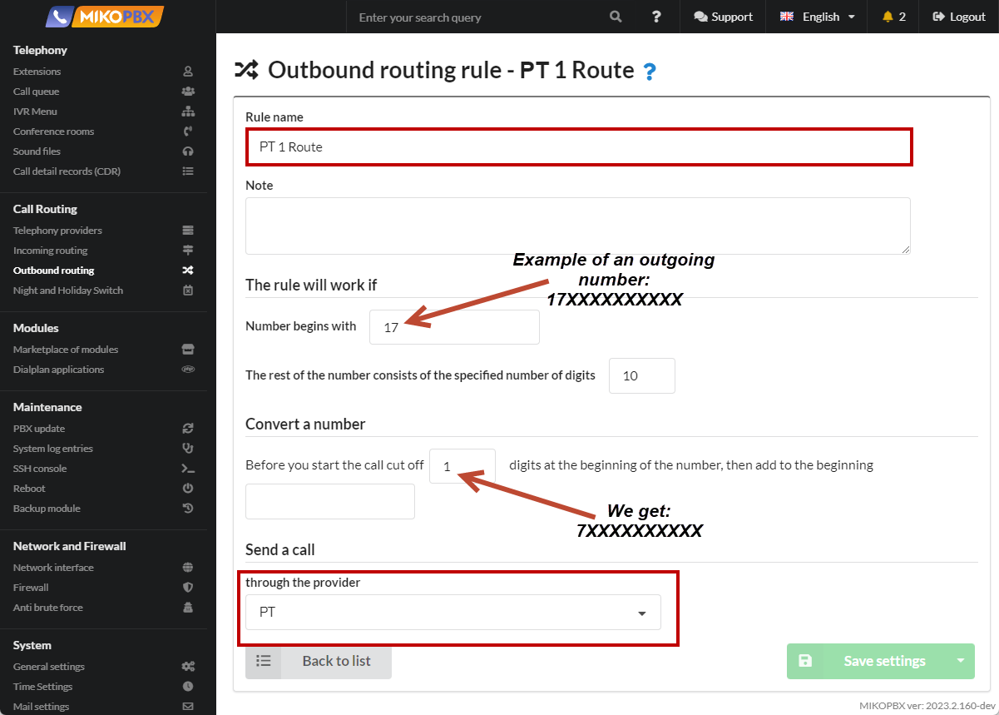
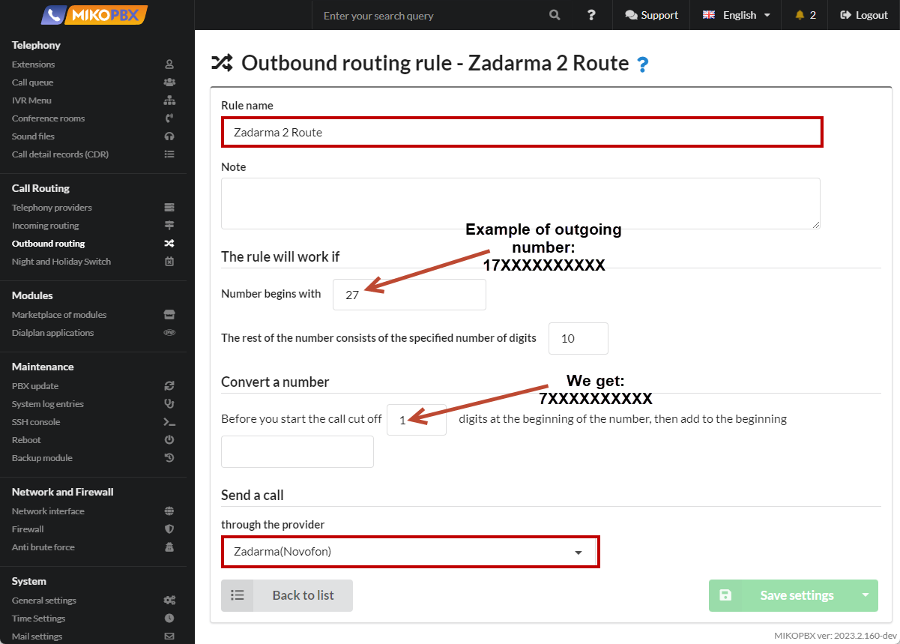
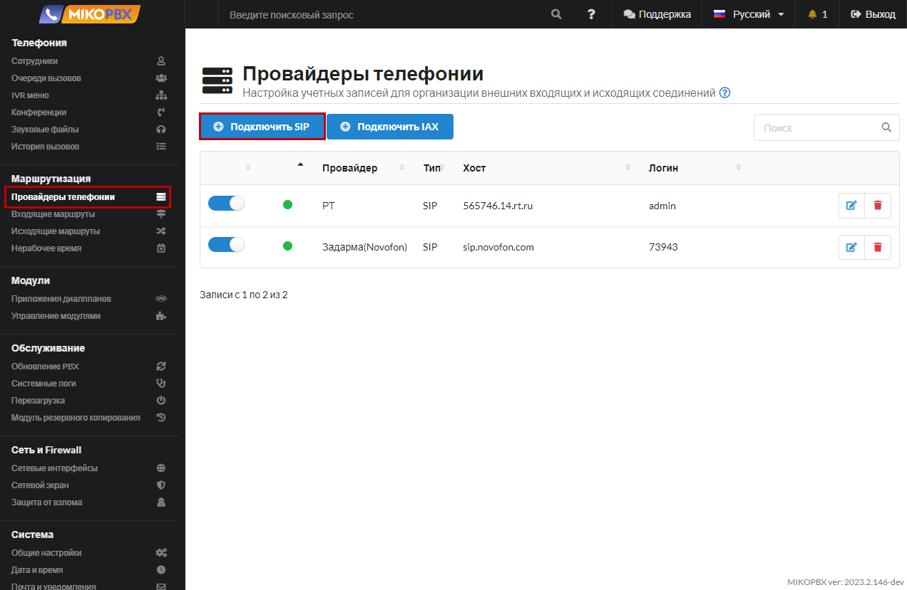
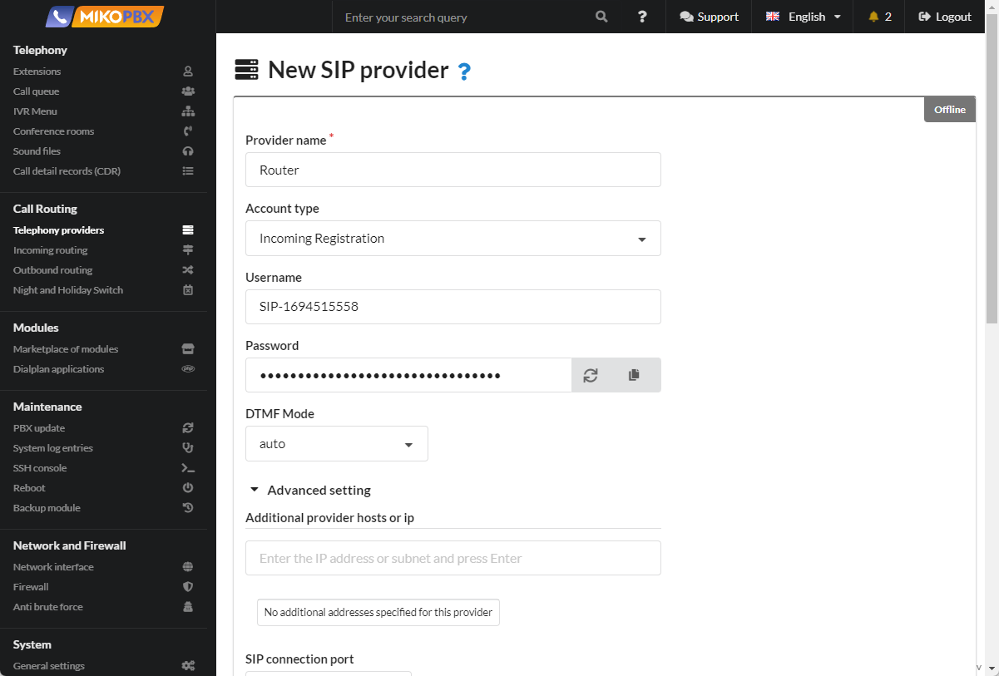
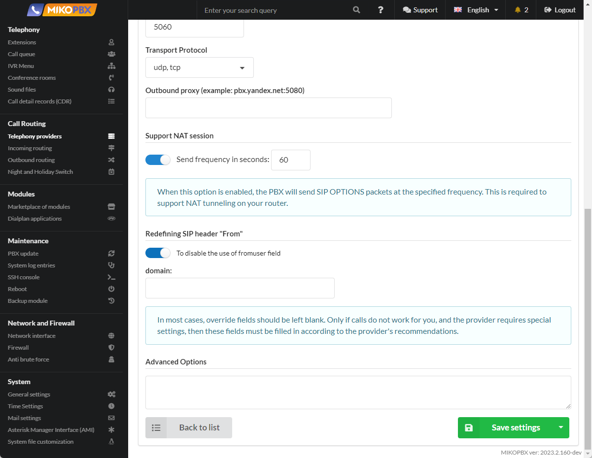
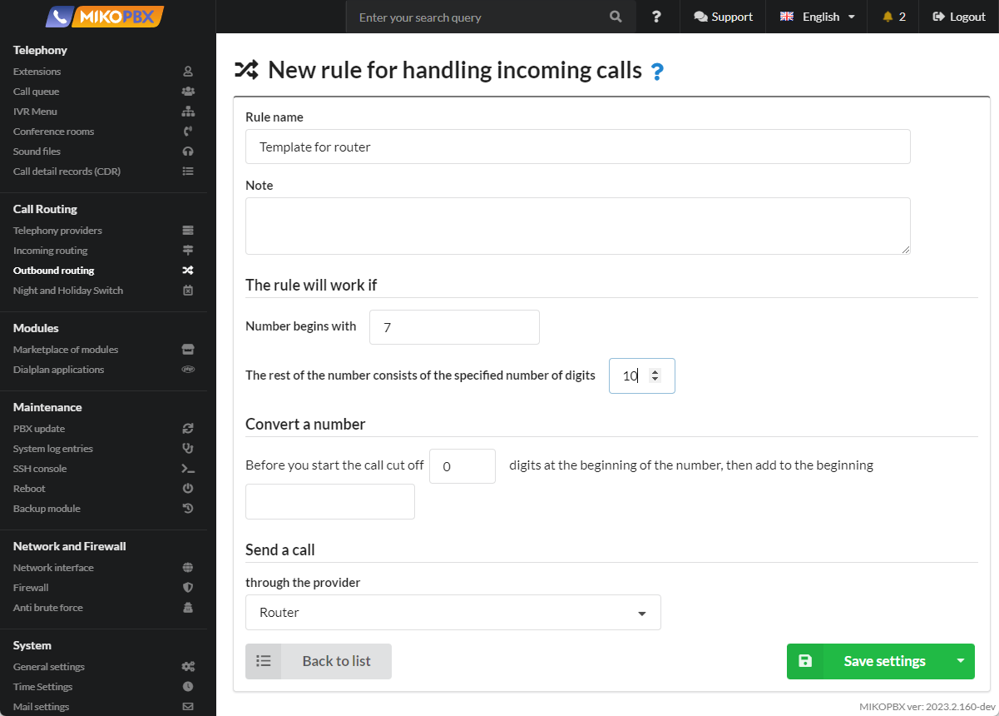
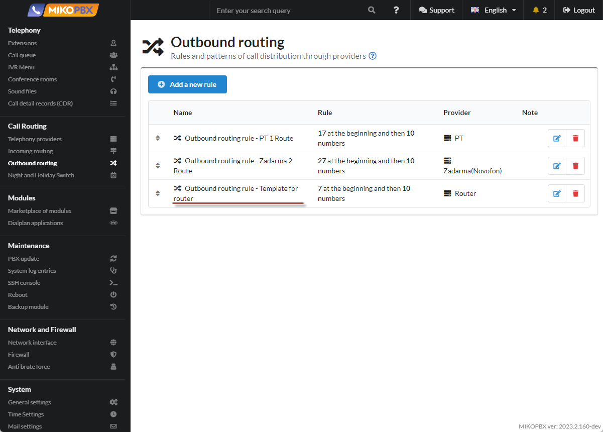
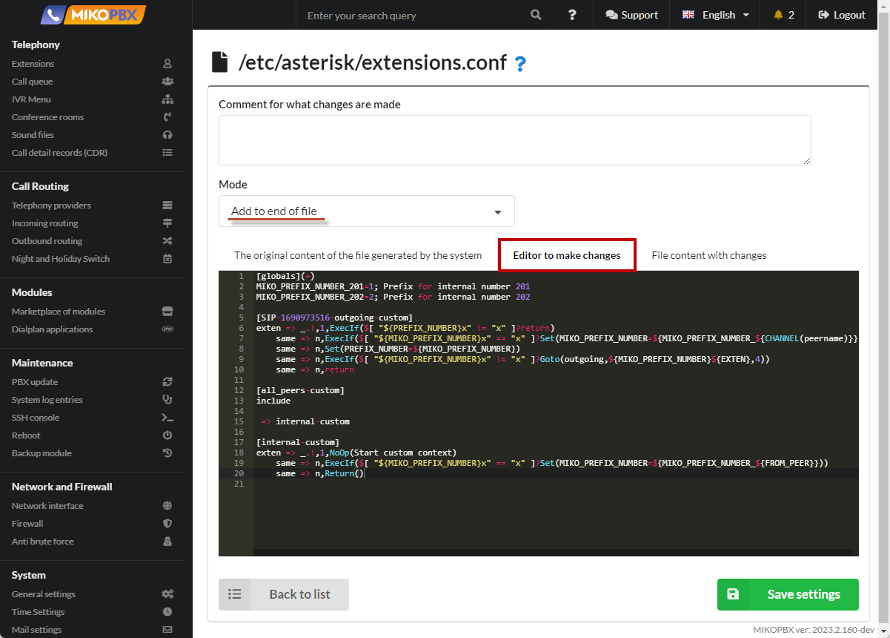

# Making Calls Through a Specific Provider

### Problem Statement <a href="#problem_statement" id="problem_statement"></a>

In MikoPBX (_**Telephony → Employees**_), the following employee accounts are configured:

<figure><figcaption><p>Section "Extensions"</p></figcaption></figure>

In MikoPBX, there are **two providers** configured (_**Routing → Telephony Providers**_):

<figure><figcaption></figcaption></figure>

The requirement is that:

1. The phone connected to account **201** should only make calls through the **first provider** **PT**.
2. The phone connected to account **202** should only make calls through the **second provider** **Zadarma(Novofon)**.

Outbound calls to the external world (to a city) through both providers are implemented using the **same outgoing rule**: it's a ten-digit number starting with 7. This task can be schematically represented as follows:

<figure><figcaption><p>The scheme of the task</p></figcaption></figure>

### Solution <a href="#solution" id="solution"></a>

Routing calls through a specific provider can be achieved using **outbound dial plan prefixes**.

* Calls will always go through the **first provider** if you add **1** before the outgoing number. Therefore, if the subscriber with **201** wants to dial outgoing numbers with the **1 prefix**, the calls will go through the first provider.
* Calls will always go through the **second provider** if you add **2** before the outgoing number. Therefore, if the subscriber with **202** wants to dial outgoing numbers with the **2 prefix**, the calls will go through the second provider.

You can schematically represent this as follows:


You can implement this task in two ways in MikoPBX:

1. Subscribers 201 and 202 will always add specific prefixes before dialing on their phones. For example, if they want to call the number 74952293042, they will add the prefix 1 or 2 before this number, such as 174952293042 or 274952293042.
2. Subscribers 201 and 202 **do not dial** special prefixes; the PBX itself performs this action for them.

#### First Method <a href="#first_method" id="first_method"></a>

The first method of implementing our task assumes that subscribers 201 and 202 will independently dial the corresponding prefixes on their phones. Subscriber 201 will always add 1 before the number, and subscriber 202 will add 2.

1. For the **first** provider, create an outbound rule. Go to **Routing** → **Outbound Routes**. Add a new rule.

<figure><figcaption><p>Creating a new rule</p></figcaption></figure>

2. Fill in the parameters as shown in the screenshot below:

<figure><figcaption><p>Routing parameters for the first provider</p></figcaption></figure>

3\. For the **second** Zadarma provider, we create an outgoing rule. Go to the **Routing** → **Outgoing routes** section. Adding a new rule as in the screenshot below:

<figure><figcaption><p>Routing parameters for the second provider</p></figcaption></figure>

#### Second Method

The second method of implementing our task assumes that subscribers 201 and 202 **do not dial** specific prefixes on their phones; the PBX does this for them.

1. Add **outbound rules** for the first and second Zadarma providers, as described in the [first method](making-calls-through-a-specific-provider.md#first\_method). The settings are identical.
2. In the **Routing** → **Telephony Providers** section, add a third provider account.

<figure><figcaption><p>New Provider</p></figcaption></figure>

3. Fill in the parameters as shown in the screenshots below:

<figure><figcaption></figcaption></figure>

<figure><figcaption><p>Router Parameters</p></figcaption></figure>

4. Save the account and copy the ID of this provider in the address bar.

<figure><figcaption><p>ProviderID</p></figcaption></figure>

5. Add an **outgoing rule** for the created provider. By default, we will direct all calls through this provider, so be careful when creating an outgoing template. Calls through our providers can be made to numbers starting with 7, so our template takes the form:

<figure><figcaption><p>Routing Parameters for Router</p></figcaption></figure>

6. Please note that the priority of the outgoing rule for the Router provider should be **lower** than all!

<figure><figcaption><p>Priority in outbound routing</p></figcaption></figure>

7. Go to **System** -> **System file customization** section

<figure><figcaption><p>"System file customization" section</p></figcaption></figure>

8. Open the **extensions.conf** configuration file for editing.

<figure><figcaption><p>"extensions.conf" file</p></figcaption></figure>

9. Select the "**Add to end of file**" mode. In the editing window, insert the following lines:

```php
[globals](+)
MIKO_PREFIX_NUMBER_201=1; Prefix for internal number 201
MIKO_PREFIX_NUMBER_202=2; Prefix for internal number 202

[SIP-1690973516-outgoing-custom]
exten => _.!,1,ExecIf($[ "${PREFIX_NUMBER}x" != "x" ]?return)
    same => n,ExecIf($[ "${MIKO_PREFIX_NUMBER}x" == "x" ]?Set(MIKO_PREFIX_NUMBER=${MIKO_PREFIX_NUMBER_${CHANNEL(peername)}}))
    same => n,Set(PREFIX_NUMBER=${MIKO_PREFIX_NUMBER})
    same => n,ExecIf($[ "${MIKO_PREFIX_NUMBER}x" != "x" ]?Goto(outgoing,${MIKO_PREFIX_NUMBER}${EXTEN},4))
    same => n,return
    
[all_peers-custom]
include

 => internal-custom

[internal-custom]
exten => _.!,1,NoOp(Start custom context)
    same => n,ExecIf($[ "${MIKO_PREFIX_NUMBER}x" == "x" ]?Set(MIKO_PREFIX_NUMBER=${MIKO_PREFIX_NUMBER_${FROM_PEER}}))
    same => n,Return()
```

In the code snippet above, you need to create the correct context name.\
The format of the created context:

```
[PROVIDER-ID-outgoing-custom]
```

**PROVIDER-ID** - the value you saved in the third step described in this method. In our example, it's **SIP-1690973516**.

<figure><figcaption><p>Code for extensions.conf</p></figcaption></figure>

**Save** the changes and return to the list of configuration files.

This way, for the 201 and 202 accounts, we have set prefixes. All outgoing calls will now go through the required provider.

#### Default Route <a href="#default_route" id="default_route"></a>

In some cases, when defining incoming routes, you may need to redirect a call not to an internal number but to an employee's mobile number. In this case, you need to describe the "Default Prefix," otherwise, there may be problems with handling such calls. &#x20;

When routing by DID number:

```php
[public-direct-dial-custom]
exten => _.!,1,NoOp(Start custom context)
    same => n,Set(__MIKO_PREFIX_NUMBER=2)
    same => n,Return()
```

For **each** provider, you should also describe the context:

```php
[PROVIDER-ID-incoming]
exten => _.!,1,NoOp(Start custom context)
    same => n,Set(__MIKO_PREFIX_NUMBER=2)
    same => n,Return() 
```

With these configurations, you have completed the setup.

