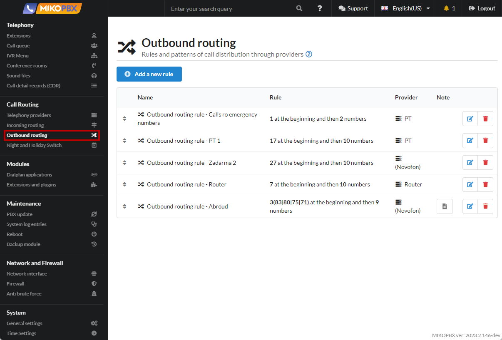
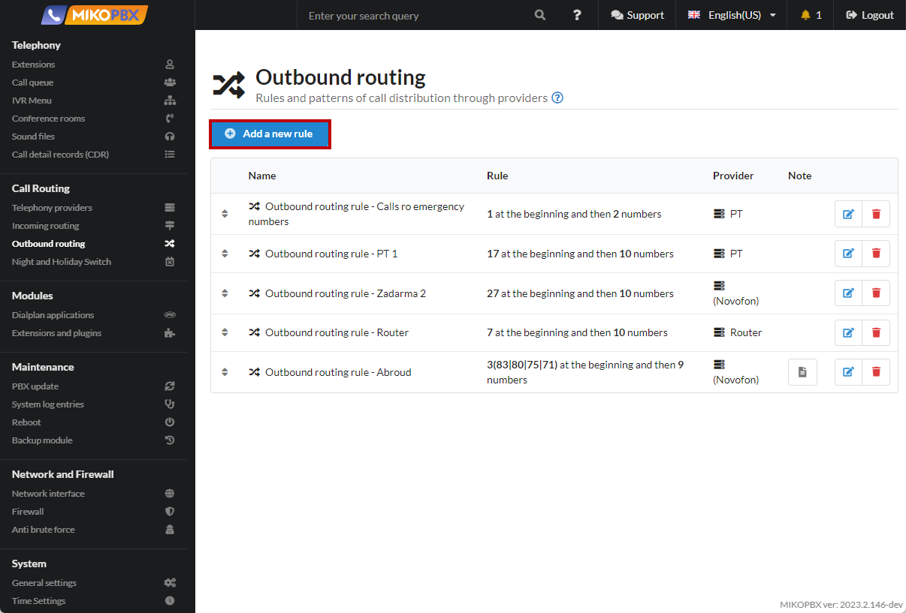
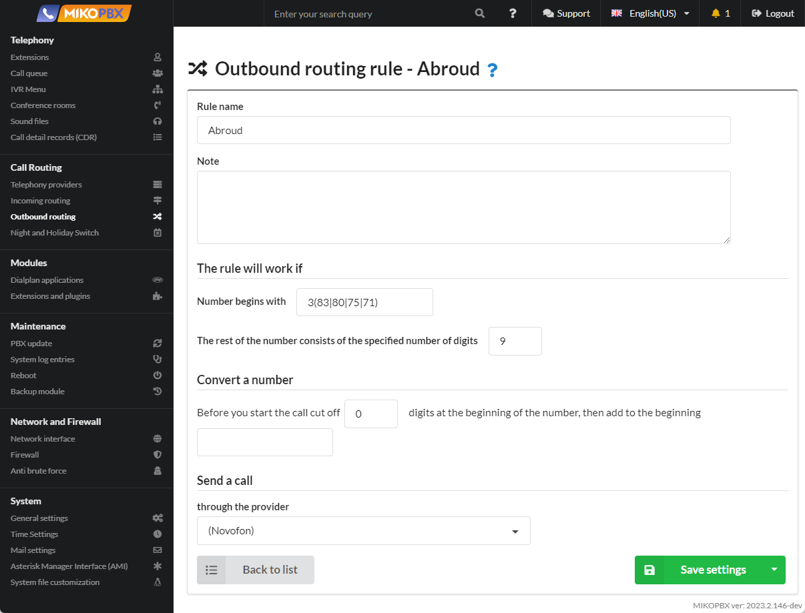

# Sample template: calls to another country


Calls to numbers:&#x20;

* **383** XXXXXXXXXX
* **380** XXXXXXXXXX&#x20;
* **375** XXXXXXXXXX&#x20;
* **371** XXXXXXXXXX


1. Go to **Routing** → **Outbound Routing**

<figure><figcaption>
Outbound routing 
</figcaption></figure>

2. Create a new outbound routing rule:

<figure><figcaption>
New rule
</figcaption></figure>

3. Fill in the parameters according to the template below:

<figure><figcaption>
Template for a new rule
</figcaption></figure>


Now, when calling any numbers that meet the patterns: 383 XXXXXXXXX, 380 XXXXXXXXX, 375 XXXXXXXXX, 371 XXXXXXXXX, the call will be routed through the provider (Novofon).

