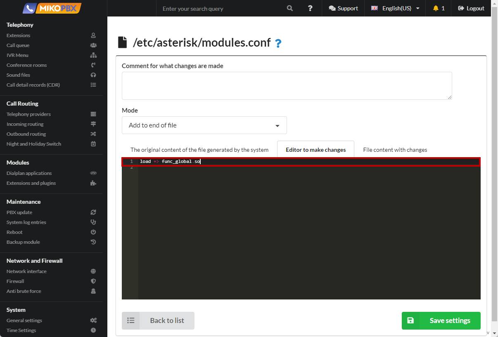

# Uniform distribution of outgoing

1. Go to the **System file customization** section

<figure><figcaption><p>System file customization section</p></figcaption></figure>

2. Open **modules.conf** for editing

<figure><figcaption><p>Modules.conf file </p></figcaption></figure>

3. Add the following code to the end of the file:

```php
load => func_global.so
```

<figure><figcaption><p>Code for Modules.conf</p></figcaption></figure>

4. Open the **extensions.conf** file for editing

<figure><figcaption><p>Extensions.conf file</p></figcaption></figure>

5. Add the following code to the end of the file:

```php
[all-outgoing-custom]
exten => _X!,1,NoOp()
    same => n,Set(NEED_RETURN=0)
    ; We describe the list of providers
    same => n,Set(PUSH(rrItem)=SIP-1601534775)
    same => n,Set(PUSH(rrItem)=SIP-1611151795)    
    same => n,Set(PUSH(rrItem)=SIP-1681205343)
    ; Maximum number of simultaneous calls over the line
    same => n,Set(busyLevel=50)
    
    ; Checking if there is a provider in the list.
    same => n,ExecIf($[ "${FIELDNUM(rrItem,\,,${PROVIDER_ID})}" == "0" ]?return)
    ; If the ID of the priority provider is determined, then immediately proceed to verification.
    same => n,GotoIf($[ "${rrElement}x" != "x" ]?check)
    ; Initializing an array
    same => n,Set(rrArray=${EMPTY})
    same => n,Set(i=${SHIFT(rrItem)})
    same => n,While(1)
    same => n,ExecIf($[ "${i}x" == "x" ]?ExitWhile())
    same => n,ExecIf($[ "${rrArray}x" != "x" ]?Set(rrArray=${rrArray},))
    same => n,ExecIf($[ "${GLOBAL(${i})}x" == "x" ]?Set(GLOBAL(${i})=0))
    same => n,Set(rrArray=${rrArray}${i}:${GLOBAL(${i})})
    same => n,Set(i=${SHIFT(rrItem)})
    same => n,EndWhile
    ; Finding an item with a lower weight
    same => n,Set(rrArray=${SORT(${rrArray})})
    same => n,Set(rrElement=${SHIFT(rrArray)})
    same => n,While(1)
    same => n,ExecIf($[ $[${GROUP_COUNT(${rrElement})} < ${busyLevel}] ]?ExitWhile())
    same => n,ExecIf($[ "${rrElement}x" == "x" ]?ExitWhile())
    same => n,NoOp( ${rrElement} - is busy)
    same => n,Set(rrElement=${SHIFT(rrArray)})
    same => n,EndWhile
    same => n,NoOp(--- ${rrElement} ---)
    
    ; Checking whether the provider matches
    same => n(check),ExecIf($[ "${PROVIDER_ID}x" != "${rrElement}x" ]?Set(NEED_RETURN=1))
    same => n,ExecIf($[ "${PROVIDER_ID}x" != "${rrElement}x" ]?return)
    ; Increasing the counter
    same => n,Set(GLOBAL(${rrElement})=$[${GLOBAL(${rrElement})} + 1])
    ; The counter of active calls through the provider
    same => n,Set(GROUP()=${rrElement})
    same => n,return
```

<figure><figcaption><p>Code for extensions.conf</p></figcaption></figure>


In the lines of the form "**Set(PUSH(rrItem)=SIP-1601534775)**", the ids of providers are listed, among which outgoing ones should be evenly distributed. The ID can be copied in the browser's address bar when editing the provider. The "**busyLevel**" variable defines the maximum allowed number of simultaneous calls through the provider.



For each provider, you will need to describe the outgoing route. The template in the routes must be the same.

