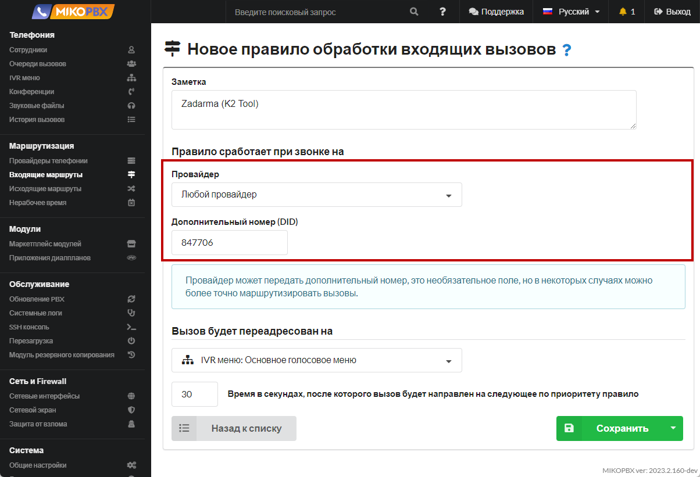

# Adding the prefix "1" to the number

The task is to **add** the prefix "1" to a number. For example, numbers 4952293042 and 4996382584 should be transformed into **1**4952293042 and **1**4996382584, respectively.

1.  Navigate to the "**Routing**" → "**Outbound Routes**" section.

    Click "**Add New Rule**."

    <figure><figcaption>
Adding a new rule
</figcaption></figure>
2. Create the pattern as shown in the image:

<figure><figcaption>
Parameters of the new rule
</figcaption></figure>

3. Click "**Save**."
