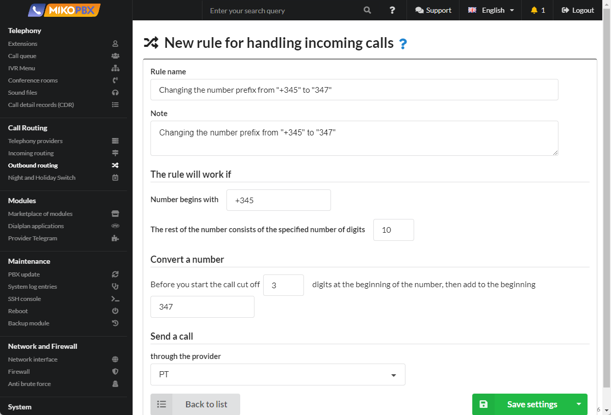

# Changing the number prefix from "+345" to "347"

It is necessary to **replace** the number prefixes **+345** with **347**. For example, the number +**345**4952293042 should be converted to the number **347**4952293042.

1. Go to "**Routing**" → "**Outbound Routing**"

Click "**Add a new rule**"

<figure><figcaption>
"Outbound Routing" section
</figcaption></figure>

2. Create a template as shown in the image:

Click "**Save settings**"

<figure><figcaption>
Template
</figcaption></figure>
