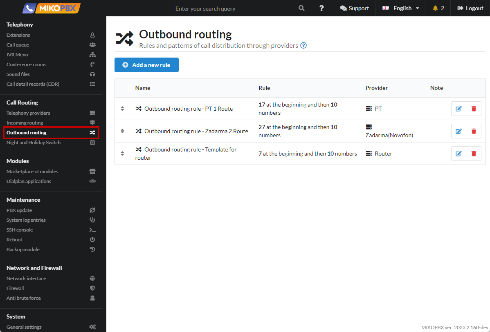

# Changing the number prefix from "345, 347" to "+345"

It is necessary to replace the number prefixes **345**, **347** with +**345**. Example, the numbers **345**4952293042 and **347**4952293042 should be converted to +**345**4952293042.

1. Go to "**Routing**" → "**Outbound Routing**"

Click "**Add a new rule**"

<figure><figcaption>
"Outbound routing" section
</figcaption></figure>

2. Create a template as shown in the image:

Click "**Save settings**"

<figure><figcaption>
Template 
</figcaption></figure>
