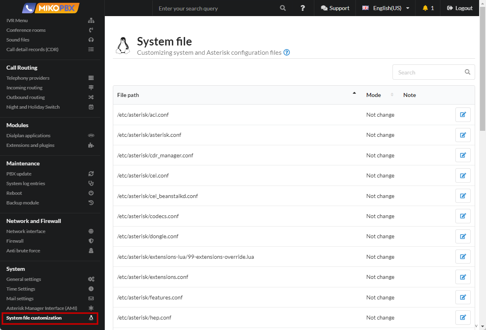
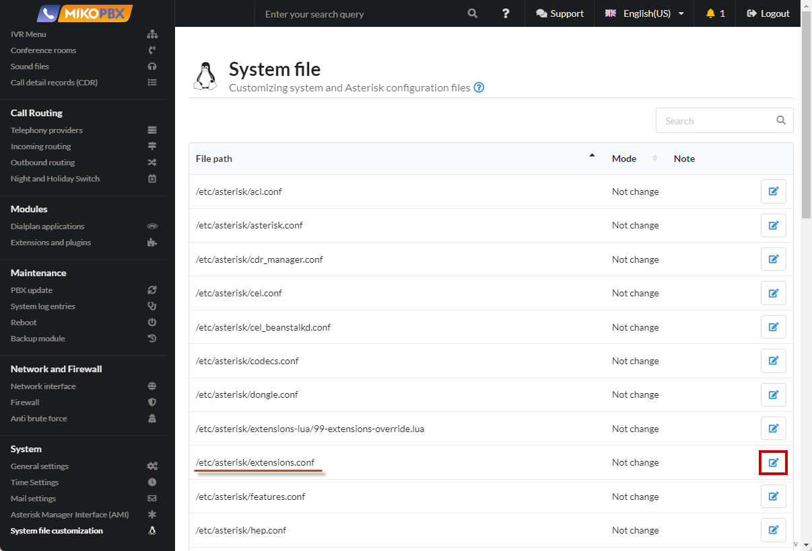
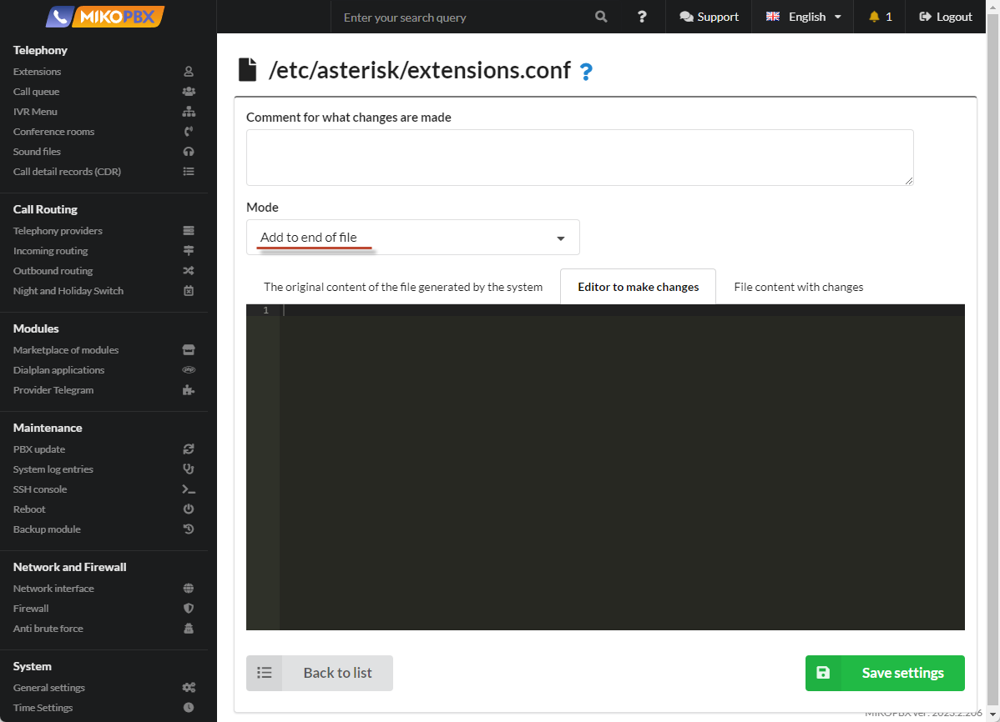
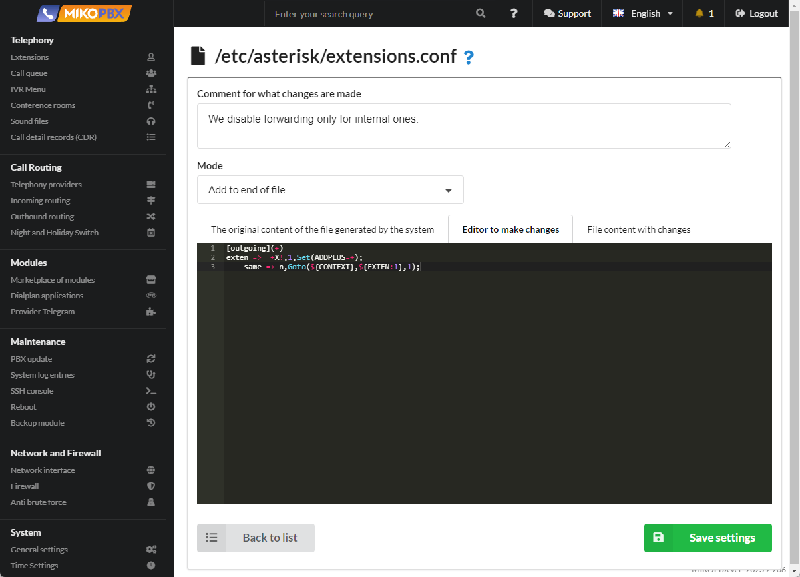

# How to prohibit the replacement of "+" with 00

1. Go to the “**System**” section -> “**System file customization**”

<figure><figcaption><p>"System file customization" section</p></figcaption></figure>

2. Select the file “**/etc/asterisk/extensions.conf**” to edit.

<figure><figcaption><p>"Extensions.conf" file</p></figcaption></figure>

3. Select the “**Add to end of file**” mode.

<figure><figcaption><p>“Add to end of file” mode</p></figcaption></figure>

4. Add the code to the second field:


```php
[outgoing](+)
exten => _+X!,1,Set(ADDPLUS=+);
    same => n,Goto(${CONTEXT},${EXTEN:1},1);
```


Save settings.

<figure><figcaption><p>Code for "extensions.conf"</p></figcaption></figure>

Now it's done :tada:

