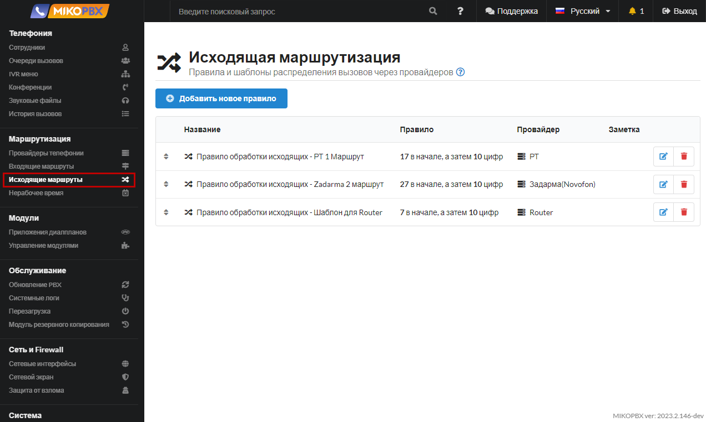
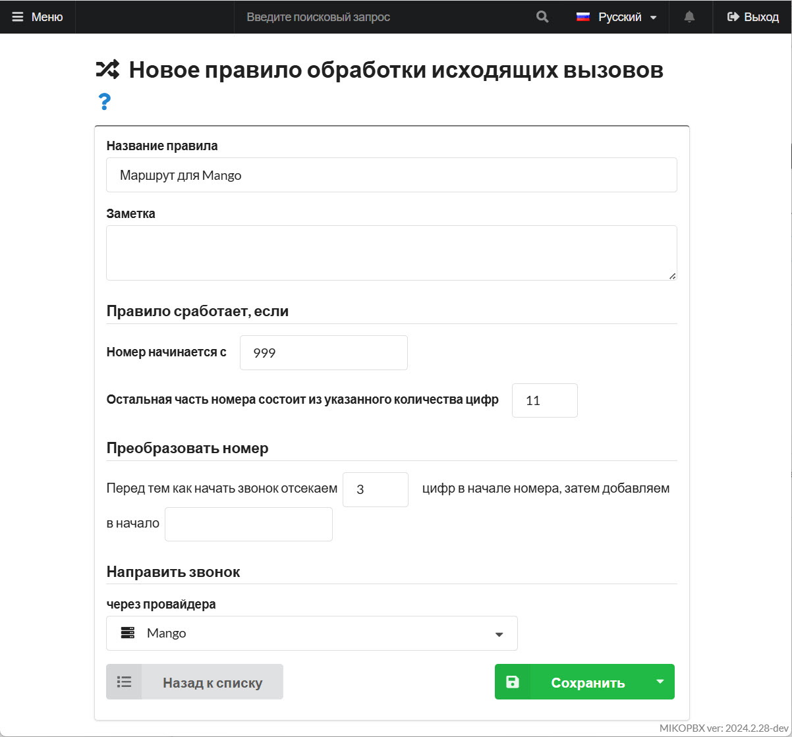
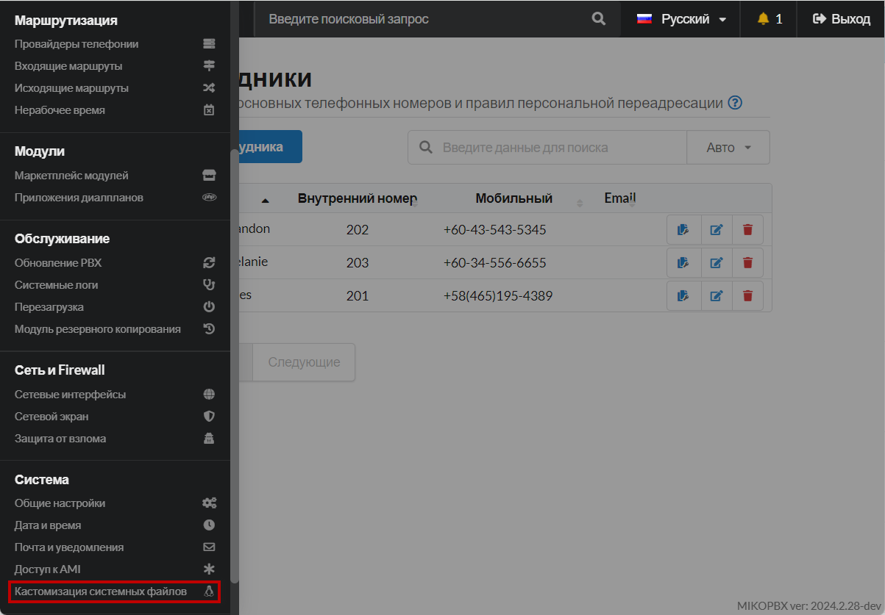
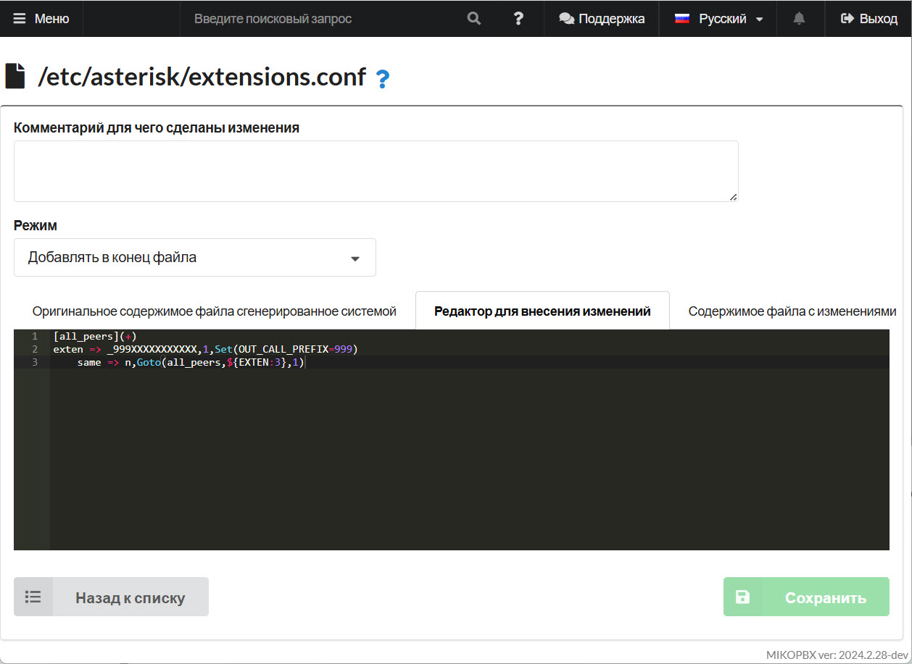
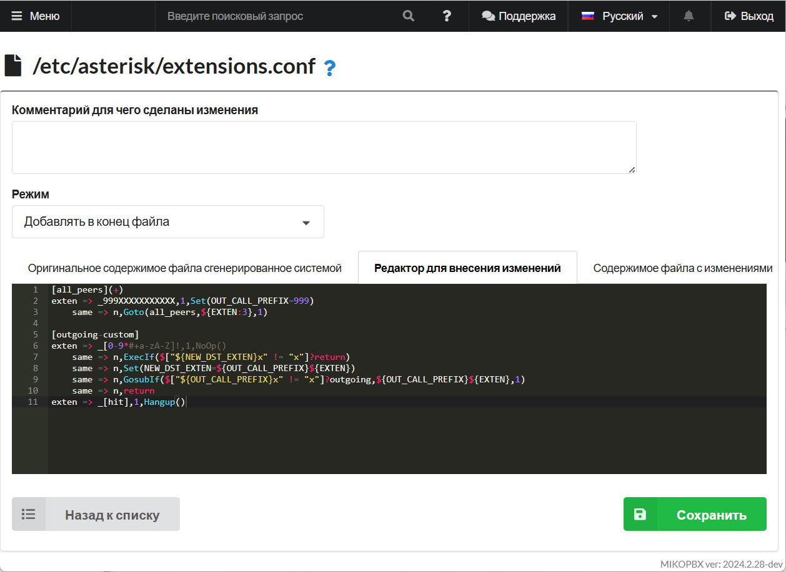

# Нормализация набираемого номера телефона

## Отсечение "999"

1. Перейдите в раздел "Маршрутизация" -> "Исходящая маршрутизация":

<figure><figcaption><p>Раздел "Исходящие маршруты"</p></figcaption></figure>

2. Опишем исходящий маршрут с префиксом «999»:

<figure><figcaption><p>Правило маршрута для Mango</p></figcaption></figure>

3. Перейдите в раздел "**Система**" -> "**Кастомизация системных файлов**":

<figure><figcaption><p>Раздел "Кастомизация системных файлов"</p></figcaption></figure>

4. Откройте для редактирования файл "**extensions.conf**". Установите режим "**Добавлять в конец файла**" и вставьте следующий контекст:

```php
[all_peers](+)
exten => _999XXXXXXXXXXX,1,Set(OUT_CALL_PREFIX=999)
    same => n,Goto(all_peers,${EXTEN:3},1)
```


Этот код отрежет префикс для **14**ти значного номера, превратит его в 11ти значный.


<figure><figcaption><p>Добавление контекста в конец файла extensions.conf</p></figcaption></figure>

5. Добавьте еще один контекст:


```php
[outgoing-custom]
exten => _[0-9*#+a-zA-Z]!,1,NoOp()
    same => n,ExecIf($["${NEW_DST_EXTEN}x" != "x"]?return)  
    same => n,Set(NEW_DST_EXTEN=${OUT_CALL_PREFIX}${EXTEN})
    same => n,GosubIf($["${OUT_CALL_PREFIX}x" != "x"]?outgoing,${OUT_CALL_PREFIX}${EXTEN},1)
    same => n,return
exten => _[hit],1,Hangup()
```


<figure><figcaption><p>Добавление контекста в конец файла extensions.conf</p></figcaption></figure>

При исходящем звонке будет добавлен отсеченный ранее префикс **999**. В истории вызовов отобразится номер без набранного префикса, в **11ти значном формате**:

<figure><figcaption><p>Раздел "История вызовов"</p></figcaption></figure>

Для звонков из CTI приложений нужно дополнить контекст:


```php
[internal-originate](+)
exten => _XXX!,1,Set(pt1c_cid=${FILTER(\*\#\+1234567890,${pt1c_cid})})

	same => n,ExecIf($[ ${LEN(${CALLERID(num)})} == 14 ]?Set(__OUT_CALL_PREFIX=7${pt1c_cid:0:3}))
	same => n,ExecIf($[ ${LEN(${CALLERID(num)})} == 14 ]?Set(pt1c_cid=7${pt1c_cid:3}))

	same => n,Set(MASTER_CHANNEL(ORIGINATE_DST_EXTEN)=${pt1c_cid})
	same => n,Set(number=${FILTER(\*\#\+1234567890,${EXTEN})})
	same => n,ExecIf($["${EXTEN}" != "${number}"]?Goto(${CONTEXT},${number},$[${PRIORITY} + 1]))
	same => n,Set(__IS_ORGNT=${EMPTY})
	same => n,Gosub(interception_start,${EXTEN},1)
	same => n,ExecIf($["${pt1c_cid}x" != "x"]?Set(CALLERID(num)=${pt1c_cid}))
	same => n,ExecIf($["${origCidName}x" != "x"]?Set(CALLERID(name)=${origCidName}))
	same => n,GosubIf($["${DIALPLAN_EXISTS(${CONTEXT}-custom,${EXTEN},1)}" == "1"]?${CONTEXT}-custom,${EXTEN},1)
	same => n,ExecIf($["${SRC_QUEUE}x" != "x"]?Goto(internal-originate-queue,${EXTEN},1))
	same => n,ExecIf($["${CUT(CHANNEL,\;,2)}" == "2"]?Set(__PT1C_SIP_HEADER=${SIPADDHEADER})) 
	same => n,ExecIf($["${PJSIP_ENDPOINT(${EXTEN},auth)}x" == "x"]?Goto(internal-num-undefined,${EXTEN},1))
	same => n,Gosub(set-dial-contacts,${EXTEN},1)
	same => n,ExecIf($["${FIELDQTY(DST_CONTACT,&)}" != "1" && "${ALLOW_MULTY_ANSWER}" != "1"]?Set(__PT1C_SIP_HEADER=${EMPTY_VAR}))
	same => n,ExecIf($["${DST_CONTACT}x" != "x"]?Dial(${DST_CONTACT},${ringlength},TtekKHhb(originate-create-channel,${EXTEN},1)U(originate-answer-channel),s,1)))
exten => _[hit],1,Gosub(interception_bridge_result,${EXTEN},1)
	same => n,Hangup
```

