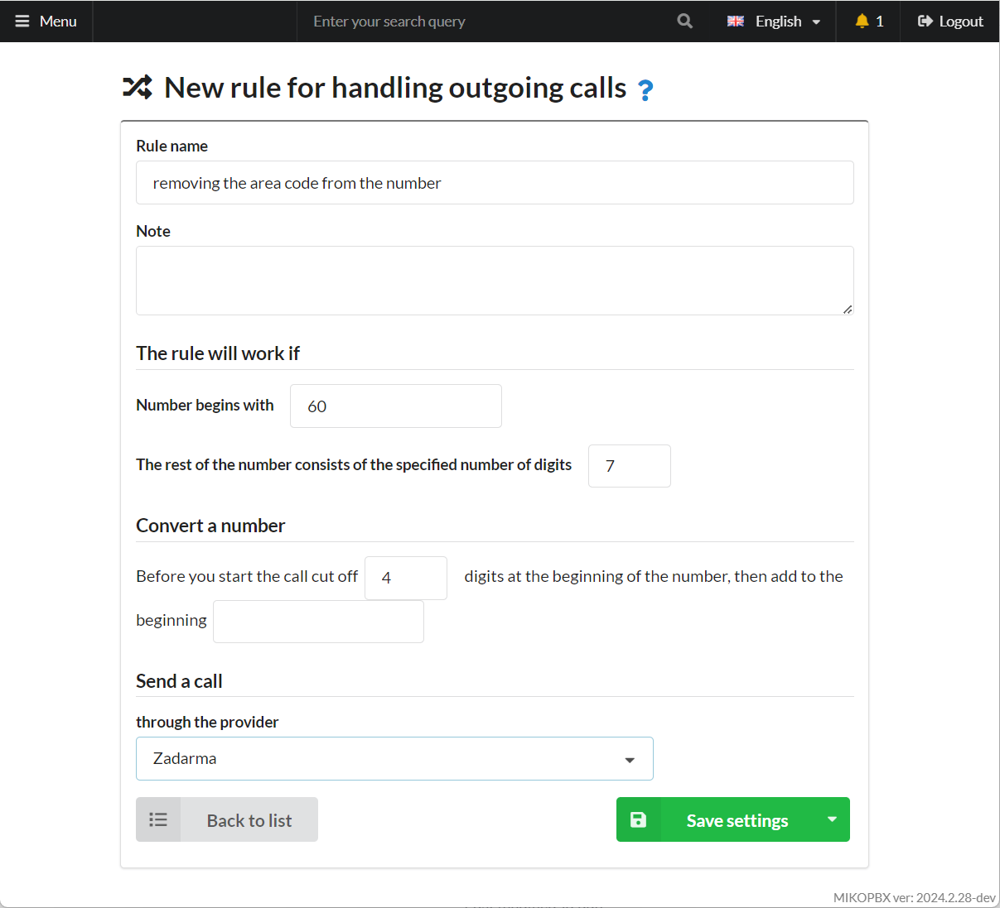

# Removing the area code from the number

The task is to **remove** the area codes 6017, 6095, 6096, or 6099 and retain the 7-digit number. For example, numbers 60172293042 and 60956382584 should be transformed to 2293042 and 6382584, respectively.

1.  Navigate to the "**Routing**" → "**Outbound Routes**" section.

    Click "**Add New Rule**."

    <figure><figcaption>
Adding a new rule
</figcaption></figure>
2. Create the pattern as shown in the image:

<figure><figcaption>
Parameters of the new rule
</figcaption></figure>

3. Click "**Save**."
