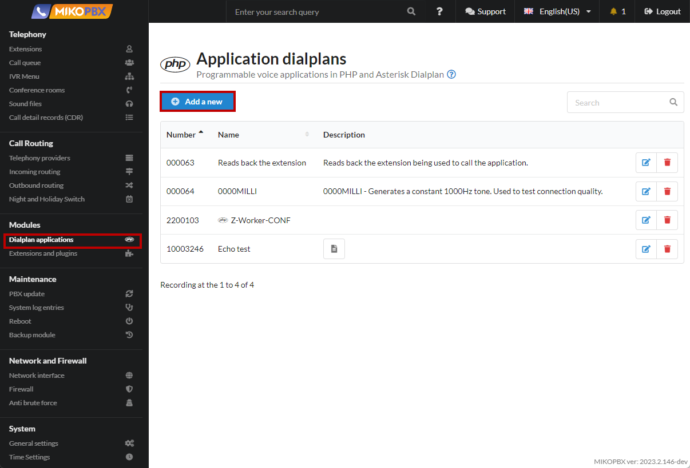
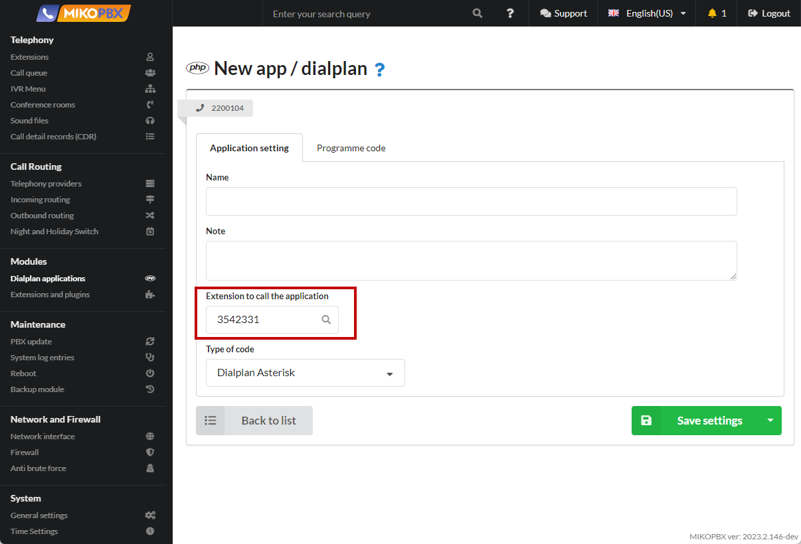

# Outgoing with internal number dialing

Let's say there is a certain number **+371 (2) 637‑23‑33**, by calling to which and dialing an extension you can get to a specific employee. This can be extremely convenient, especially if the extension number is longer than 3 characters. Next, we describe an example of the implementation of the task.

1. To solve the problem, additional contexts should be described through the [Customization of System Files](../../manual/system/custom-files.md) menu.

<figure><figcaption><p>System file customization </p></figcaption></figure>

2. We will edit the **extensions.conf** file.

<figure><figcaption><p>Extensions.conf</p></figcaption></figure>

3. Add the following text to the end of the file:

```php
[z-outgoing]
exten => _X!,1,Ringing()
  same => n,Gosub(${ISTRANSFER}dial,${EXTEN},1)
  same => n,Dial(PJSIP/${EXTEN}@${ZPROVIDERID},600,${DOPTIONS}TKU(z-dial-answer)b(dial_create_chan,s,1))
  same => n,ExecIf($["${ISTRANSFER}x" != "x"]?Gosub(${ISTRANSFER}dial_hangup,${EXTEN},1))
  same => n,Set(pt1c_UNIQUEID=${EMPTY_VALUE})
  same => n,ExecIf($["${BLINDTRANSFER}x" != "x"]?AGI(check_redirect.php,${BLINDTRANSFER}))
  same => n,Hangup()

[z-dial-answer]
exten => s,1,NoOp(Answered send DTMF...)
  same => n,Gosub(dial_answer,${EXTEN},1)
  same => n,SendDTMF(${ZDTMF})
  same => n,return
```

<figure><figcaption><p>Code for extensions,conf</p></figcaption></figure>

4. Next, it is necessary to describe the [Applications of dialplans](../../manual/modules/dialplan-applications.md)

<figure><figcaption><p>New dialplan</p></figcaption></figure>

5. Select "**Type of code**" - "**Asterisk Dialplan**"

<figure><figcaption><p>Type of code for dialplan</p></figcaption></figure>

6. Let's say you need to "dial" the number 3542331, set this value to "**Number to call the application"**

<figure><figcaption><p>Number to call the application</p></figcaption></figure>

7. Go to the "**Programme Code**" tab and insert the template:

```php
1,Set(_ZDTMF=${EXTEN})
n,Set(_ZDST=37126372333)
n,Set(_ZPROVIDERID=SIP-1601534775)
n,Goto(z-outgoing,${ZDST},1)
```

<figure><figcaption><p>Code for dialplan</p></figcaption></figure>

* If you specify the **9XXXX** template in the "**Application call number**" field, it will be possible to "dial" any five-digit numbers starting with the digit "**9**"&#x20;
* In the application, assign the variable "ZDST" the number to which the call should be made In the "**ZDTMF**" variable, specify the number for the additional set&#x20;
* In the "**ZPROVIDERID**" variable, specify the ID of the provider through which the outgoing call should be made. ID can be peeped in the browser address bar when editing the provider
