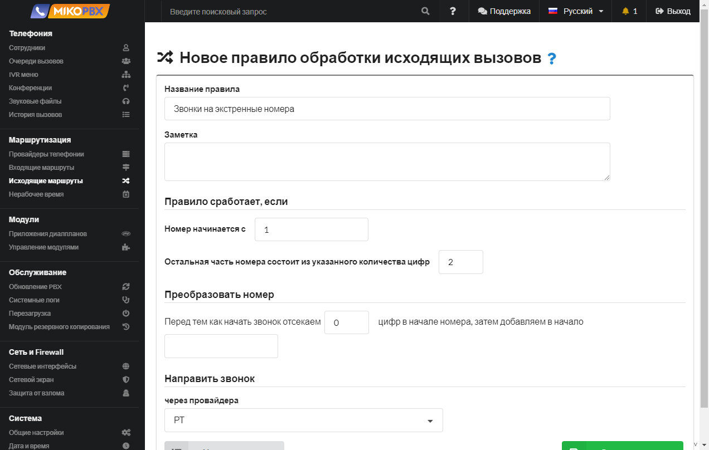
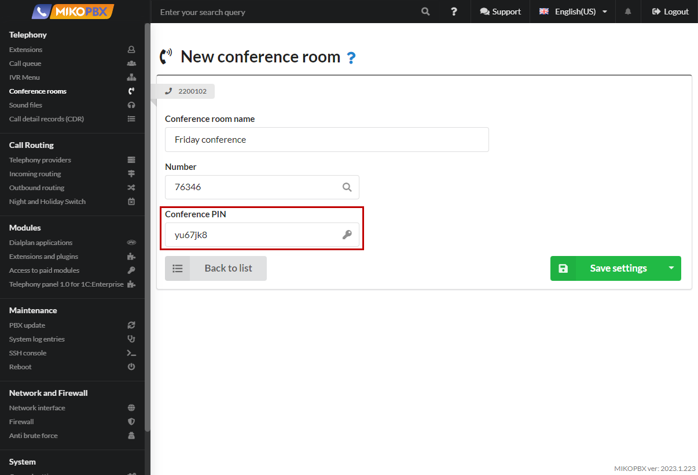
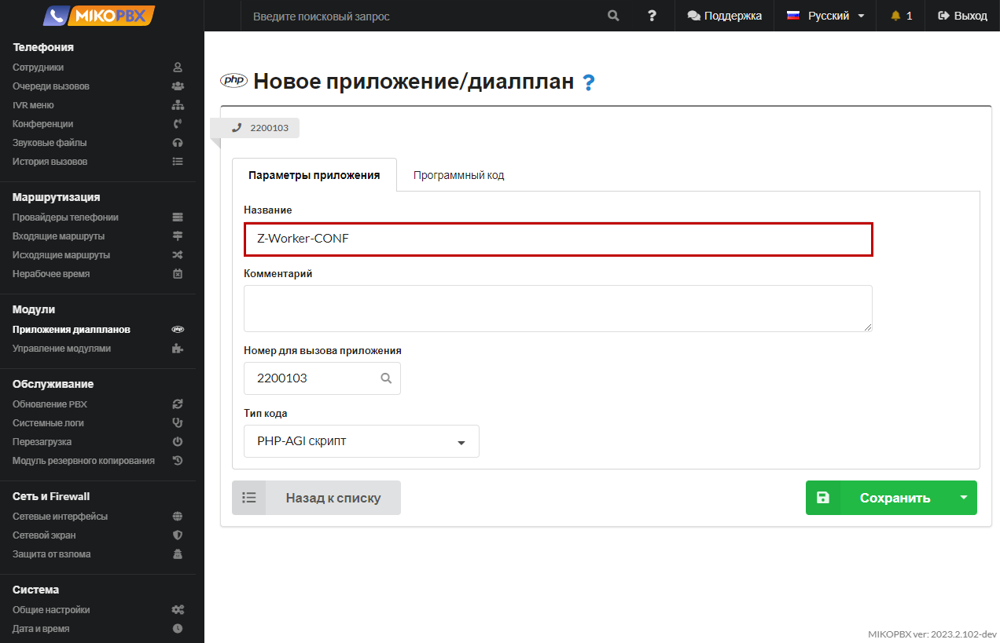
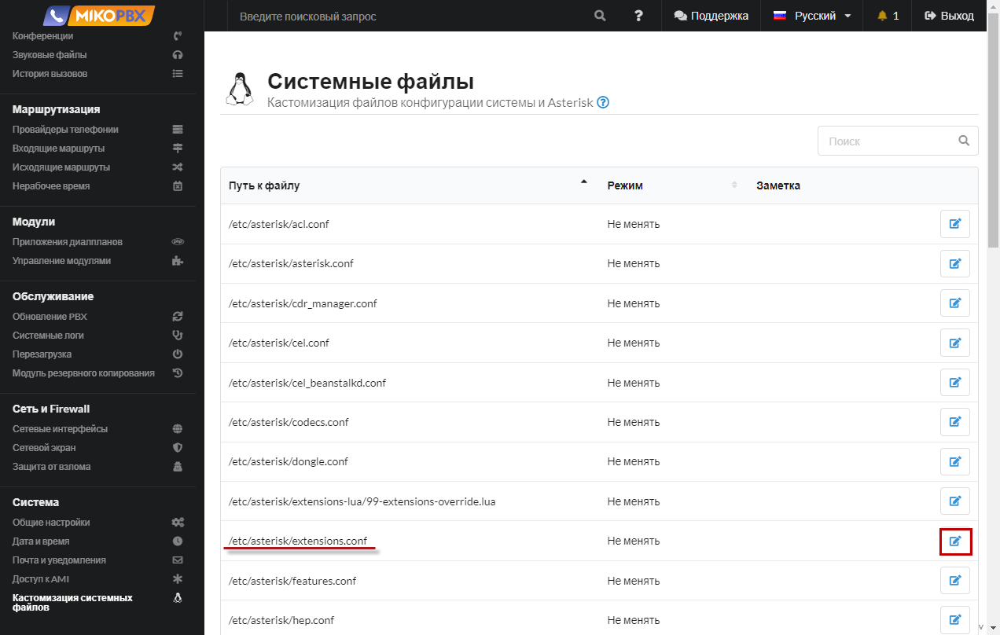

# Звонки на экстренные номера


Необходимо иметь возможность звонить на экстренные номера 101, 102, 103, 112 и т.д.


1. Переходим в раздел **Маршрутизация** → **Исходящие маршруты**.&#x20;

<figure><figcaption><p>Раздел "<a href="../../manual/routing/outbound-routes.md">Исходящие маршруты</a>"</p></figcaption></figure>

2. Добавляем новое правило

<figure><figcaption><p>Добавление нового правила </p></figcaption></figure>

3. &#x20;Заполняем параметры как на скриншоте ниже:

<figure><figcaption><p>Параметры для правила "Звонки на экстренные номера"</p></figcaption></figure>

4. Звонки на экстренные номера направляете через произвольного провайдера. Провайдер **должен поддерживать** набор экстренных номеров. Приоритет данного правила должен быть наивысшим, т.е. в списке созданных исходящих маршрутов он должен быть описан первым.

<figure><figcaption><p>Указание приоритета для звонков на экстренные номера </p></figcaption></figure>

5. &#x20;Перейдите в раздел **Система** → **Кастомизация системных файлов**.

<figure><figcaption><p>Раздел "Кастомизация системных файлов"</p></figcaption></figure>

6. Откройте для редактирования конфигурационный файл **extensions.conf**.

<figure><figcaption><p>Редактирование файла "extensions.conf"</p></figcaption></figure>

7. Установите режим «**Добавлять в конец файла**». В черное окно добавьте следующий фрагмент кода:

```php
[internal](+)
exten => _1XX,1,Goto(outgoing,${EXTEN},1)	
```

<figure><figcaption><p>Добавление кода в конец файла</p></figcaption></figure>

В выше приведенном фрагменте кода мы описали правила для всех трехзначных номеров, начинающихся с 1. Если нужно указать конкретные экстренные номера, то вместо выше представленного кода нужно вставить следующие строки:

```php
[internal](+)
exten => 112,1,Goto(outgoing,${EXTEN},1)
exten => 101,1,Goto(outgoing,${EXTEN},1)
exten => 102,1,Goto(outgoing,${EXTEN},1)
exten => 103,1,Goto(outgoing,${EXTEN},1)
```
