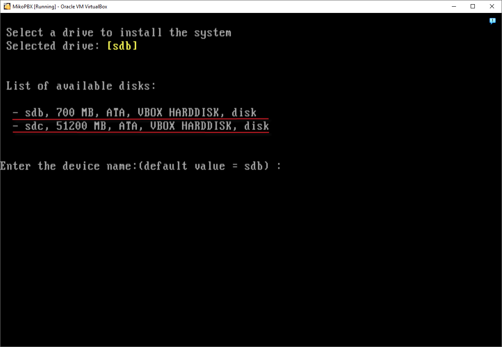

# Билайн

## Настройка в личном кабинете Билайн <a href="#nastrojka_v_lichnom_kabinete_zadarma_novofon" id="nastrojka_v_lichnom_kabinete_zadarma_novofon"></a>

1. Перейдите на главную страницу Облачной АТС Билайн

<figure><figcaption></figcaption></figure>

2. Создайте многоканальный номер

<figure><figcaption></figcaption></figure>

3. Перейдите во вкладку "**Номера сотрудников**"

<figure><figcaption></figcaption></figure>

4. Нажмите "**+Номера сотрудников**"

<figure><figcaption></figcaption></figure>

5. Выберите **"Загрузить SIP-сотрудников без номера"**&#x20;

Нажмите "**Загрузить номера**"&#x20;

<figure><figcaption></figcaption></figure>

6. Выберите внутренний номер для сотрудника и нажмите "**Подключить номера**"

<figure><figcaption></figcaption></figure>

7. Нажмите на только что созданного сотрудника&#x20;

<figure><figcaption></figcaption></figure>

8. Перейдите во вкладку "**Настройки**"

Данные, обведенные ниже понадобятся для авторизации провайдера в MikoPBX

<figure><figcaption></figcaption></figure>

9. Заполните поле "**Пароль**"

<figure><figcaption></figcaption></figure>

## Подключение провайдера в MikoPBX <a href="#podkljuchenie_provajdera_v_mikopbx" id="podkljuchenie_provajdera_v_mikopbx"></a>

1. Переходим в раздел **Маршрутизация** → **Провайдеры телефонии**, нажимаем на кнопку «**Подключить SIP**»

<figure><figcaption></figcaption></figure>

2. Указываем настройки подключения, как показано на скриншоте ниже:

* **Логин** - логин SIP-учетной записи пользователя Билайн
* **Пароль** - пароль SIP-учетной записи пользователя Билайн

<figure><figcaption></figcaption></figure>

3. Перейдите в расширенные настройки

<figure><figcaption></figcaption></figure>

4. Заполните поле «**Outbound proxy**»

```
ip.beeline.ru\;lr
```

<figure><figcaption></figcaption></figure>

5. В поле «**Дополнительные параметры**» добавьте текст (необходимо подставить свои данные)

```
[registration-auth]
username=SIP01XXXXXXXXX@ip.beeline.ru

[endpoint-auth]
username=SIP01XXXXXXXXX@ip.beeline.ru
```

<figure><figcaption></figcaption></figure>

Результатом успешного подключения является зеленый индикатор.

<figure><figcaption></figcaption></figure>


В некоторых случаях, если не работают исходящие, помогает добавление в поле «**Дополнительные параметры**»

```
[endpoint]
outbound_proxy=;
```


<figure><figcaption></figcaption></figure>

## Настройка входящей маршрутизации <a href="#nastrojka_vxodjaschej_marshrutizacii" id="nastrojka_vxodjaschej_marshrutizacii"></a>

1. Чтобы можно было принять первый входящий звонок через провайдера Novofon, необходимо описать правила для входящего вызова. Для этого переходим в раздел **Маршрутизация** → **Входящие маршруты**. Нажимаем на кнопку «**Добавить новое правило**».

<figure><figcaption></figcaption></figure>

2. Выбираем провайдера Билайн и указываем на какой номер направляем все входящие звонки через этого провайдера. В нашем примере все вызова мы направили на сотрудника с внутренним номером 202, Вы можете выбрать очередь вызовов / IVR-меню. Подробнее о входящих маршрутах описано [здесь](../../manual/routing/incoming-routes.md).

<figure><figcaption></figcaption></figure>

## Исходящая маршрутизация <a href="#isxodjaschaja_marshrutizacija" id="isxodjaschaja_marshrutizacija"></a>

Чтобы внешние исходящие звонки осуществлялись через Билайн нужно настроить исходящую маршрутизацию.

1. Переходим **Маршрутизация** → **Исходящие маршруты**. Нажимаем на кнопку «**Добавить новое правило**».

<figure><figcaption></figcaption></figure>

2. Настройка как на скриншоте означает, что если номер начинается с **«7»** или **«8»** и остальная часть содержит 10 цифр, звонок будет осуществляться через провайдера Билайн.\
   Подробнее про настройку исходящих маршрутов можно прочитать [здесь.](../../manual/routing/outbound-routes.md)

<figure><figcaption></figcaption></figure>


В некоторых случаях, если не работают исходящие, помогает добавление в поле «**Дополнительные параметры**»

```
[endpoint]
outbound_proxy=;
```

