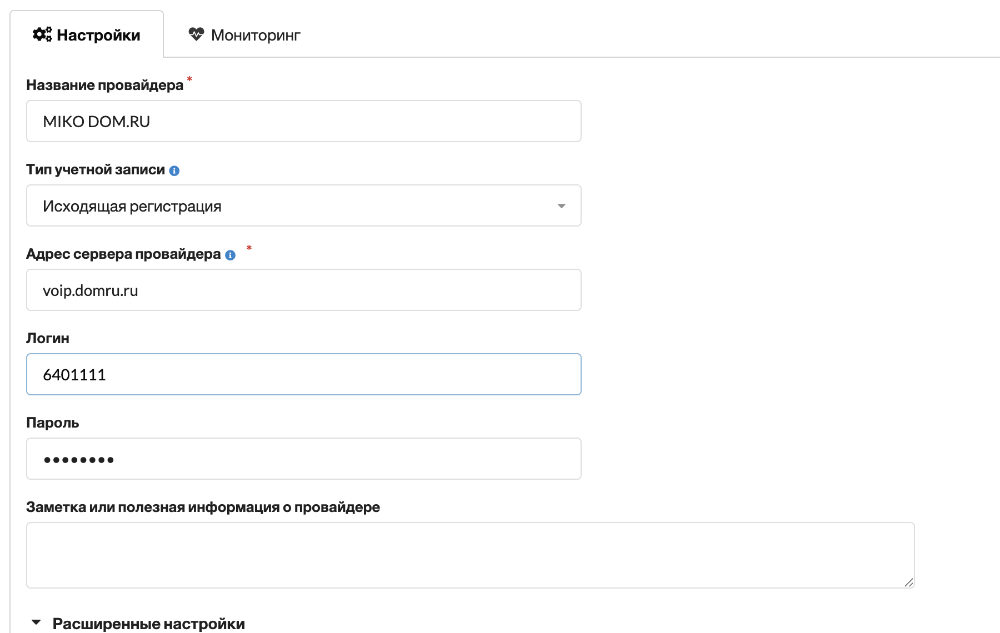
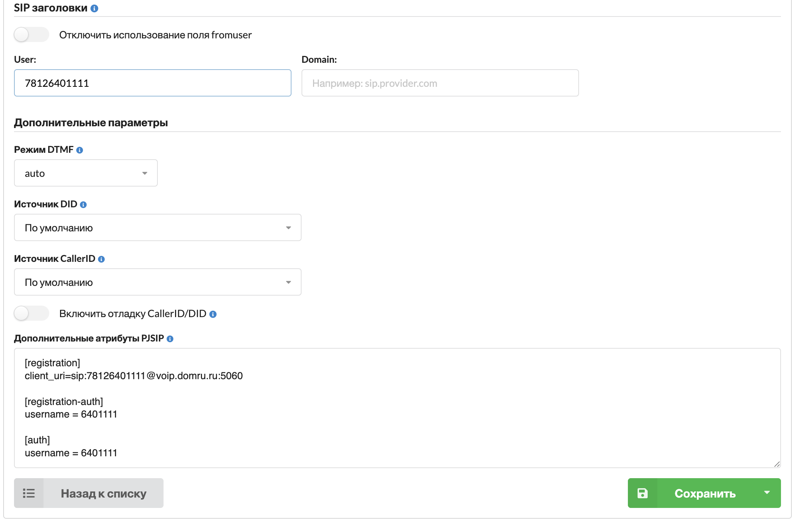
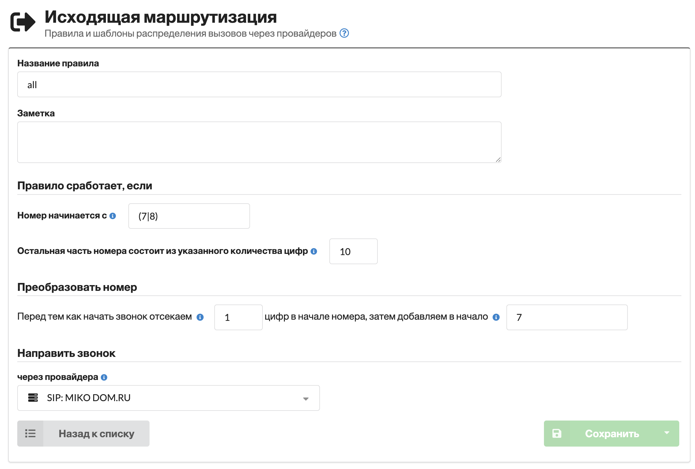
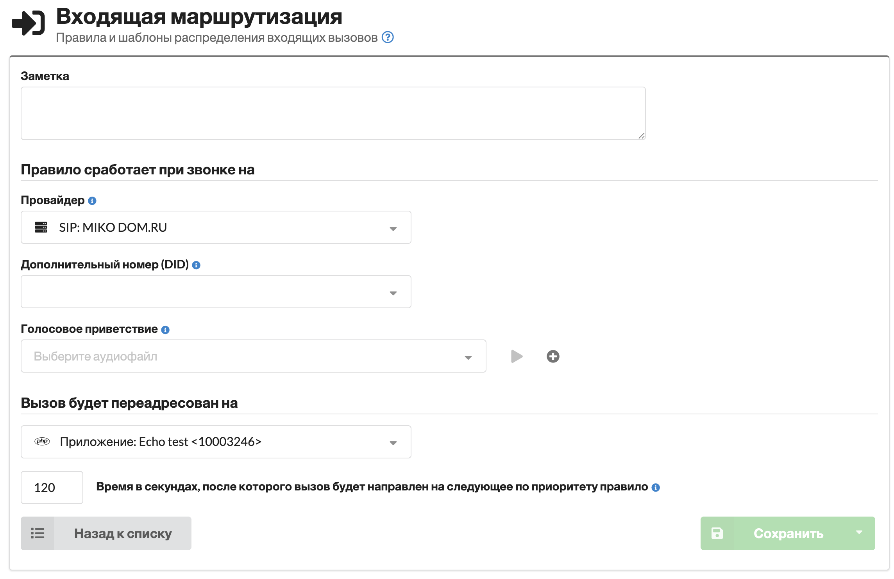

# domru.ru

Провайдер обычно присылает следующие параметры для подключения:

* — короткий номер, пример **6401111**
* — 11ти значный номер, пример **74852231111**
* **voip.domru.ru** — адрес для подключения (188.234.136.49)
* **пароль** для подключения

## Пример настройки провайдера



**Перейдите в web-интерфейс MikoPBX**



**Создайте нового провайдера**

[см. раздел Провайдеры телефонии](https://wiki.mikopbx.ru/providers)



**Укажите наименование**

Например, «**MIKO Dom.ru**»



**Заполните поле «Хост»**

[**voip.domru.ru**](http://voip.domru.ru/)



**В качестве логина укажите короткий номер**

К примеру **6401111**



**Заполните пароль**







**Перейдите в «Расширенные настройки»**



**Заполните User**

11ти значный номер телефона, к примеру **74852231111**



**Заполните поле «Дополнительные атрибуты PJSIP»**





Пример дополнительных атрибутов:

```ini
[registration]
client_uri=sip:78126401111@voip.domru.ru:5060

[registration-auth]
username = 6401111

[auth] 
username = 6401111
```



## Настройка маршрутизации



**Опишите исходящий маршрут**

Пример для РФ:







**Опишите входящий маршрут**







**В данном примере входящие направлены на эхо тест**



Во входящем маршруте можно уточнить DID номер, это коротки номер телефона, к примеру **6401111**, актуально, если подключаете несколько номеров от одного провайдера.


