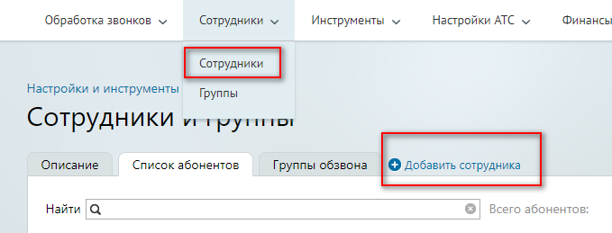
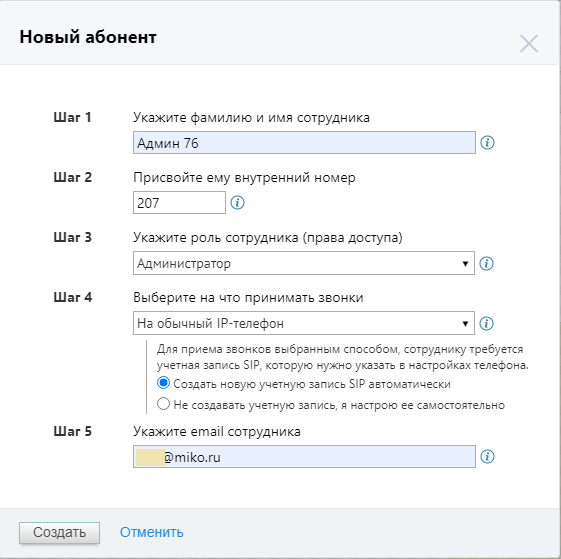
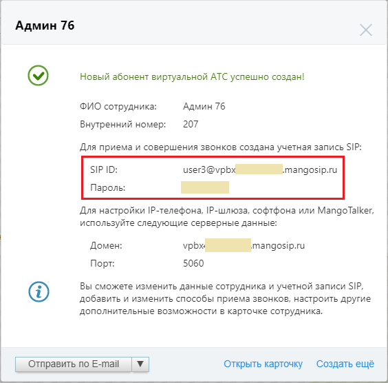
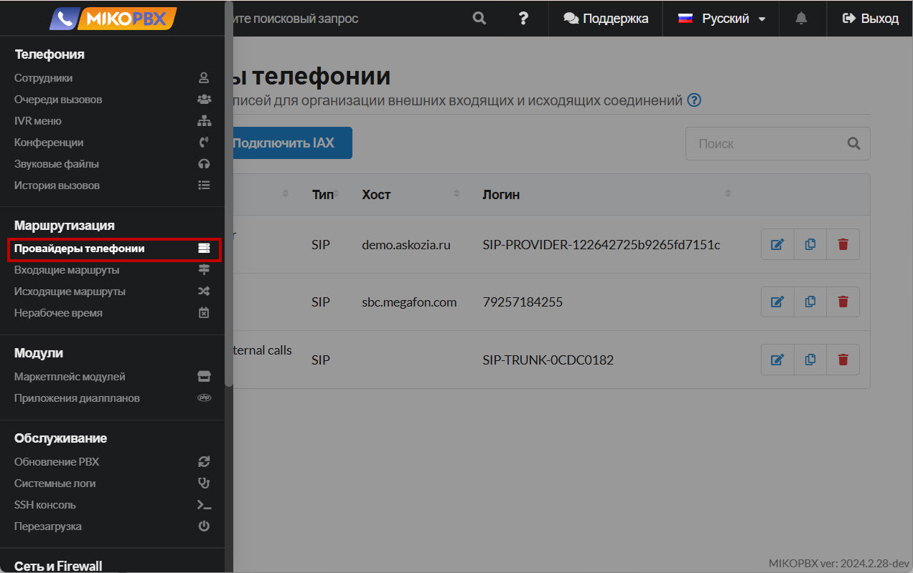
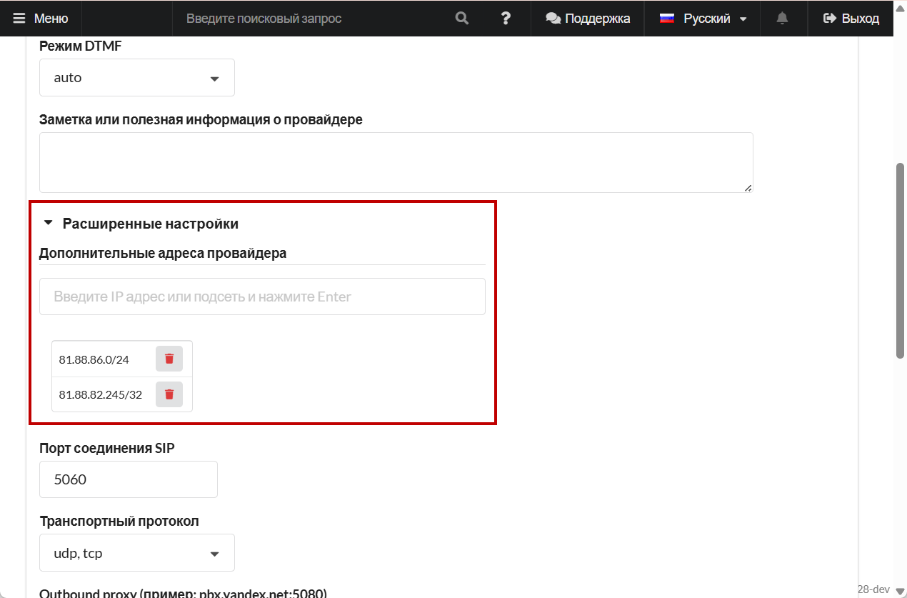

# Mango

### Настройка в личном кабинете Mango Office 

1. Авторизуйтесь в [личном кабинете Mango](https://lk.mango-office.ru/). Подключите номер в личном кабинете.
2. Добавьте в личном кабинете учетную запись сотрудника.

<figure><figcaption>
Добавление нового сотрудника в ЛК Mango Office
</figcaption></figure>

3. Укажите параметры сотрудника, укажите в качестве роли - администратор.

<figure><figcaption>
Параметры нового сотрудника
</figcaption></figure>

4. Для созданного сотрудника должна быть автоматически создана SIP-учетная запись. Сохраните эти данные, они понадобятся нам для подключения провайдера в MikoPBX.

<figure><figcaption>
Данные для подключения провайдера
</figcaption></figure>

5. Перейдите на вкладку "**Обработка звонков"** → "**Голосовое меню и распределение звонков"**. Для подключенного номера направьте все входящие звонки на созданного вами сотрудника «**Админ 76**».

<figure><figcaption>
Настройки обработки звонков
</figcaption></figure>

6. Переходим в настройки SIP-учетной записи для сотрудника «Админ 76». **Общие настройки** → **Настройки SIP**, вкладка «**Учетные записи и домены SIP**»

<figure><figcaption>
Вкладка «Учетные записи и домены SIP»
</figcaption></figure>

Следующие данные будут использованы для SIP-подключения:

<figure><figcaption>
Параметры для SIP авторизации
</figcaption></figure>

### Подключение провайдера в веб-интерфейсе MikoPBX 

1. Перейдите в раздел "**Провайдеры телефонии**".

<figure><figcaption>
Раздел "Провайдеры телефонии"
</figcaption></figure>

2. Нажмите "**Подключить SIP**" для подключение провайдера.

<figure><figcaption>
Элемент "Подключить SIP"
</figcaption></figure>

3. Укажите параметры подключения:

* **Название** - произвольное.
* **Хост или IP адрес** - IP-адрес из личного кабинета Mango.
* **Логин** - логин из личного кабинета Mango.

<figure><figcaption>
Параметры для SIP-подключения
</figcaption></figure>

4. Перейдите в "**Расширенные настройки**". В поле "**Дополнительные адреса провайдера"** - добавьте две подсети «**81.88.86.0/24**» и «**81.88.82.245/32**». Для этого введите первый адрес в поле ввода, нажмите «Enter», он отобразится ниже. Таким же образом введите второй адрес. Это пул адресов Mango, с них могут поступать входящие вызовы. Сохраните настройки провайдера.

<figure><figcaption>
Параметры для SIP-подключения
</figcaption></figure>

Результатом успешного подключения является зеленый индикатор.

<figure><figcaption>
Успешное подключение провайдера
</figcaption></figure>
