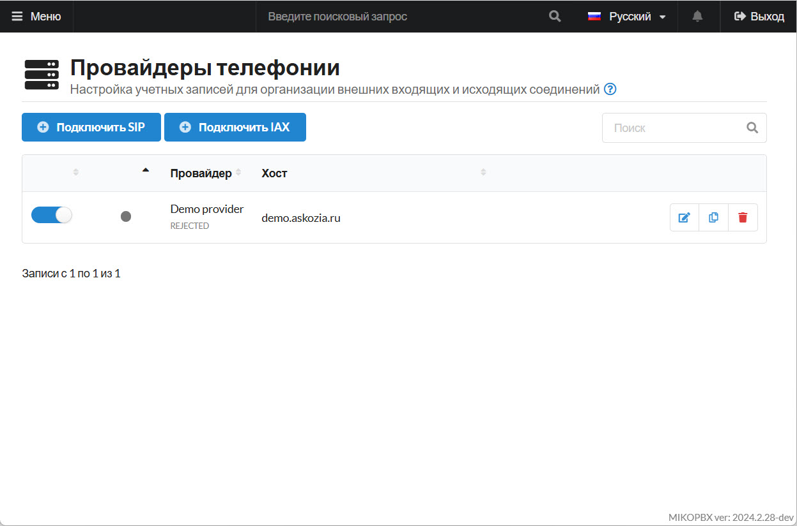
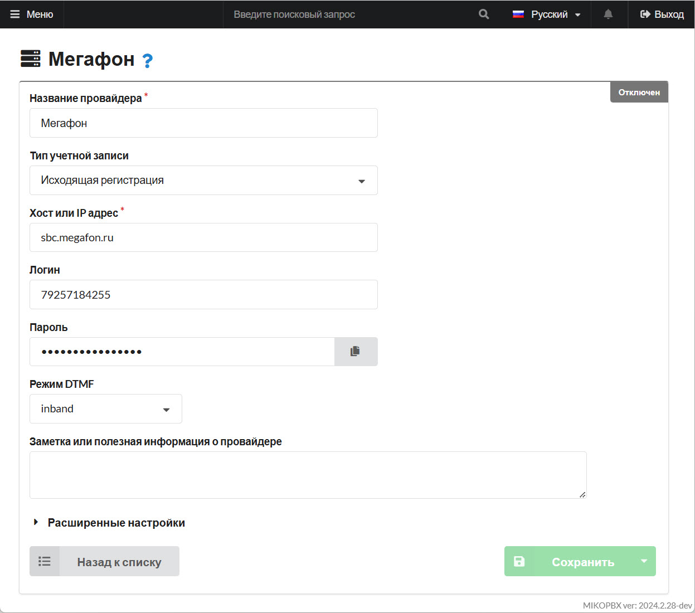
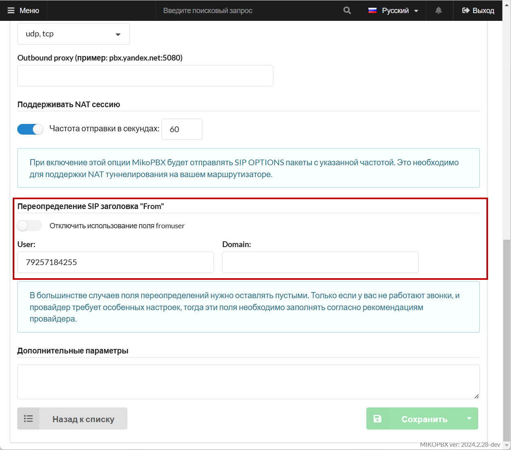

# Мегафон

Описание услуги доступно по на [официальном сайте](https://multifon.megafon.ru/).

Для подключения услуги нужно набрать на мобильном телефоне номер `*137#`.&#x20;

Вам придет сообщение с запросом на подключение услуги: **1** - подключить, **0** - отказаться. Отправьте **1**.&#x20;

Когда услуга будет подключена, вам будет направлена SMS с логин  и пароль:

`Услуга "МультиФон Бизнес" подключена! Логин - 7922XXXXXXX, пароль - XXXXXXXXX.`

#### Настройка маршрутизации входящих звонков

Откройте в браузере ссылку:&#x20;

`https://sm.megafon.ru/sm/client/routing?login=MSISDN&password=Pass&routing=2`

Параметры:

* `login`— логин (номер телефона) из sms;
* `password` — пароль из sms;
* `routing` — вызов в приоритете будет направлен на SIP, в случае неудачи - на GSM.

Документаци по API доступна по [ссылке](https://moscow.megafon.ru/corporate/help/faq/services/mfon_biznes/upravlenie/api).

Документаци по подключению услуги "Мультифон" доступно по [ссылке](https://moscow.megafon.ru/corporate/help/faq/services/mfon_biznes/podklyuchenie_otklyuchenie).

## Настройка провайдера

1. Перейдите в раздел "**Маршрутизация**" -> "**Провайдеры телефонии**".

<figure><figcaption>
Раздел "Провайдеры телефонии"
</figcaption></figure>

2. Нажмите "**Подключить SIP**":

<figure><figcaption>
"Подключить SIP"
</figcaption></figure>

3. Заполните необходимые данные:

* **Название провайдера** - произвольное
* **Тип учетной записи** - "Исходящая регистрация"
* **Хост или IP адрес** - "sbc.megafon.ru"
* **Логин** - номер телефона, полученный в SMS при подключениии услуги
* **Пароль** - пароль, полученный в SMS при подключениии услуги
* **Режим DTMF** - "inband"

<figure><figcaption>
Параметры провайдера
</figcaption></figure>

4. Перейдите в "**Расширенные настройки**", заполните поле "**User**" в подразделе "**Переопределение SIP-заголовка "From"**" Вашим номером телефона (продублировать используемый номер"

<figure><figcaption>
Дополнительные параметры
</figcaption></figure>

После сохранения настроек произойдет соединение. Далее настройте [Входящую ](../../manual/routing/incoming-routing.md)и [Исходящую ](../../manual/routing/outbound-routing.md)маршрутизацию.
