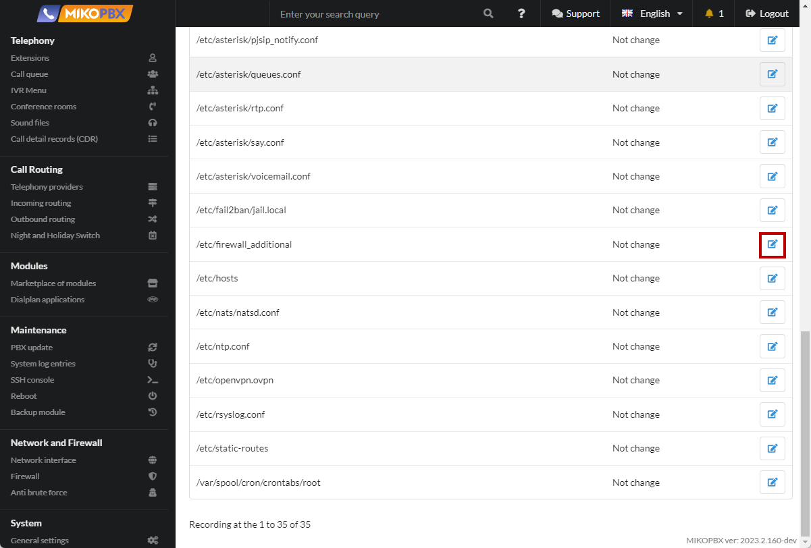

# Fine-tuning the firewall

When publishing a PBX on a public IP address, the task arises to protect the speaker from scanners, pests who are trying to pick up passwords to SIP PBX accounts. If a simple numeric password is set, it will be picked up very quickly, which will cause losses.

For basic protection against scanners, fail2ban must be enabled. Additionally, you can fine-tune the iptables rules.

1. Go to the "**System file customization**" section

<figure><figcaption><p>"System file customization" section</p></figcaption></figure>

2. Go to edit the **/etc/firewall\_additional** file

<figure><figcaption><p>File "/etc/firewall_additional"</p></figcaption></figure>

3. Set the "**Add to end of file**" mode, insert the following code:

```php
iptables -I INPUT 2 -p udp -m udp --dport 5060 -m string --string 'friendly-scanner' --algo bm --to 65535 -j DROP
```

