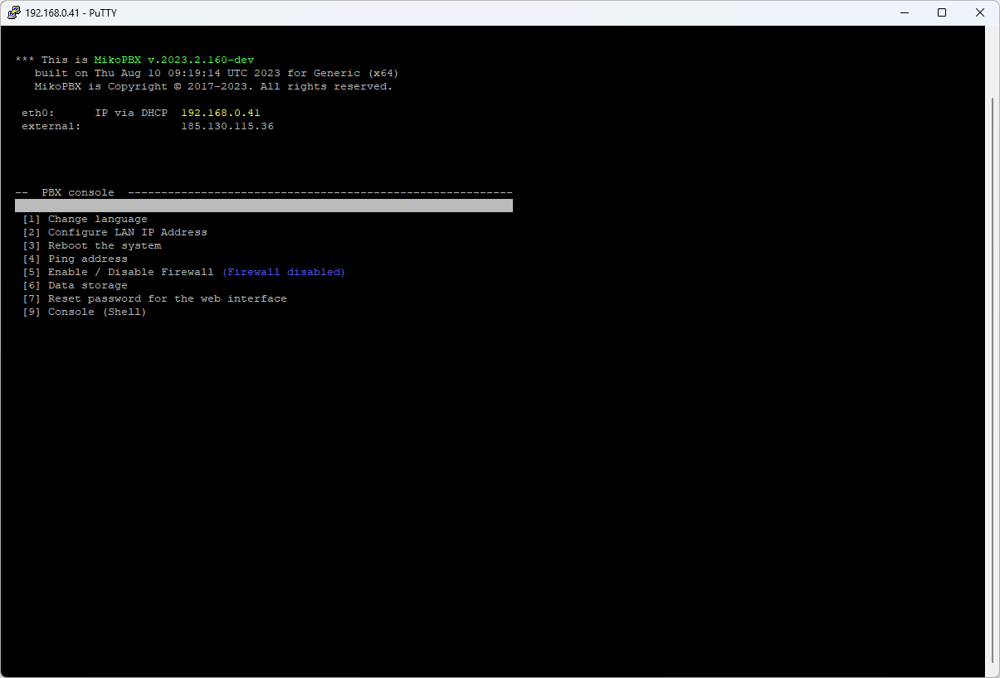
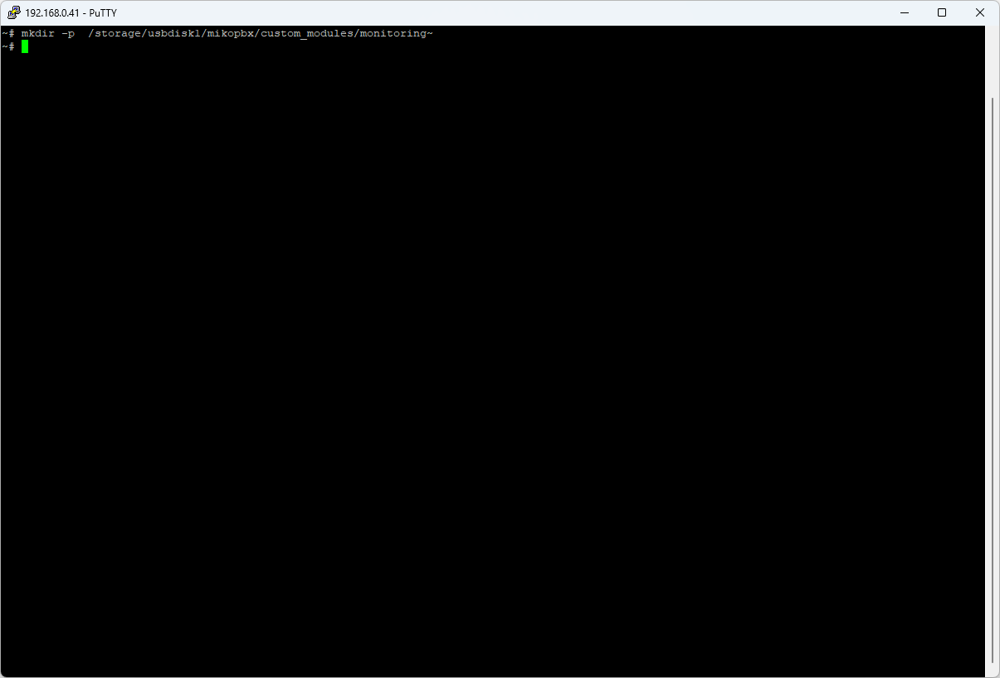

# Мониторинг провайдеров на MikoPBX

При работе с поставщиками услуг связи периодически могут возникать проблемы. К примеру сервер поставщика не отвечает / не доступен. В рамках данной статьи будет предложен механизм оповещения на email системного администратора.

1. Подключитесь к АТС [с помощью SSH-клиента](../troubleshooting/connecting-to-a-pbx-using-an-ssh-client.md)

<figure><figcaption><p>SSH подключение</p></figcaption></figure>

2. Создадим каталог для хранения скриптов:

```php
mkdir -p  /storage/usbdisk1/mikopbx/custom_modules/monitoring
```

<figure><figcaption></figcaption></figure>

3. Создадим новый файл nano:

```php
/storage/usbdisk1/mikopbx/custom_modules/monitoring/prodiders.php
```
