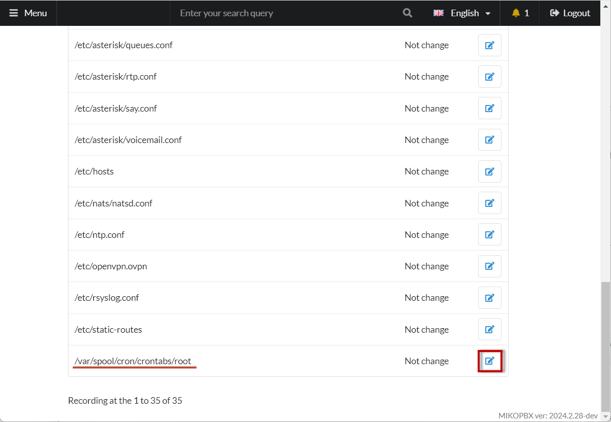
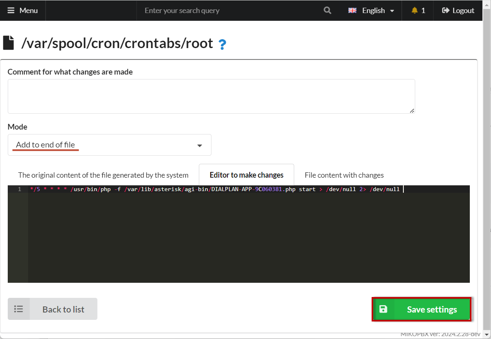

# Monitoring Providers on MikoPBX

When working with telecom service providers, issues may occasionally arise. For example, the provider's server might become unresponsive or unavailable. This article provides a mechanism for notifying the system administrator via email.


To enable notifications, you will need to configure the SMTP client. See instructions in the section "Mail and Notifications".


1. Create a new "Dialplan Application".

<figure><figcaption><p>Creating a new dialplan application</p></figcaption></figure>

2. Enter a name (e.g., Blacklist), a short number for the application (e.g., 99), and select "**Code Type**" - "**PHP AGI Script**".

<figure><figcaption><p>Parameters of dialplan</p></figcaption></figure>

3. Go to the "Program Code" tab:

<figure><figcaption></figcaption></figure>

4. Insert the following code:

```php
<?php
use MikoPBX\Common\Models\PbxSettings;
use MikoPBX\Common\Models\LanInterfaces;
use MikoPBX\Core\System\Notifications;
use MikoPBX\PBXCoreREST\Lib\SIPStackProcessor;

require_once 'Globals.php';

$result = SIPStackProcessor::callBack(['action' => 'getRegistry']);
$adminMail = null;
$localIP = '';
$message = '';
foreach ($result->data as $provider) {
    if ($provider['state'] !== 'OFF' && $provider['state'] !== 'REGISTERED') {
        if ($adminMail === null) {
            $adminMail = PbxSettings::getValueByKey('SystemNotificationsEmail');
            $interfaces = LanInterfaces::find("disabled='0'");
            foreach ($interfaces as $interface) {
                if (!empty($interface->ipaddr)) {
                    $localIP = $interface->ipaddr;
                    break;
                }
            }
        }
        $message .= "Provider state: {$provider['state']}<br>" . "Url (local): ']} <br><br>";
    }
}

if (!empty($message) && !empty($adminMail)) {
    $notify = new Notifications();
    try {
        $notify->sendMail($adminMail, 'Provider invalid state...', $message);
    } catch (\Throwable $e) {
    }
}
```

5. Save the changes and copy the dialplan application identifier from the browser's address bar. It will look like "**DIALPLAN-APP-CF967EE0**".

<figure><figcaption><p>Identificator of dialplan application</p></figcaption></figure>

6. Go to **System** → **Customizing System Files** and open the file **/var/spool/cron/crontabs/root** for editing.

<figure><figcaption><p>File for editing</p></figcaption></figure>

7. Select the mode "**Append to the end of the file**", and in the black editing field at the bottom, insert the following code:


Adjust the file name according to your dialplan application identifier "**DIALPLAN-APP-CF967EE0**


```php
*/5 * * * * /usr/bin/php -f /var/lib/asterisk/agi-bin/DIALPLAN-APP-9С060381.php start > /dev/null 2> /dev/null 
```

Save the changes.

<figure><figcaption></figcaption></figure>

You're done!
