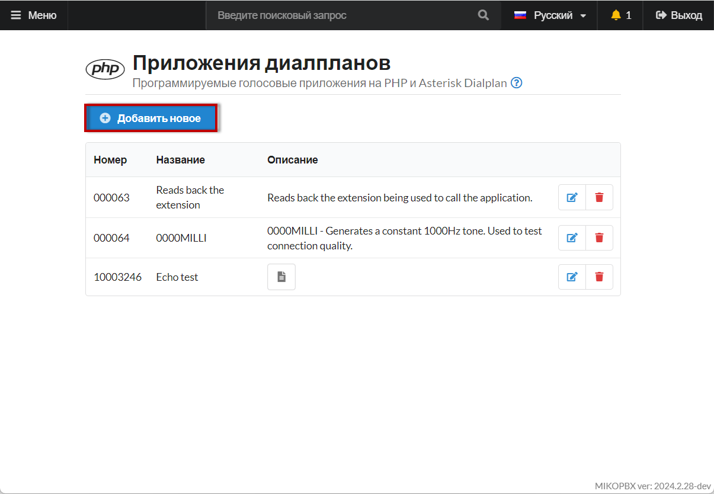
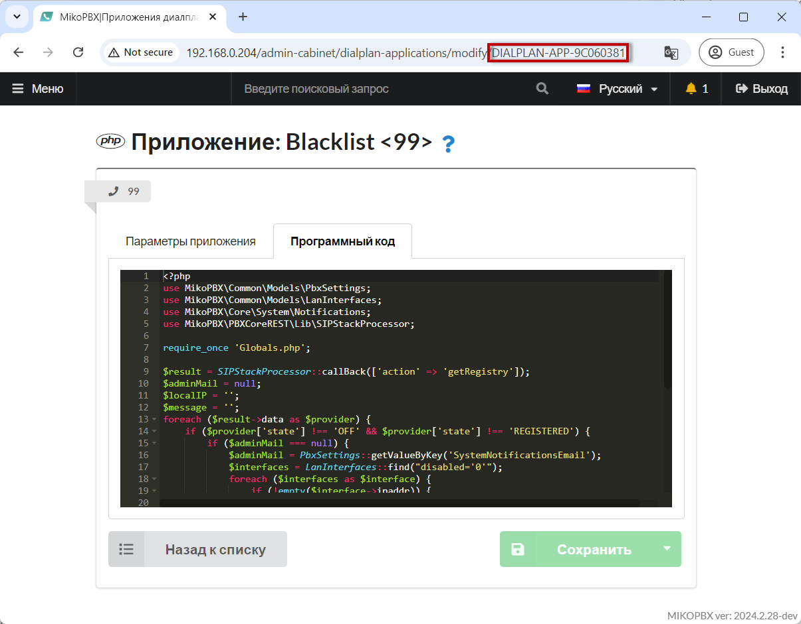
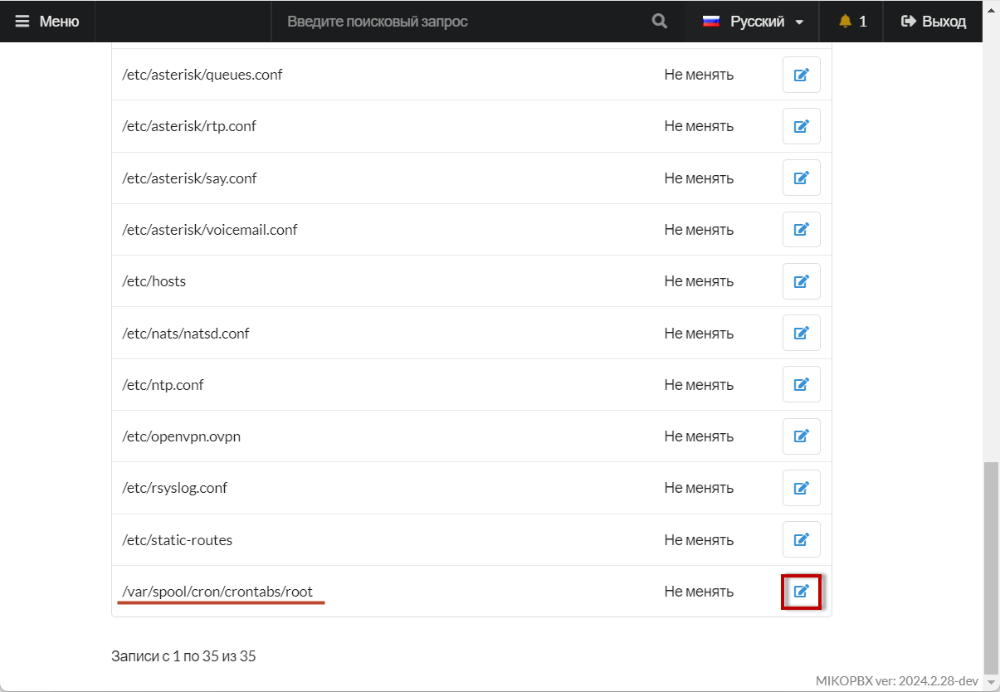
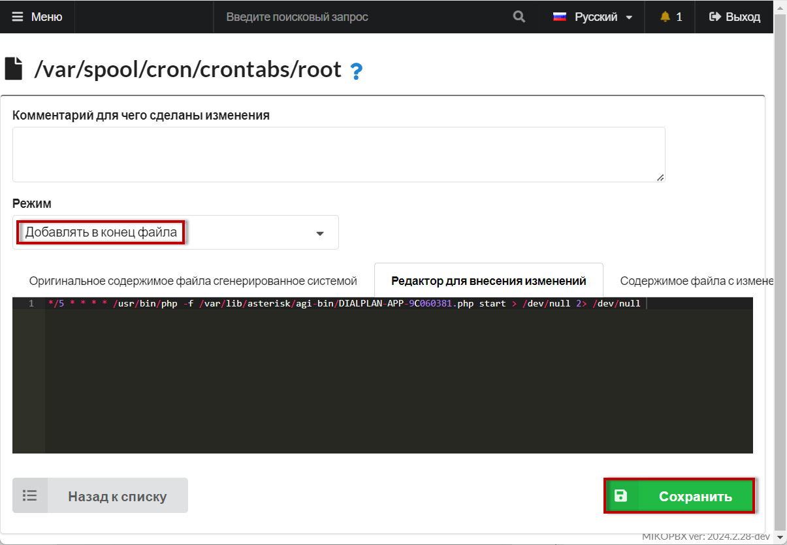

# Мониторинг провайдеров на MikoPBX

При работе с поставщиками услуг связи периодически могут возникать проблемы. К примеру сервер поставщика не отвечает / не доступен. В рамках данной статьи будет предложен механизм оповещения на email системного администратора.


Для работы оповещений потребуется настроить SMTP клиент. См. инструкции в разделе «[Почта и уведомления](../../manual/system/mail-settings/)»


1. Создайте новое «[Приложение диалплан](../../manual/modules/dialplan-applications.md)[а](../../manual/modules/dialplan-applications.md)».

<figure><figcaption><p>Создание нового приложения диалплана</p></figcaption></figure>

2. Укажите название - например, Provider Monitoring, короткий номер для приложения, к примеру 99, а так жу выберите «**Тип кода**» - «**PHP AGI Скрипт**»

<figure><figcaption><p>Параметры диалплана</p></figcaption></figure>

3. Перейдите во вкладку "Программный код":

<figure><figcaption><p>Раздел "Программный код"</p></figcaption></figure>

4. Вставьте код:

```php
<?php
use MikoPBX\Common\Models\PbxSettings;
use MikoPBX\Common\Models\LanInterfaces;
use MikoPBX\Core\System\Notifications;
use MikoPBX\PBXCoreREST\Lib\SIPStackProcessor;

require_once 'Globals.php';

$result = SIPStackProcessor::callBack(['action' => 'getRegistry']);
$adminMail = null;
$localIP = '';
$message = '';
foreach ($result->data as $provider) {
    if ($provider['state'] !== 'OFF' && $provider['state'] !== 'REGISTERED') {
        if ($adminMail === null) {
            $adminMail = PbxSettings::getValueByKey('SystemNotificationsEmail');
            $interfaces = LanInterfaces::find("disabled='0'");
            foreach ($interfaces as $interface) {
                if (!empty($interface->ipaddr)) {
                    $localIP = $interface->ipaddr;
                    break;
                }
            }
        }
        $message .= "Provider state: {$provider['state']}<br>" . "Url (local): ']} <br><br>";
    }
}

if (!empty($message) && !empty($adminMail)) {
    $notify = new Notifications();
    try {
        $notify->sendMail($adminMail, 'Provider invalid state...', $message);
    } catch (\Throwable $e) {
    }
}
```

5. Сохраните изменения и скопируйте идентификатор приложения из адресной строки браузера, он имеет вид «**DIALPLAN-APP-9С060381**»

<figure><figcaption><p>Идентификатор приложения диалплана</p></figcaption></figure>

6. Перейдите в раздел **Система** → **Кастомизация системных файлов**, откройте для редактирования файл **/var/spool/cron/crontabs/root**

<figure><figcaption><p>Необходимый файл для редактирования </p></figcaption></figure>

7. Выберите режим **«Добавлять в конец файла»**, внизу в черное поле для редактирования вставьте следующий код:


Скорректируйте имя файла согласно вашему идентификатору приложения «**DIALPLAN-APP-9С060381**»


```
*/5 * * * * /usr/bin/php -f /var/lib/asterisk/agi-bin/DIALPLAN-APP-9С060381.php start > /dev/null 2> /dev/null 
```

Сохраните изменения.&#x20;

<figure><figcaption></figcaption></figure>

Готово!
