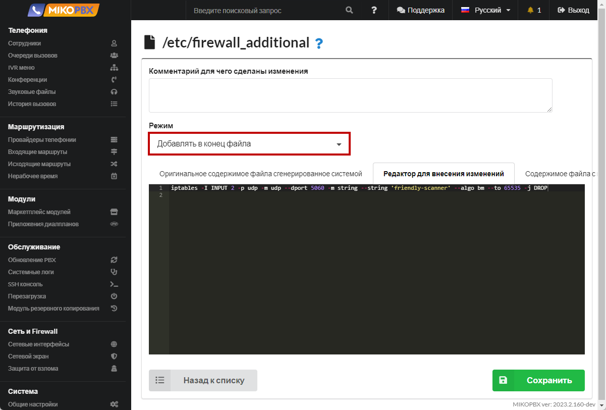

# Тонкая настройка firewall

При публикации АТС на публичном IP адресе возникает задача по защите АТС от сканеров, вредителей, кто пытается подобрать пароли к SIP учетным записям АТС. Если установлен простой числовой пароль, то он будет подобран очень быстро, что повлечет убытки.

Для базовой защиты от сканеров обязательно следует включить fail2ban. Дополнительно, можно более тонко настроить правила iptables.

1. Перейдите в раздел "**Кастомизация системных файлов**"

<figure><figcaption><p>Раздел "Кастомизация системных файлов"</p></figcaption></figure>

2. Перейдите к редактированию файла **/etc/firewall\_additional**

<figure><figcaption><p>Файл "/etc/firewall_additional" </p></figcaption></figure>

3. Установите режим "**Добавлять в конец файла**", вставьте следующий код:

```php
iptables -I INPUT 2 -p udp -m udp --dport 5060 -m string --string 'friendly-scanner' --algo bm --to 65535 -j DROP
```

<figure><figcaption><p>Код для файла  "/etc/firewall_additional"</p></figcaption></figure>


Добавленное правило позвонил блокировать все входящие запросы по UDP протоколу, которые содержать подстроку «**friendly-scanner**»


Более полный пример набора правил:

```php
iptables -I INPUT 2 -p udp -m udp --dport 5060 -m string --string 'sipcli' --algo bm --to 65535 -j DROP
iptables -I INPUT 2 -p udp -m udp --dport 5060 -m string --string 'sip-scan' --algo bm --to 65535 -j DROP
iptables -I INPUT 2 -p udp -m udp --dport 5060 -m string --string 'iWar' --algo bm --to 65535 -j DROP
iptables -I INPUT 2 -p udp -m udp --dport 5060 -m string --string 'sipvicious' --algo bm --to 65535 -j DROP
iptables -I INPUT 2 -p udp -m udp --dport 5060 -m string --string 'sipsak' --algo bm --to 65535 -j DROP
iptables -I INPUT 2 -p udp -m udp --dport 5060 -m string --string 'sundayddr' --algo bm --to 65535 -j DROP
iptables -I INPUT 2 -p udp -m udp --dport 5060 -m string --string 'VaxSIPUserAgent' --algo bm --to 65535 -j DROP
iptables -I INPUT 2 -p udp -m udp --dport 5060 -m string --string 'friendly-scanner' --algo bm --to 65535 -j DROP

iptables -I INPUT 2 -p tcp -m tcp --dport 5060 -m string --string 'sipcli' --algo bm --to 65535 -j DROP
iptables -I INPUT 2 -p tcp -m tcp --dport 5060 -m string --string 'sip-scan' --algo bm --to 65535 -j DROP
iptables -I INPUT 2 -p tcp -m tcp --dport 5060 -m string --string 'iWar' --algo bm --to 65535 -j DROP
iptables -I INPUT 2 -p tcp -m tcp --dport 5060 -m string --string 'sipvicious' --algo bm --to 65535 -j DROP
iptables -I INPUT 2 -p tcp -m tcp --dport 5060 -m string --string 'sipsak' --algo bm --to 65535 -j DROP
iptables -I INPUT 2 -p tcp -m tcp --dport 5060 -m string --string 'sundayddr' --algo bm --to 65535 -j DROP
iptables -I INPUT 2 -p tcp -m tcp --dport 5060 -m string --string 'VaxSIPUserAgent' --algo bm --to 65535 -j DROP
iptables -I INPUT 2 -p tcp -m tcp --dport 5060 -m string --string 'friendly-scanner' --algo bm --to 65535 -j DROP
```

Это обезопасит от большинства сканеров, которые при запросе упоминаю User-Agent.
