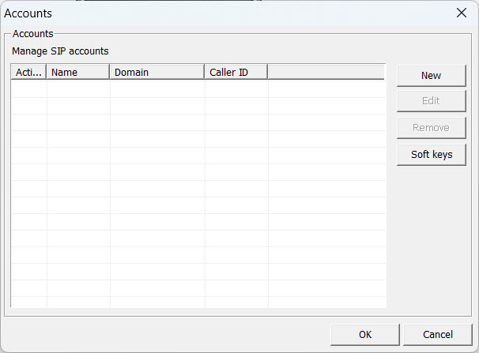
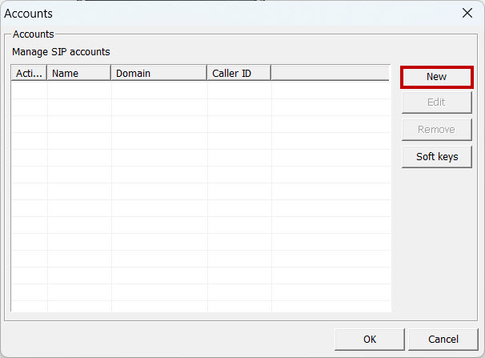
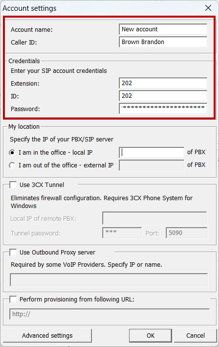
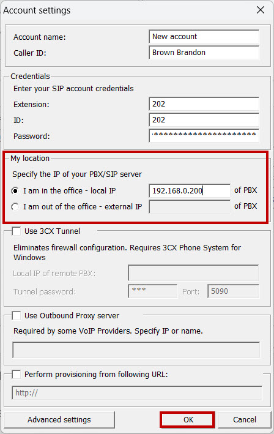
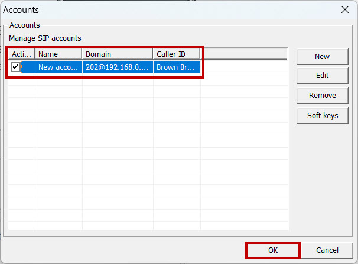

# 3CX Softphone

**3CX** — это SIP софтфон, предназначенный для бизнеса, который обеспечивает голосовые и видеозвонки, а также поддержку многоканальных звонков и конференц-связи.&#x20;

<figure><figcaption>
Интерфейс софтфона 3CX
</figcaption></figure>

1. Скачайте и установите софтфон с оффициального сайта ([ссылка](https://www.3cx.com/voip/softphone/)).

<figure><figcaption>
Стартовое окно
</figcaption></figure>

2. Добавьте новый SIP-аккаунт; для этого нажмите "**New**":

<figure><figcaption>
Добавление нового SIP-аккаунта
</figcaption></figure>

3. Далее укажите все необходимые данные для SIP-подключения:

* **Account name** - произвольное
* **CallerID** - имя сотрудника
* **Extension** - внутренний номер сотрудника (Из карточки сотрудника)
* **ID** - внутренний номер сотрудника (Из карточки сотрудника)
* **Password** - пароль для SIP-подключения (Из карточки сотрудника)

<figure><figcaption>
Данные для подключения
</figcaption></figure>

4. В разделе "**My location**", укажите IP-адрес Вашей MikoPBX. Если она расположена в одной локальной сети с софтфоном - выберите вариант "**I am in the office - local IP**", если вы хотите подключиться с помощью внешнего IP-адреса, выберите "**I am out of the office - external IP**"

После заполнения этих данных, нажмите "**OK**".&#x20;

<figure><figcaption>
Раздел "My location"
</figcaption></figure>

5. Выберите добавленую учетную запись и нажмите "**OK**":

<figure><figcaption>
Выбор учетной записи
</figcaption></figure>

Произойдет соединение. Вы можете проверить его успешность по индикатору подключения сотрудника:

<figure><figcaption>
Успешное подключение!
</figcaption></figure>
