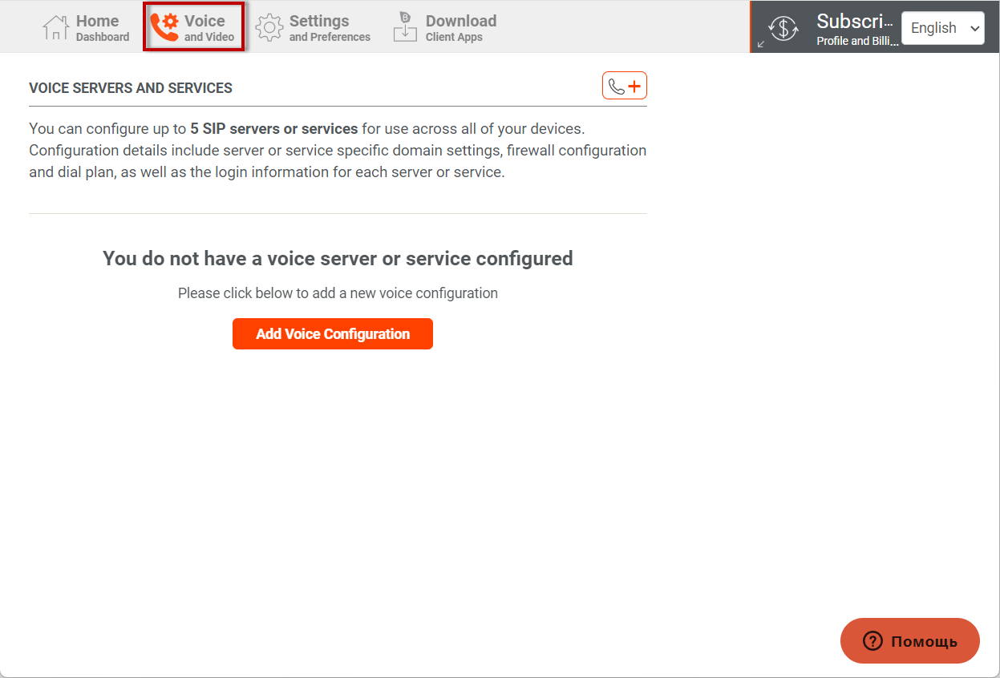
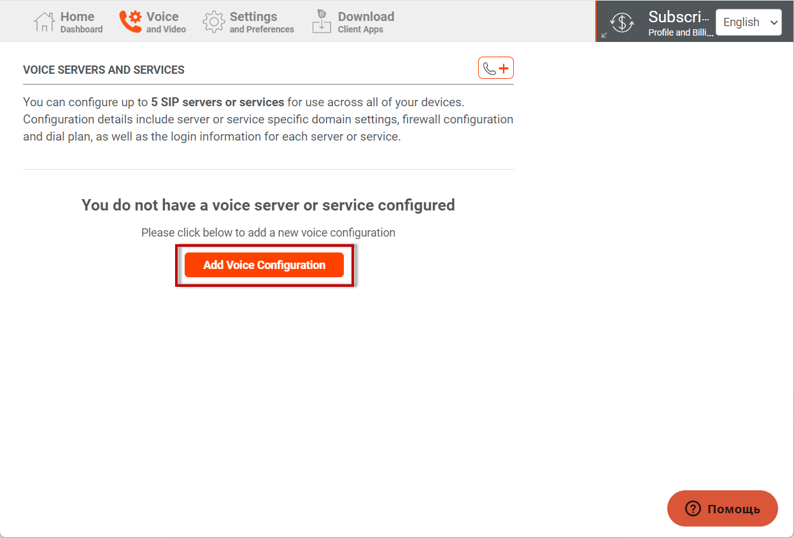
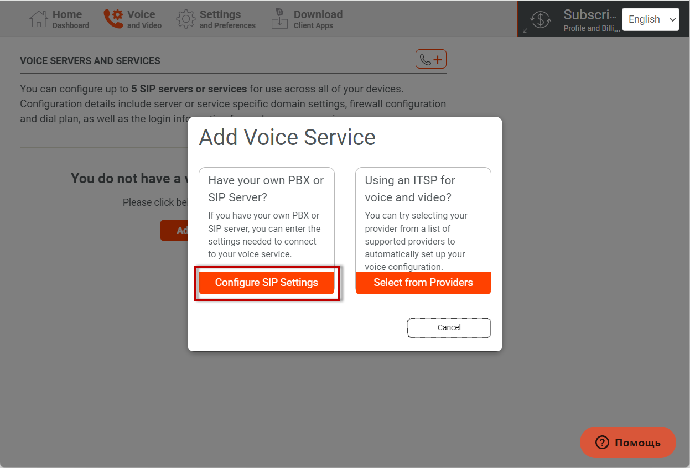
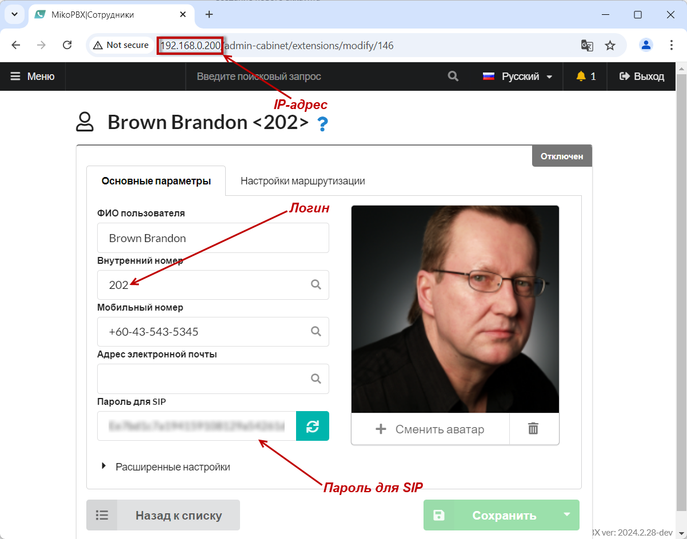
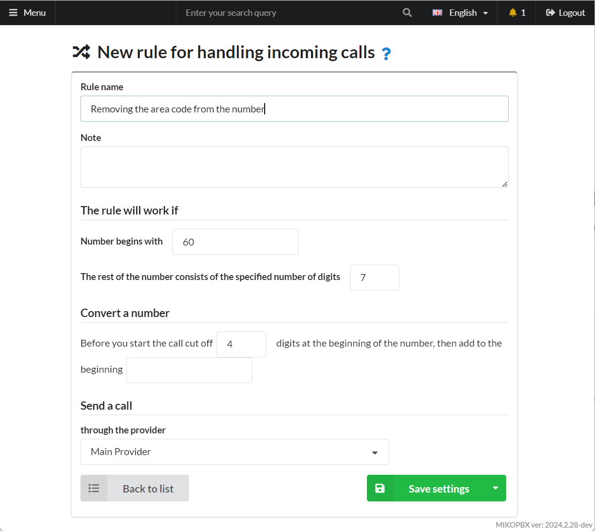
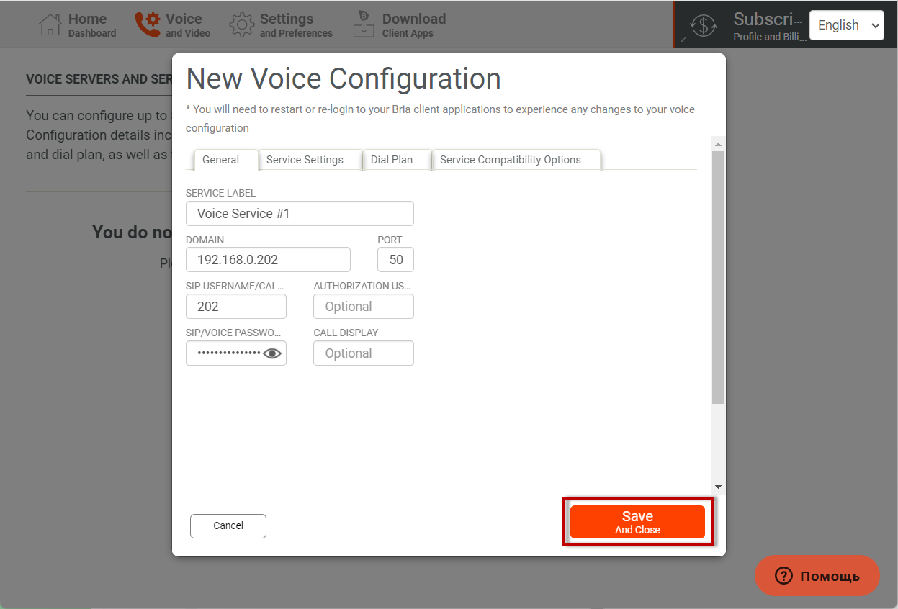
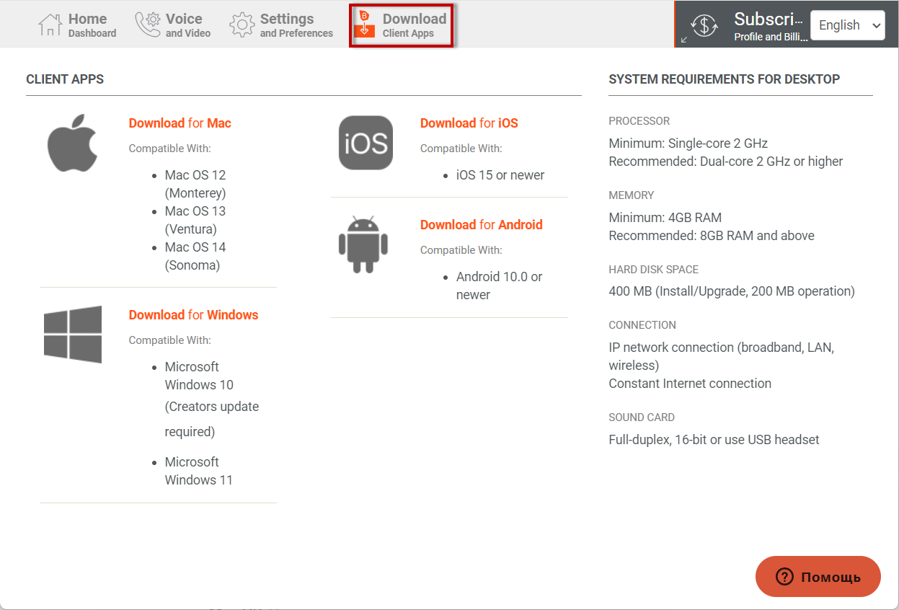
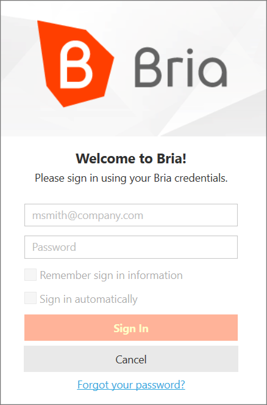
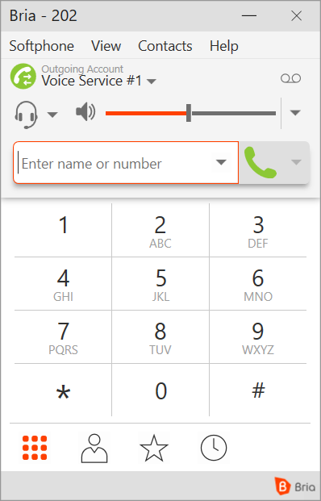
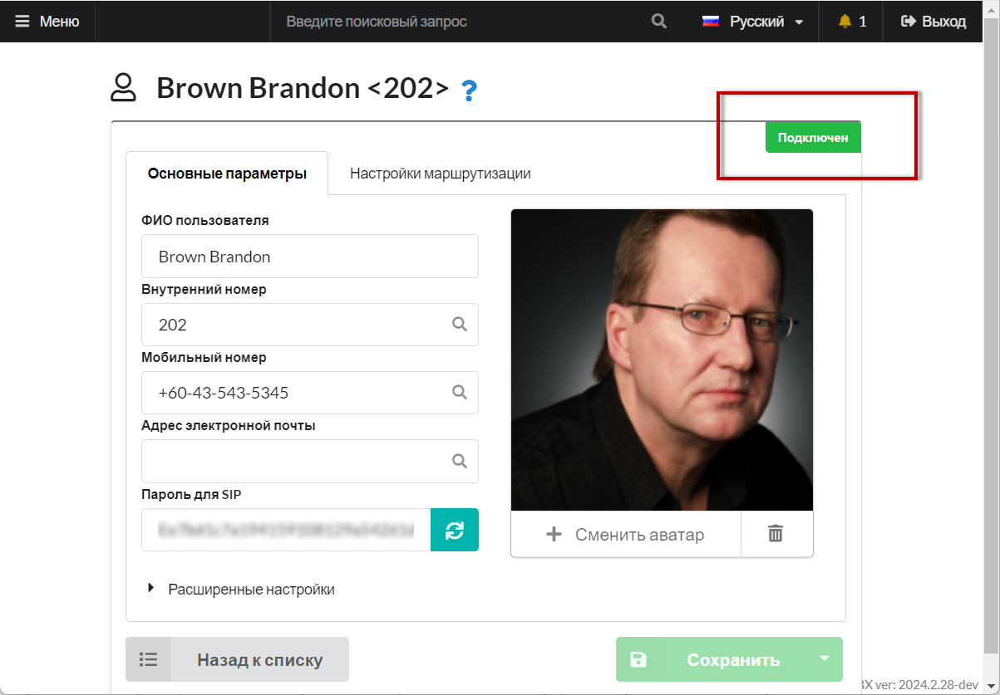

# Bria Solo


Бесплатно разрешено настроить и использовать один аккаунт на одном устройстве.



Смущает тот факт, что данные авторизации предлагается хранить в облаке разработчика:)


1. Перейдите по [ссылке ](https://www.counterpath.com/x-lite/)и авторизуйтесь.&#x20;
2. Переходим в раздел **Voice and Video.**

<figure><figcaption>
Раздел "Voice and video"
</figcaption></figure>

3. Выполните действие «**Add Voice Configuration**»

<figure><figcaption>
"Add voice configuration"
</figcaption></figure>

4. Выберите вариант «**Configure SIP Settings**»

<figure><figcaption>
"Configure SIP Settings"
</figcaption></figure>

5. На следующем этапе следует заполнить параметры подключения к MikoPBX. Порт по умолчанию - 5060.

<figure><figcaption></figcaption></figure>

<figure><figcaption>
Параметры голосовой конфигурации
</figcaption></figure>

6. Выполните действие «**Save and close**»

<figure><figcaption>
"Save and close"
</figcaption></figure>

7. Настройка аккаунта завершена, Теперь необходимо скачать приложение; перейдите в раздел «**Download Client Apps**»

<figure><figcaption>
Загрузка приложения
</figcaption></figure>

8. Скачайте приложение и авторизуйтесь.

<figure><figcaption>
Форма авторизации
</figcaption></figure>

9. Софтфон автоматически зарегистрируется на **АТС,** а рядом с сотрудником надпись "<mark style="color:green;">Подключён</mark>"

<figure><figcaption></figcaption></figure>

<figure><figcaption></figcaption></figure>
