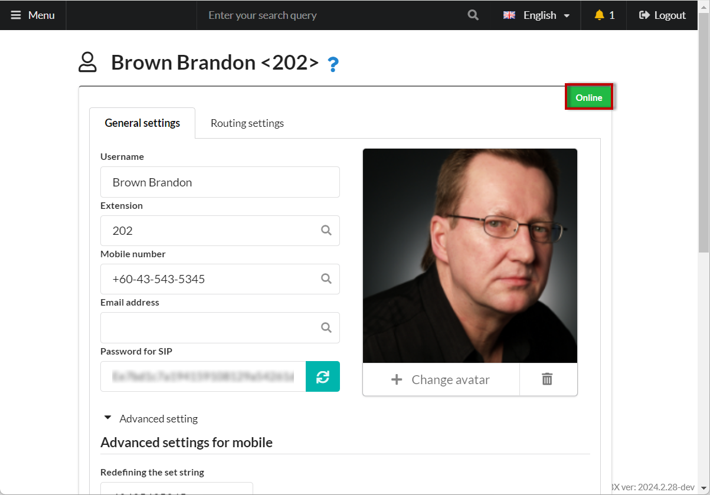

# Bria Solo


Only one account is allowed for free on one device.



It might be concerning that the authorization data is stored in the developer's cloud. :)


1. Follow the [link](https://www.counterpath.com/x-lite/) and sign in.
2. Go to the **Voice and Video** section.

<figure><figcaption>
"Voice and Video" section
</figcaption></figure>

3. Click on **"Add Voice Configuration"**.

<figure><figcaption>
"Add Voice Configuration" 
</figcaption></figure>

4. Choose **"Configure SIP Settings"**.

<figure><figcaption>
"Configure SIP Settings"
</figcaption></figure>

5. On the next step, fill in the connection parameters to MikoPBX. The default port is 5060.

<figure><figcaption></figcaption></figure>

<figure><figcaption>
Voice Configuration Options
</figcaption></figure>

6. Click **"Save and close"**.

<figure><figcaption>
"Save and close"
</figcaption></figure>

7. The account setup is complete. Now, download the app by going to **"Download Client Apps"**.

<figure><figcaption>
"Download Client Apps"
</figcaption></figure>

8. Download the app and log in.

<figure><figcaption>
Registraton form
</figcaption></figure>

9. The softphone will automatically register with the **PBX**, and next to the employee's name, the status "<mark style="color:green;">Online</mark>" will appear.

<figure><figcaption></figcaption></figure>

<figure><figcaption></figcaption></figure>
