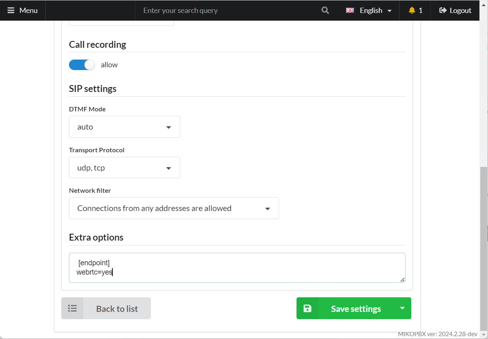
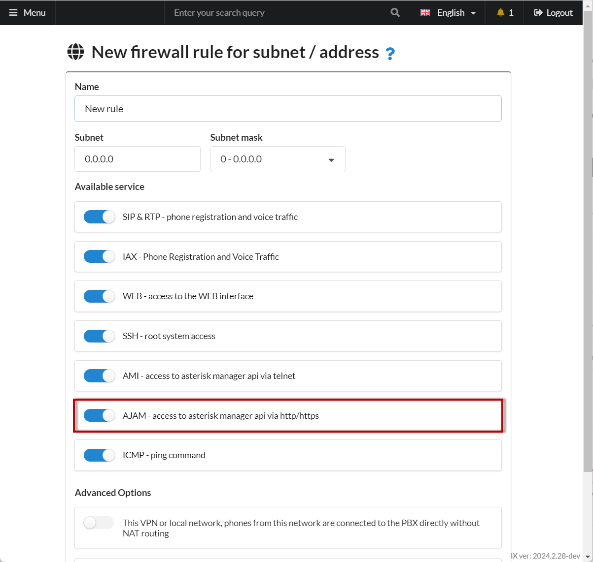
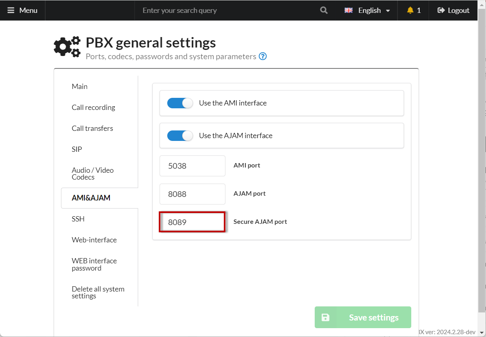
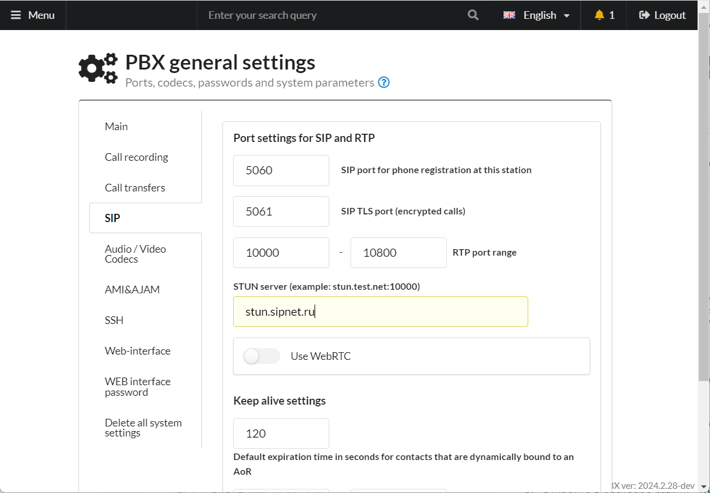
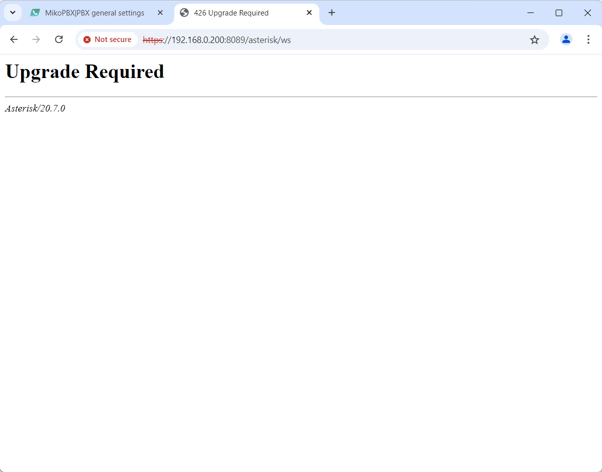

# Configuring webRTC client SIMPL5

## PBX Configuration <a href="#nastrojka_ats" id="nastrojka_ats"></a>

To ensure the proper functioning of WebRTC in most browsers, a trusted SSL certificate is required. We recommend using the additional module [Let's Encrypt Module](../../modules/miko/module-get-ssl-lets-encrypt.md). For the module to work, the PBX must be accessible via a public IP address.

1. Create a new employee [**account**](../../manual/telephony/extensions.md).
2. **Option 1.** For each internal number, set it to work only over the RTC protocol. In the "**Advanced Settings**" section - "**Extra options**", add the following options:

```
[endpoint]
webrtc=yes
```

Click "**Save**". From this moment, this internal number will work _only_ using the WebRTC protocol.

<figure><figcaption><p>Extra options in employee settings</p></figcaption></figure>

\
**Option 2.** Set up all internal numbers to work _both via PJSIP and WebRTC protocols._\
To do this, go to **System → General Settings → SIP** and enable the "**Use WebRTC**" toggle switch.

<figure><figcaption><p>Switch "Use WebRTC"</p></figcaption></figure>

3. In MikoPBX, go to **Network & Firewall** → **Firewall**, and add the subnet 0.0.0.0 with a mask of 0.0.0.0. Enable access via AJAM.

<figure><figcaption><p>Address, mask, AJAM switch in firewall settings</p></figcaption></figure>

4. Go to **System** → **General Settings** → **AMI & AJAM**. Ensure the "**AJAM Port with Encryption**" is set to **8089.**

<figure><figcaption><p>Encrypted AJAM port</p></figcaption></figure>

5. In the [**General Settings**](../../manual/system/general-settings.md) section, specify the STUN server address. For example, **stun.sipnet.ru**.

<figure><figcaption><p>Stun server</p></figcaption></figure>

6. Open the link in your browser: [**https://PBX\_ADDRESS:8089/asterisk/ws**](https://xn--\_-7sbbof9dici:8089/asterisk/ws). Use Chrome, as other browsers may have issues. If the certificate is self-signed, you might see a warning "**Connection is not secure**", ignore it and click "**Proceed to the website**."

You should see the following message:

<figure><figcaption></figcaption></figure>

If Asterisk responds, the setup was successful.

## WebRTC Client Setup <a href="#nastrojka_web_rtc_klienta" id="nastrojka_web_rtc_klienta"></a>

1. Go to the website [https://sipml5.org](https://sipml5.org/). You will be redirected to [https://www.doubango.org/sipml5/](https://www.doubango.org/sipml5/). Follow the link "[Enjoy our live demo](https://www.doubango.org/sipml5/call.htm?svn=252)".
2. Set up the WebRTC client:

<figure><figcaption></figcaption></figure>

In the "**Public Identity**" field, enter the following template:

```
sip:INTERNAL_NUMBER@PBX_ADDRESS
```

**When you enable** the [Use WebRTC](../../manual/system/general-settings.md#sip) option

```
sip:INTERNAL_NUMBER-WS@PBX_ADDRESS
```

Click on the "**Expert mode?**" button and proceed with the additional configuration:

<figure><figcaption></figcaption></figure>

In the **"WebSocket Server URL"** field, enter the following format:

<pre><code><strong>wss://PBX_ADDRESS:8089/asterisk/ws
</strong></code></pre>

Click **Login**. You can now start making calls.
