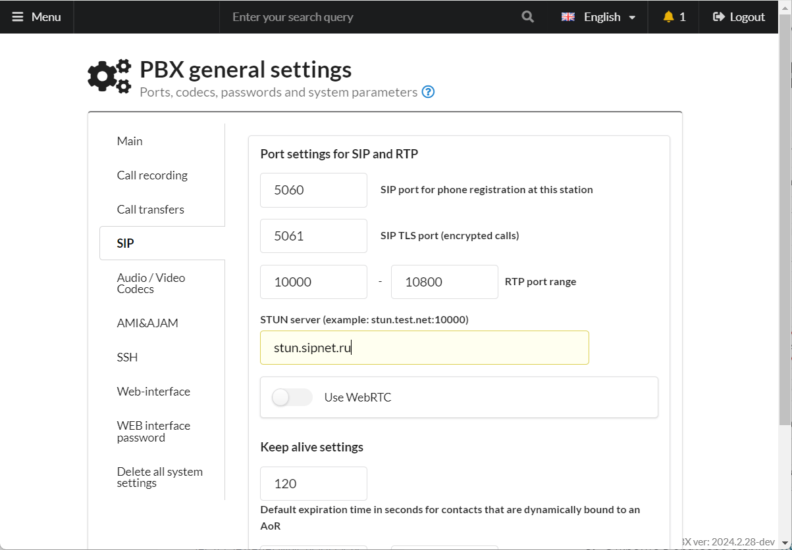

# Configuring webRTC client sipml5

## PBX Configuration 

1. Create a new employee [**account**](../../manual/telephony/extensions.md).
2. Go to **System → General Settings → SIP** and enable the "**Use WebRTC**" toggle switch.

This automatically creates a dedicated WebRTC endpoint for each internal number (e.g. `204-WS`), allowing simultaneous operation over both PJSIP and WebRTC protocols. No additional per-extension configuration is required.

<figure><figcaption>
Switch "Use WebRTC"
</figcaption></figure>

3. In the [**General Settings**](../../manual/system/general-settings.md) section, specify the STUN server address. For example, **stun.sipnet.ru**.

<figure><figcaption>
Stun server
</figcaption></figure>

4. Verify the WebSocket connection by opening the following URL in your browser:
   - **Local network (no SSL):** `http://PBX_ADDRESS:8088/asterisk/ws`
   - **With SSL certificate:** `https://PBX_ADDRESS:8089/asterisk/ws`

If Asterisk responds, the setup was successful.

> **Note:** For connections over the public internet, a trusted SSL certificate is required so that browsers allow microphone access. We recommend the [Let's Encrypt Module](../../modules/miko/module-get-ssl-lets-encrypt.md).

## WebRTC Client Setup 

1. Open the sipml5 demo in your browser: follow the link "[Enjoy our live demo](https://www.doubango.org/sipml5/call.htm?svn=252)".
2. Fill in the main fields:

<figure><figcaption></figcaption></figure>

| Field | Value |
|---|---|
| **Display Name** | Any name |
| **Private Identity** | `INTERNAL_NUMBER` (e.g. `204`) |
| **Public Identity** | `sip:INTERNAL_NUMBER-WS@PBX_ADDRESS` (e.g. `sip:204-WS@192.0.2.1`) |
| **Password** | The extension's SIP password |
| **Realm** | `PBX_ADDRESS` |

3. Click **"Expert mode?"** and set the WebSocket Server URL:

<figure><figcaption></figcaption></figure>

| Connection type | WebSocket Server URL |
|---|---|
| Local network (no SSL) | `ws://192.0.2.1:8088/asterisk/ws` |
| With SSL certificate | `wss://pbx.example.com:8089/asterisk/ws` |

4. Click **Login**. You can now start making calls.
