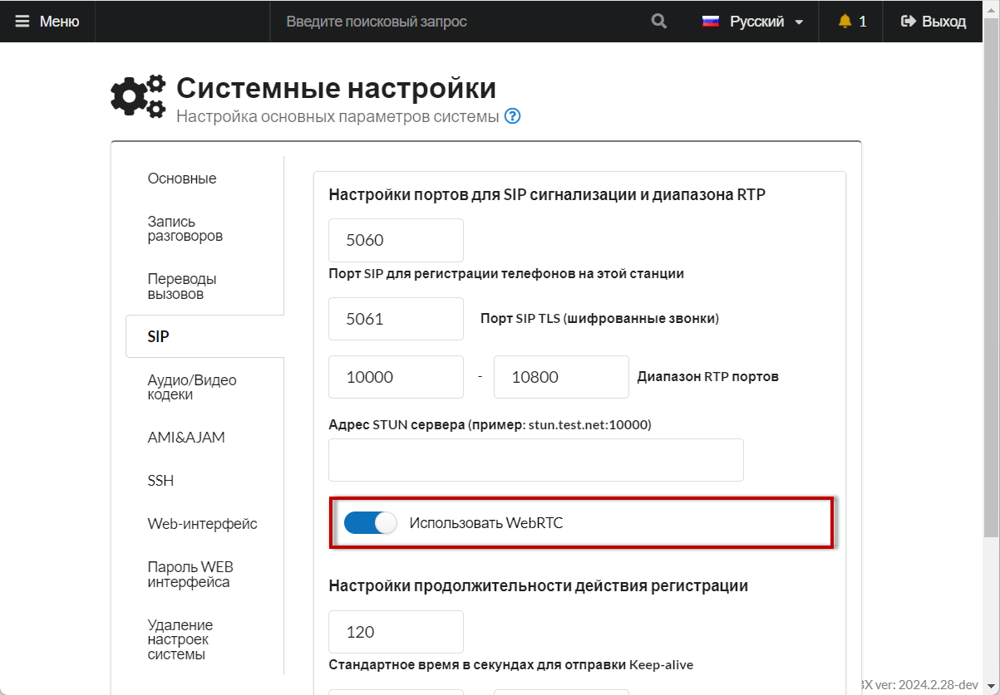
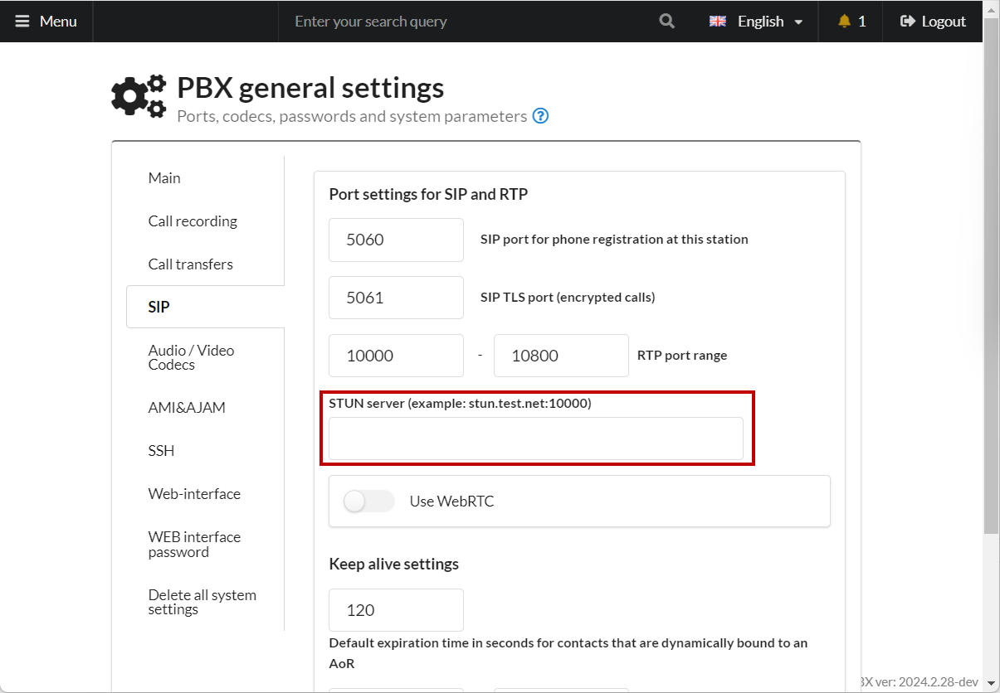

# Настройка WebRTC клиента sipml5

## Настройка АТС 

1. Создайте новую учетную запись [**сотрудника**](../../manual/telephony/extensions.md).
2. Перейдите в **Система → Общие настройки → SIP** и включите переключатель «**Использовать WebRTC**».

Это автоматически создаёт выделенный WebRTC endpoint для каждого внутреннего номера (например, `204-WS`), что позволяет работать одновременно по протоколам PJSIP и WebRTC. Никаких дополнительных настроек для отдельных номеров не требуется.

<figure><figcaption>
Переключатель "Использовать WebRTC"
</figcaption></figure>

3. В разделе [«**Общие настройки**»](../../manual/system/general-settings.md) укажите адрес STUN сервера. Например, **stun.sipnet.ru**.

<figure><figcaption>
STUN сервер
</figcaption></figure>

4. Проверьте WebSocket соединение, открыв в браузере следующий адрес:
   - **Локальная сеть (без SSL):** `http://АДРЕС_АТС:8088/asterisk/ws`
   - **С SSL сертификатом:** `https://АДРЕС_АТС:8089/asterisk/ws`

Если Asterisk ответил — настройка прошла успешно.

> **Примечание:** Для подключения через интернет необходим доверенный SSL сертификат, чтобы браузер разрешил доступ к микрофону. Рекомендуем использовать [Модуль Let's Encrypt](../../modules/miko/module-get-ssl-lets-encrypt.md).

## Настройка WebRTC клиента 

1. Откройте демо sipml5 в браузере: перейдите по ссылке "[Enjoy our live demo](https://www.doubango.org/sipml5/call.htm?svn=252)".
2. Заполните основные поля:

<figure><figcaption></figcaption></figure>

| Поле | Значение |
|---|---|
| **Display Name** | Любое имя |
| **Private Identity** | `ВНУТРЕННИЙ_НОМЕР` (например, `204`) |
| **Public Identity** | `sip:ВНУТРЕННИЙ_НОМЕР-WS@АДРЕС_АТС` (например, `sip:204-WS@192.0.2.1`) |
| **Password** | SIP пароль учетной записи |
| **Realm** | `АДРЕС_АТС` |

3. Нажмите **«Expert mode?»** и укажите адрес WebSocket сервера:

<figure><figcaption></figcaption></figure>

| Тип подключения | WebSocket Server URL |
|---|---|
| Локальная сеть (без SSL) | `ws://192.0.2.1:8088/asterisk/ws` |
| С SSL сертификатом | `wss://pbx.example.com:8089/asterisk/ws` |

4. Нажмите **Login**. Теперь можно совершать звонки.
