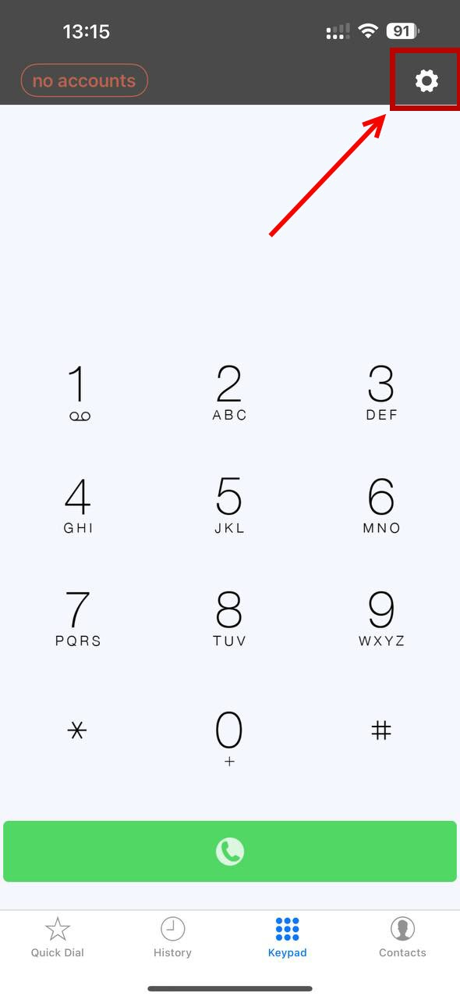
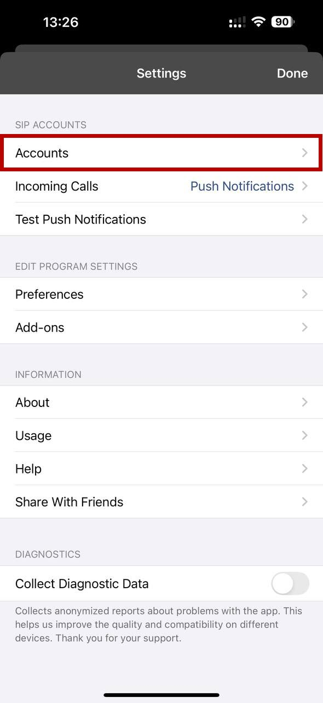
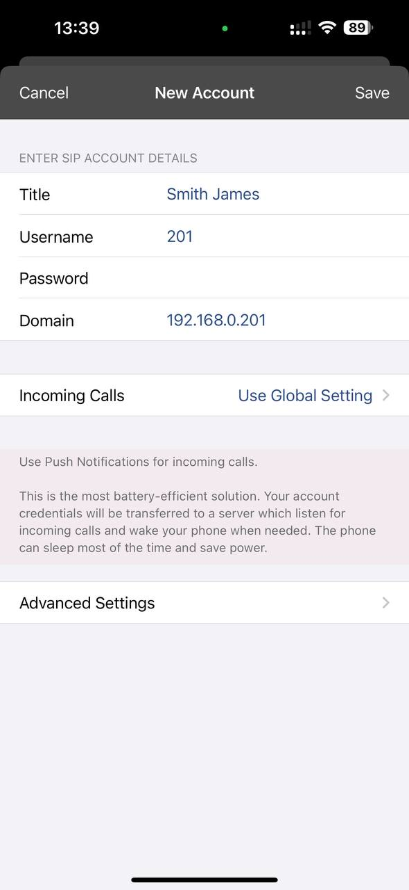
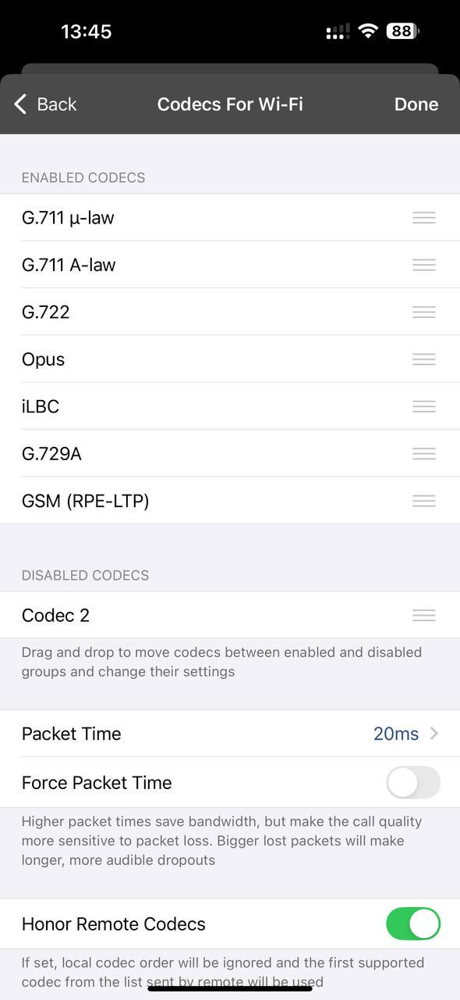
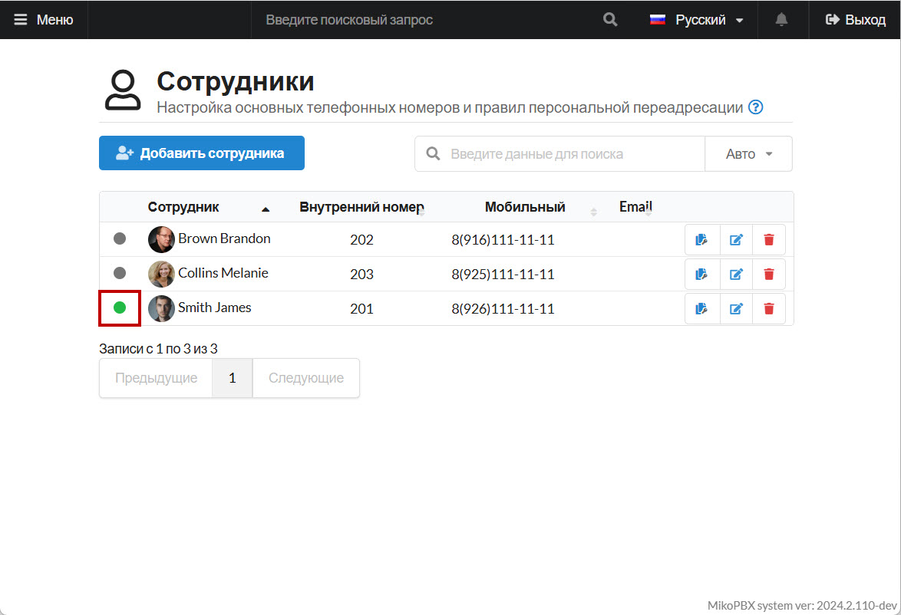
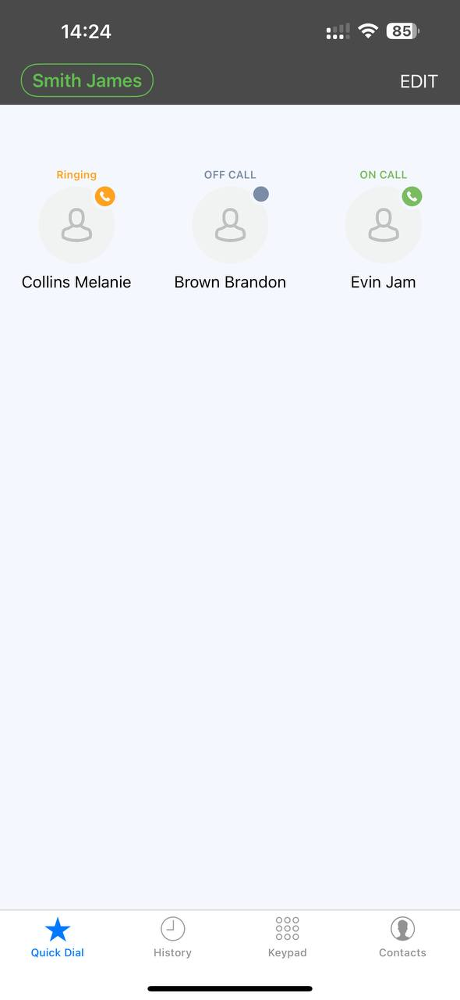
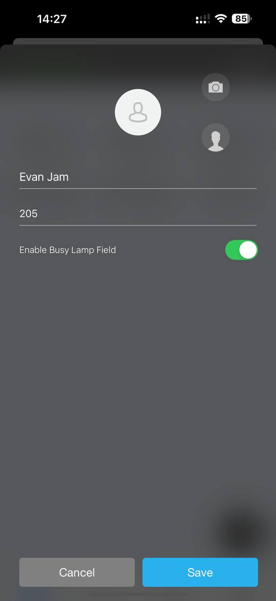
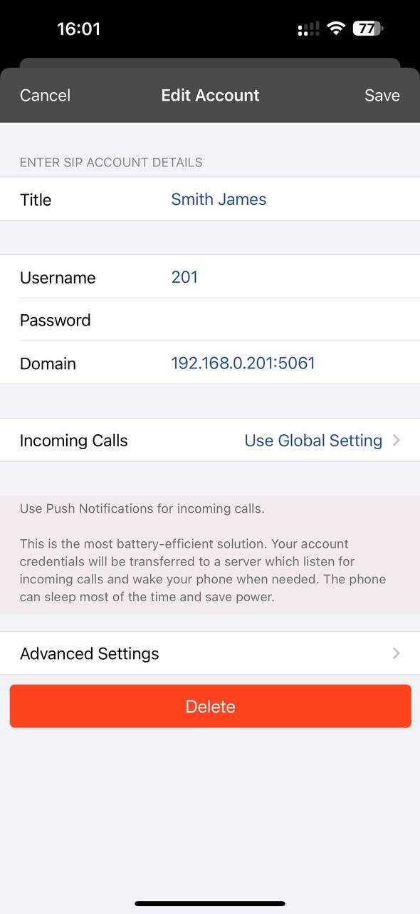
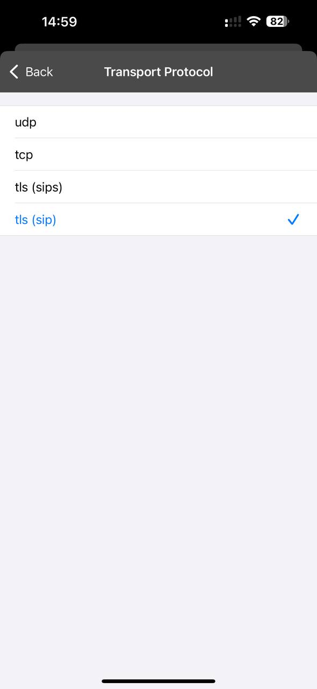
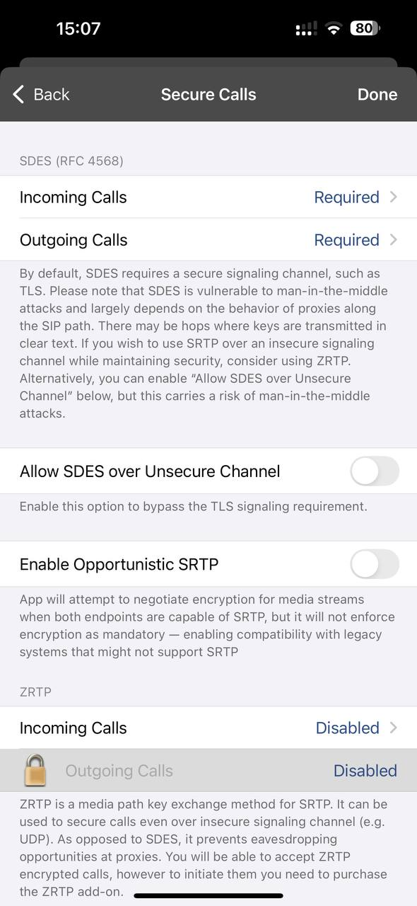

# Groundwire

**Groundwire** is a softphone that offers low power consumption by avoiding constant SIP session maintenance with the server. When an incoming call arrives, a PUSH notification is first sent to the smartphone, which then launches the SIP client and establishes a connection to the server.

## Softphone Setup

1. Download and open the **Groundwire** app on your smartphone.

<figure><figcaption>
Main menu
</figcaption></figure>

2. Go to **Groundwire** settings by tapping the corresponding icon at the top of the screen.

<figure><figcaption>
Settings button
</figcaption></figure>

3. Go to the "**Accounts**" section:

<figure><figcaption>
"Account" section
</figcaption></figure>

4. Add a new account by tapping the "+" icon at the top of the screen.
5. Select "**Generic SIP Account**."
6. Fill in the required data:
   * **Title** – An arbitrary account name.
   * **Username** – The employee’s extension number (e.g., 201).
   * **Password** – The SIP password from the employee’s configuration.
   * **Domain** – The IP address of your MikoPBX server.

<figure><figcaption>
Data for SIP connection
</figcaption></figure>

7. Go to "**Advanced Settings**."
8. In "**Audio Codecs**" → "**Codecs for Wi-Fi**," choose the desired codecs for use.

<figure><figcaption>
Audio codecs
</figcaption></figure>

9. Navigate to "**Caller Id Method**." Select "**P-Asserted-Identity**."

<figure><figcaption>
Section "Caller Id Method"
</figcaption></figure>

Save the settings. A connection attempt will occur. In the MikoPBX "Employees" section, you can see a status indicator confirming a successful connection:

<figure><figcaption>
Successful SIP-connection
</figcaption></figure>

## Configuring Employee Status Monitoring

Groundwire can display the current status of employees (see example below):

<figure><figcaption>
Employee statuses
</figcaption></figure>

To enable this feature, populate the "**Quick Dial**" section with employees. Tap "**EDIT**" at the top of the screen. Then tap the "**+**" at the bottom of the screen to add entries:

* **Title** – The employee’s name to display in "**Quick Dial**."
* **Number or SIP Address** – The employee’s extension number.

Tap "**Save**."

<figure><figcaption>
New employee in the "Quick Dial" section
</figcaption></figure>

## Configuring GroundWire with Encryption

1. In the MikoPBX web interface, open the employee’s SIP account settings. Change the "**Transport Protocol**" to "**tls**."

<figure><figcaption>
Changing the transport protocol
</figcaption></figure>

2. In **Groundwire** → **Employee’s SIP Account Settings**, change the **"Domain"** field to **"MikoPBXAdress:NumOfTLSPort"**.


You can find or change the TLS port in MikoPBX’s "**General Settings**" → "**SIP**."&#x20;


<figure><figcaption>
Domain for the TLS connection
</figcaption></figure>

3. Go to "**Advanced Settings**" → "**Transport Protocol**" and change "**udp**" to "**tls (sip)**."

<figure><figcaption>
Changing the transport protoco
</figcaption></figure>

4. In the "**Advanced Settings**" of your SIP account, go to "**Secure Calls**" and, under the "**SDES**" section, set "**Incoming Calls**" and "**Outgoing Calls**" to "**Required**":

<figure><figcaption>
SDES Parameters
</figcaption></figure>
