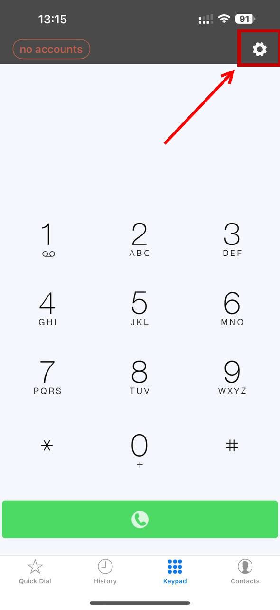
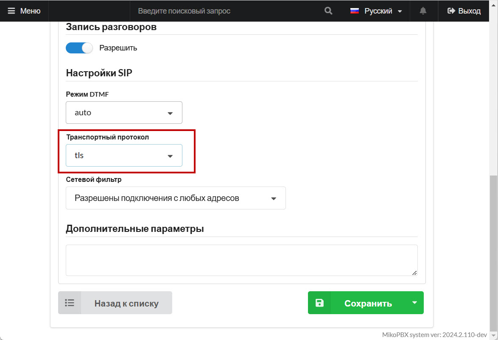

# Groundwire

**Groundwire** обладает низким энергопотреблением за счет того, что не поддерживает постоянно с сервером SIP сессию. При поступлении входящего звонка сперва на смартфон поступей PUSH уведомление, а затем запускается SIP клиент и происходит соединение с сервером.

## Подключение софтфона

1. Скачайте и откройте приложение **Groundwire** на смартфоне.

<figure><figcaption>
Главное меню Groundwire
</figcaption></figure>

2. Перейдите в настройки **Groundwire**, используя соответствующий элемент в верхней части экрана.

<figure><figcaption>
Переход в настройки
</figcaption></figure>

3. Перейдите в раздел "**Accounts**":

<figure><figcaption>
Переход в раздел с аккаунтами
</figcaption></figure>

4. Добавьте новый аккаунт, нажав на "+" в верхней части экрана.
5. Выберите тип "**Generic SIP Account**".
6. Заполните необходимые данные:

* "**Title**" - Название аккаунта. (произвольное)
* "**Username**" - Внутренний номер сотрудника. (например, 201)
* "**Password**" - Пароль для SIP из карточки сотрудника.
* "**Domain**" - IP-адрес Вашей станции MikoPBX.

<figure><figcaption>
Данные для SIP-подключения
</figcaption></figure>

7. Перейдите в раздел "**Advanced Settings**".
8. В разделе "**Audio Codecs**" -> "**Codecs for Wi-Fi**" укажите необходимые Вам кодеки для использования.&#x20;

<figure><figcaption>
Аудио кодеки
</figcaption></figure>

9. Перейдите в раздел "**Caller Id Method**". Укажите "**P-Asserted-Identify".**

<figure><figcaption>
Раздел "Caller Id Method"
</figcaption></figure>

Сохраните параметры. Произойдет соединение. По индикатору в разделе "Сотрудники" в MikoPBX, Вы можете убедиться, что оно было успешным.

<figure><figcaption>
Успешное SIP-подключение
</figcaption></figure>

## Настройка отслеживания статусов сотрудников

Существует возможность вывода информации о текущем статусе сотрудника (пример - изображение далее)

<figure><figcaption>
Статусы сотрудников
</figcaption></figure>

Для реализации, наполните раздел "Quick Dial" сотрудниками. Для этого нажмите "EDIT" в верхей части экрана, наполните список, используя элемент "+", в нижней части экрана:

* **"Title"** - имя сотрудника, которое будет отображено в разделе "**Quick Dial**".
* "**Number or SIP Address**" - внутренний номер сотрудника.

Нажмите "**Save**"

<figure><figcaption>
Новый сотрудник в разделе "Quick Dial"
</figcaption></figure>

## Настройка GroundWire Softphone с поддержкой шифрования&#x20;

1. Перейдите в раздел настроек учетной записи сотрудника в интерфейсе MikoPBX. Измените "**Транспортный протокол**" на "tls".

<figure><figcaption>
Настройка транспортного протокола
</figcaption></figure>

2. Перейдите в интерфейс **Groundwire ->** Настройка SIP-аккаунта сотрудника. Измените **"Domain"** на **"АдресMikoPBX>:НомерПортаДляTLS**".


Номер порта для TLS Вы можете найти/изменить в web-интерфейсе MikoPBX: "**Общие настройки**" -> "**SIP**".


<figure><figcaption>
Поле "Domain"
</figcaption></figure>

3. Перейдите в раздел "**Advanced Settings**" -> "**Transport Protocol**". Измените "**udp**" на "**tls (sip)**".

<figure><figcaption>
Изменение транспортного протокола
</figcaption></figure>

4. Перейдите в раздел "**Advanced Settings**" Вашего SIP-аккаунта -> "**Secure Calls**".

Измените параметры "**Incoming Calls**", "**Outgoing Calls**" в разделе "**SDES**" на "**Required**":

<figure><figcaption>
SDES параметры
</figcaption></figure>
