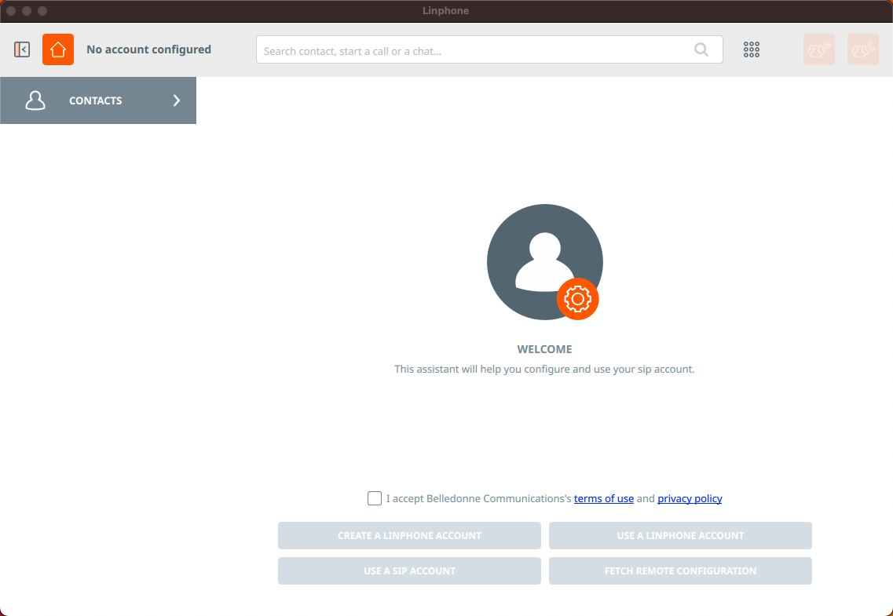
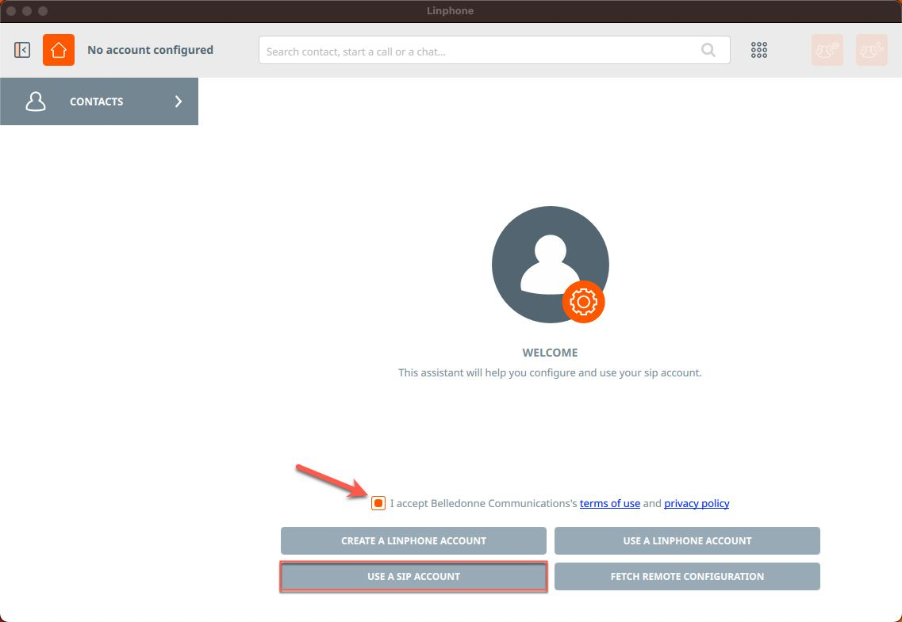
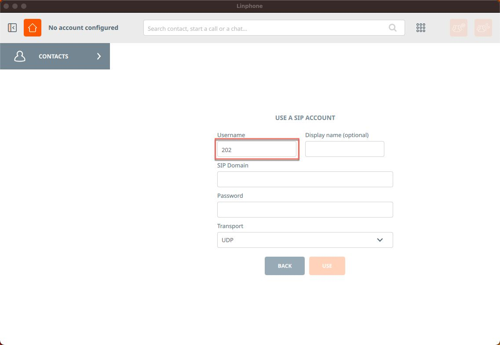
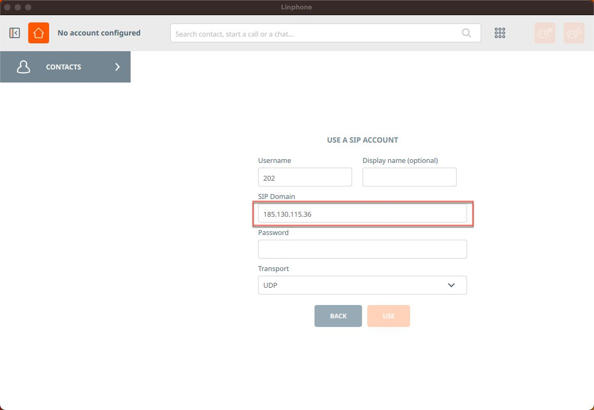
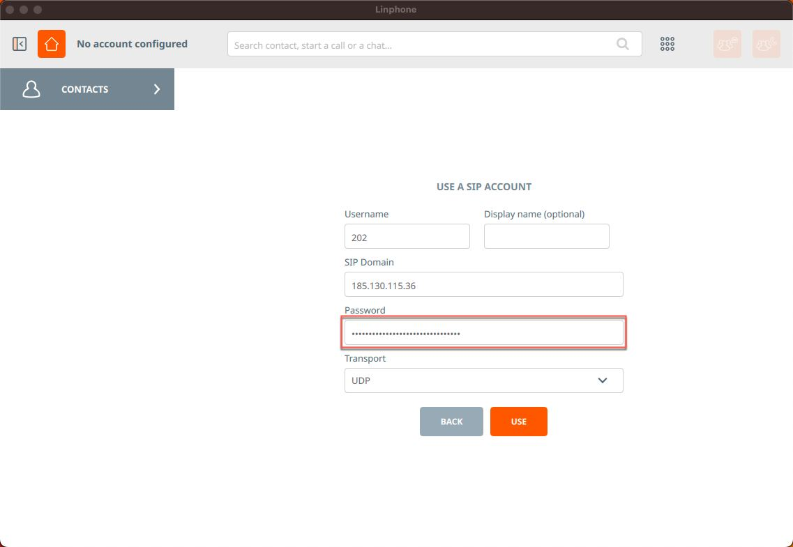
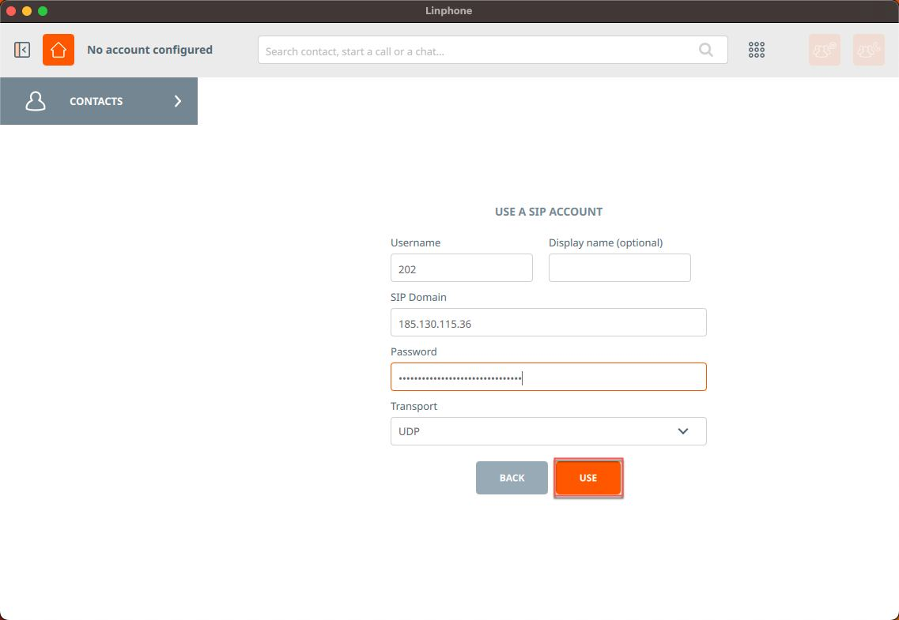
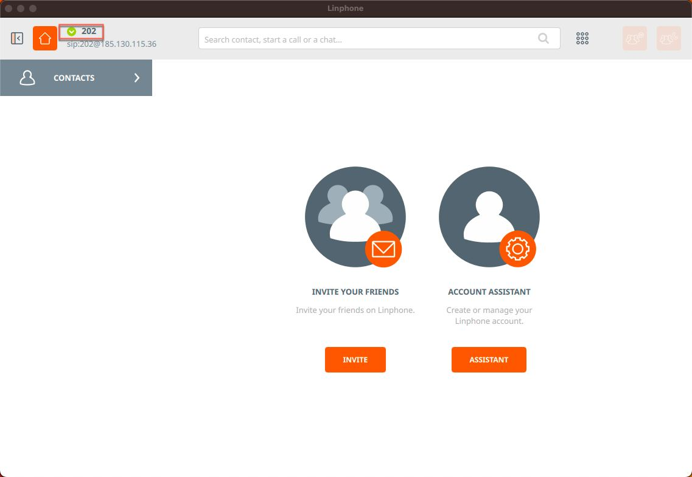

# Linphone (MacOS)

1. Download the softphone installer from the official website at the [link](https://www.linphone.org/). Install it by following the instructions of the installer.
2. The following window will be displayed at the first launch:

<figure><figcaption></figcaption></figure>

3. Accept the agreement and click **"Use SIP account"**

<figure><figcaption></figcaption></figure>

4. In the "**Username**" field, enter the internal number of the employee

<figure><figcaption></figcaption></figure>

<figure><figcaption></figcaption></figure>

5. In the "**SIP Domain**" field, enter the **IP address** of the MikoPBX you are going to connect to&#x20;

<figure><figcaption></figcaption></figure>

<figure><figcaption></figcaption></figure>

6. In the "**Password**" field, enter "**SIP password**"

<figure><figcaption></figcaption></figure>

<figure><figcaption></figcaption></figure>

7. Click "**Use**"

<figure><figcaption></figcaption></figure>

The green indicator on the top indicates successful authorization. Also, the status <mark style="color:green;">Online</mark> should be displayed on the PBX for this internal number.

<figure><figcaption></figcaption></figure>

<figure><figcaption></figcaption></figure>
