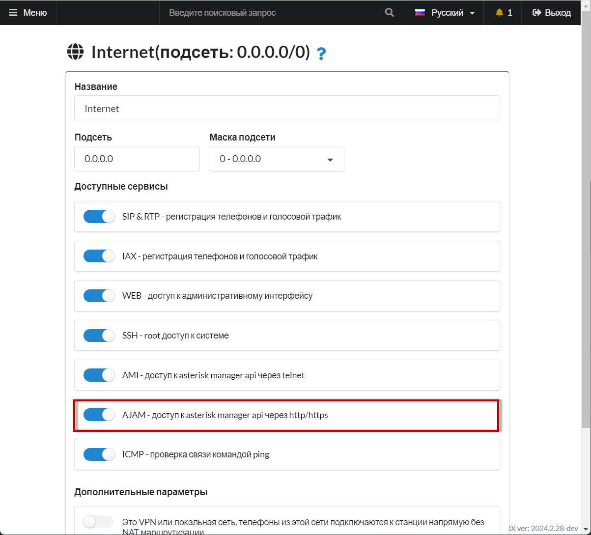

# Настройка WebRTC клиента SIPML5

## Настройка АТС <a href="#nastrojka_ats" id="nastrojka_ats"></a>

Для корректной работа WebRTC в большинстве браузеров необходим доверенный SSL сертификат. Рекомендуем использовать дополнительный модуль [Модуль Lets encrypt](../../modules/miko/module-get-ssl-lets-encrypt.md). Для использования модуля АТС должна быть доступна на белом IP адресе.

1. Создайте новую учетную запись [**сотрудника**](../../manual/telefoniya/extensions.md).
2. **Вариант 1.** Индивидуально для каждого внутреннего номера устанавливается, что он работает только по протоколу RTС. В разделе «**Расширенные настройки**» - «**Дополнительные параметры SIP учетной записи**» Добавьте опции:

```
 [endpoint]
webrtc=yes
```

Нажмите «**Сохранить**». С этого момента данный внутренний номер сможет работать _только_ по протоколу WebRTC.

<figure><figcaption><p>Extra options в параметрах сотрудника </p></figcaption></figure>

\
**Вариант 2.** Для всех внутренних номеров устанавливается, что они могут работать, _как по протоколу PJSIP, так и по WebRTC_.\
Для этого в разделе **Система → Общие настройки → SIP** включите переключатель «**Использовать WebRTC**».

<figure><figcaption><p>Переключатель "Использовать WebRTC"</p></figcaption></figure>

3. В MikoPBX в разделе «**Сеть и Firewall**» → «**Сетевой экран**» добавить подсеть 0.0.0.0 с маской 0.0.0.0. Откройте доступ по AJAM

<figure><figcaption><p>Адрес, маска, переключатель AJAM в настройках сетевого экрана</p></figcaption></figure>

4. Перейдите в «**Система**» → «**Общие настройки**» → «**AMI\&AJAM**». Убедитесь, что «**Порт AJAM с шифрованием**» установлен в значение **8089.**

<figure><figcaption><p>Порт AJAM с шифрованием</p></figcaption></figure>

5. В разделе «[Общие настройки](../../manual/system/general-settings.md)» укажите адрес STUN сервера. Например **stun.sipnet.ru**

<figure><figcaption><p>STUN сервер</p></figcaption></figure>

6. Откройте в браузере ссылку «[**https://АДРЕС\_АТС:8089/asterisk/ws**](https://xn--\_-7sbbof9dici:8089/asterisk/ws)». Используйте Chrome, в других браузерах могут быть проблемы. Если сертификат самоподписанный, то может появиться предупреждение «**Подключение не защищено**», игнорируйте его и выполните действие «**Перейти на сайт**»

Должно появиться следующее сообщение:

<figure><figcaption></figcaption></figure>

Ответил asterisk - настройка прошла успешно.

## Настройка Web RTC клиента <a href="#nastrojka_web_rtc_klienta" id="nastrojka_web_rtc_klienta"></a>

1. Перейдите на сайт [https://sipml5.org](https://sipml5.org/). Вы будете переправлены на страницу [https://www.doubango.org/sipml5/](https://www.doubango.org/sipml5/). Перейдите по ссылке "[Enjoy our live demo](https://www.doubango.org/sipml5/call.htm?svn=252)"
2. Настроим Web RTC клиент:

<figure><figcaption></figcaption></figure>

Поле «**Public Identity**» опишите по шаблону

```
sip:ВНУТРЕННИЙ_НОМЕР@АДРЕС_АТС
```

**При включении опции** [Использовать WebRTC](../../manual/system/general-settings.md#sip)

```
sip:ВНУТРЕННИЙ_НОМЕР-WS@АДРЕС_АТС
```

Кликните по кнопке «**Expert mode?**» и выполните дополнительную настройку:

<figure><figcaption></figcaption></figure>

«**WebSocket Server URL**» опишите по шаблону

<pre><code><strong>wss://АДРЕС_АТС:8089/asterisk/ws
</strong></code></pre>

Выполните действие **Login.** Теперь можно совершать звонки.
