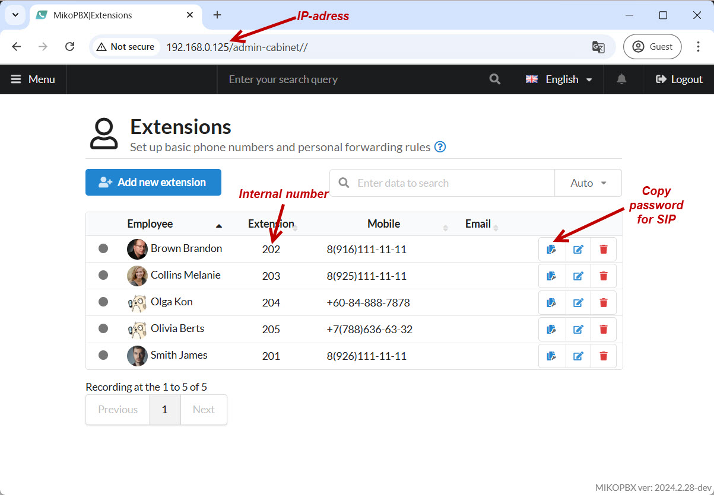
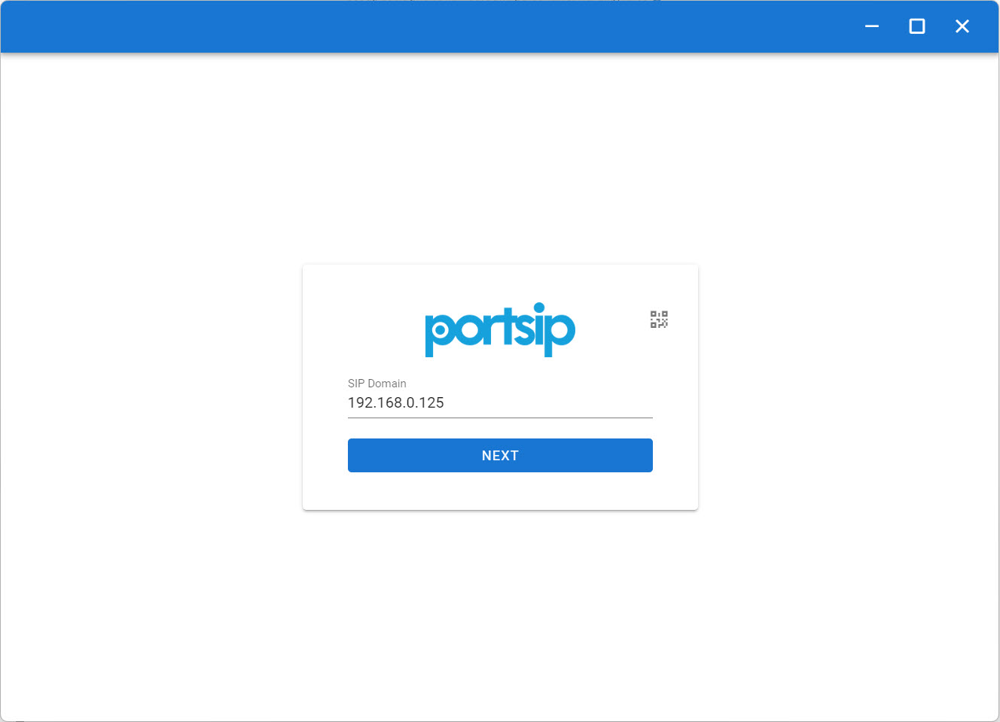
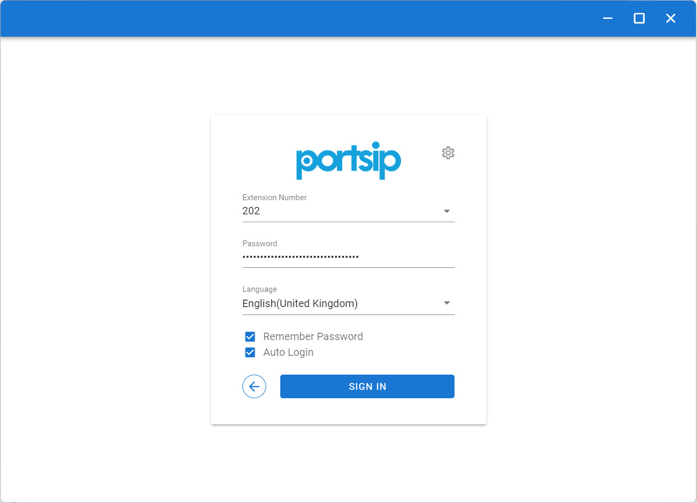

# PortSIP


Download PortSIP from the official website — [here](https://www.portsip.com/download-portsip-softphone/).


Below is a detailed guide for connecting your PortSIP softphone to the MikoPBX SIP server.

Here's an example screenshot showing the necessary SIP connection details:

<figure><figcaption>
Creditionals for SIP-connection
</figcaption></figure>

1. Open the PortSIP app and, on the initial screen, enter the **IP address** of your MikoPBX station into the **"SIP Domain"** field.

Click "**Done**".

<figure><figcaption>
SIP Domain field
</figcaption></figure>

2. In the next window, enter the following details:

* **Extension number** — your MikoPBX employee's internal extension number.
* **Password** — your SIP password.
* **Language** — select your preferred language.

Then, click "**Login**":

<figure><figcaption>
Parameters for SIP-connection
</figcaption></figure>

After logging in, ensure your connection was successful by checking the indicator in both PortSIP and MikoPBX interfaces.

PortSIP interface:

<figure><figcaption>
Successful connection in PortSIP interface
</figcaption></figure>

MikoPBX interface:

<figure><figcaption>
Successful connection in MikoPBX interface
</figcaption></figure>
