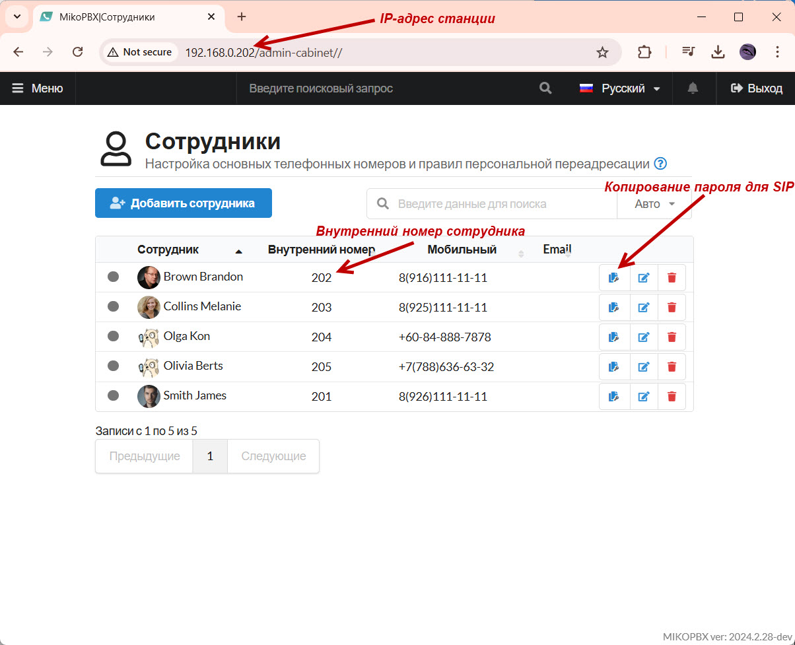
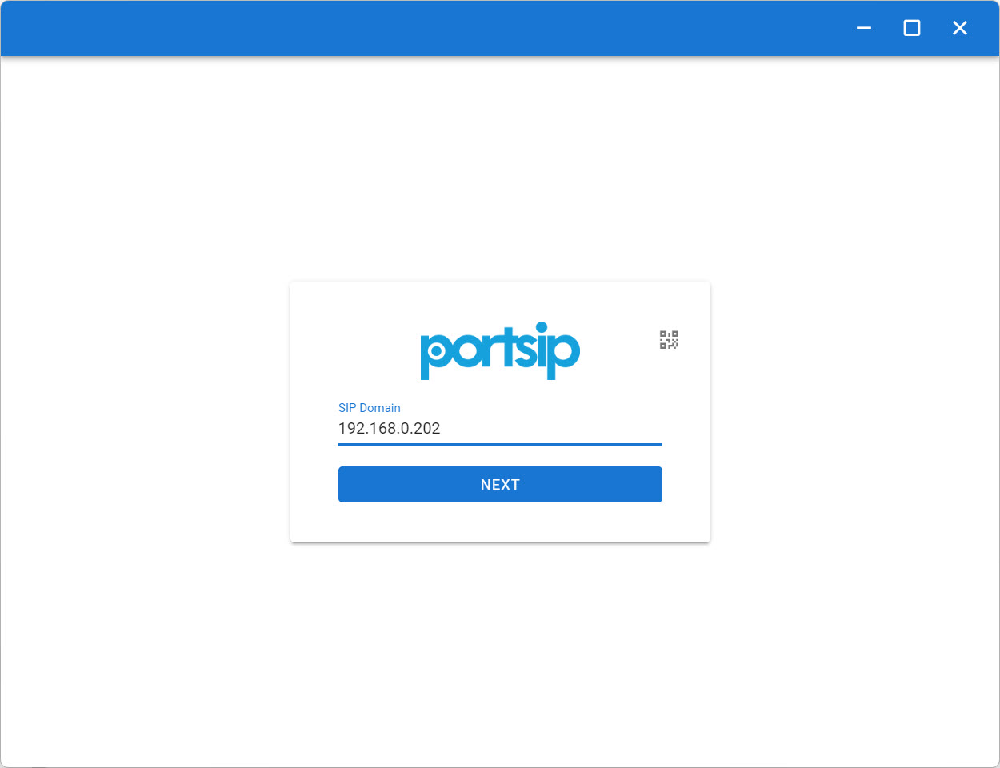
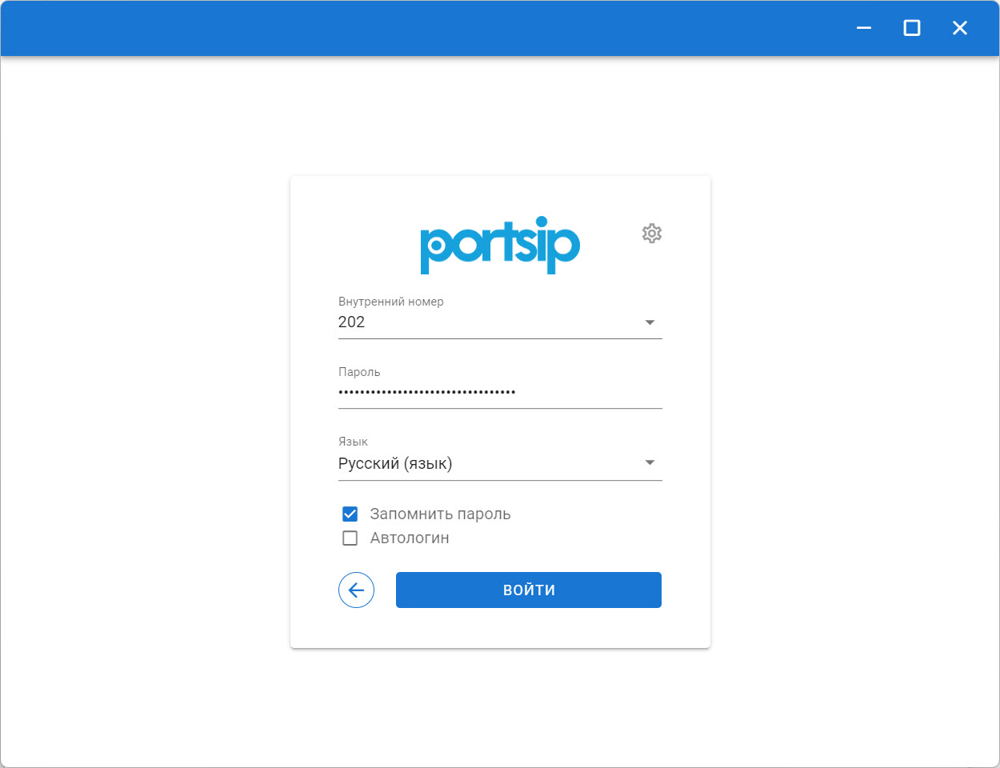
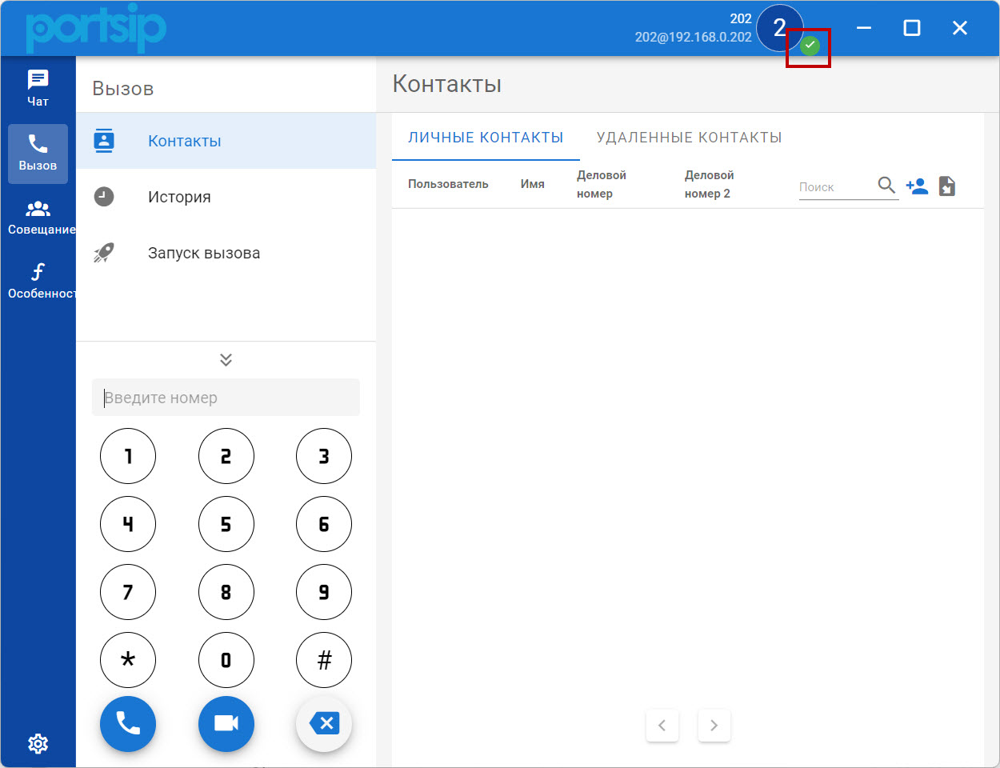

# PortSIP


Ссылка на загрузку софтфона - [здесь](https://www.portsip.com/download-portsip-softphone/).


Ниже на скриншоте представлены необходимые данные для SIP-покдлючения:

<figure><figcaption>
Параметры для SIP-подключения
</figcaption></figure>

1. В стартовом окне введите **IP-адрес** станции MikoPBX.

Нажмите "**Done**"

<figure><figcaption>
Поле "SIP Domain"
</figcaption></figure>

2. Далее укажите:

* Внутренний номер сотрудника
* Пароль для SIP
* Выберите язык

Нажмите "**Войти**":

<figure><figcaption>
Параметры для SIP-подключения
</figcaption></figure>

Произойдет авторизация. Понять, что она была успешной Вы можете по индикатору в интерфейсах PortSIP и MikoPBX.

<figure><figcaption>
Индикатор подключения в интерфейсе PortSIP
</figcaption></figure>

<figure><figcaption>
Индикатор подключения в интерфейсе MikoPBX
</figcaption></figure>
