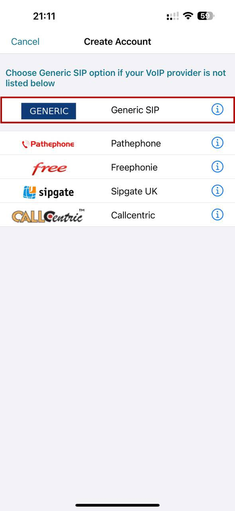
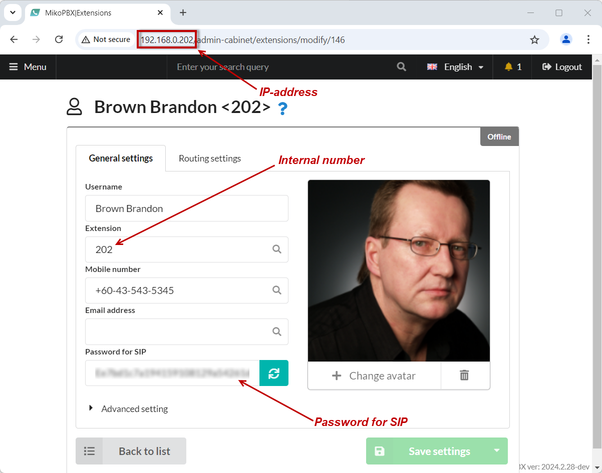
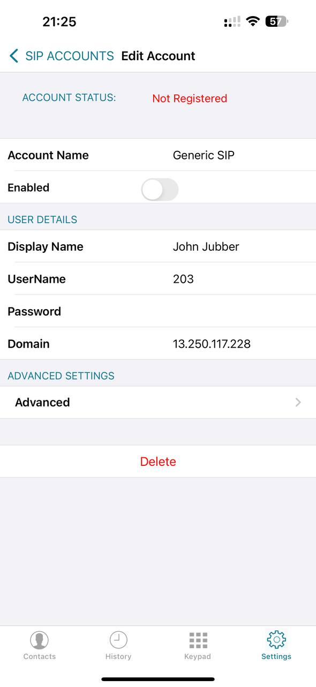
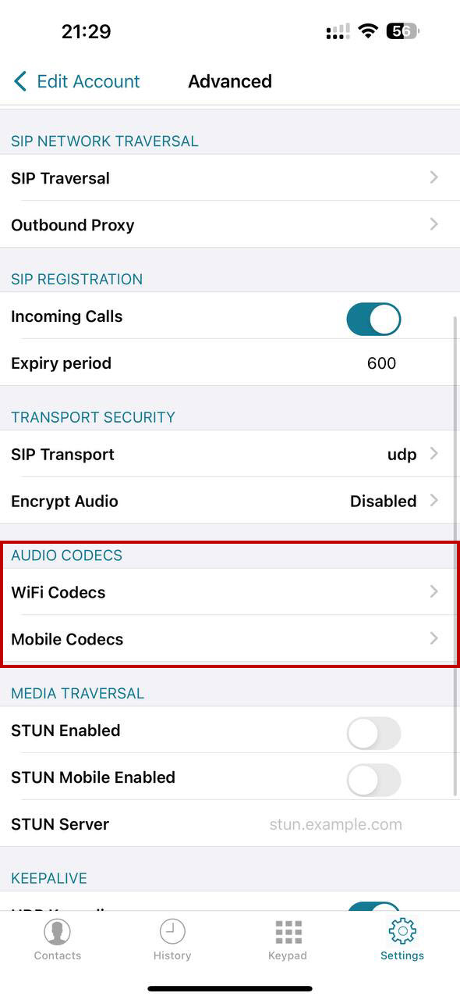
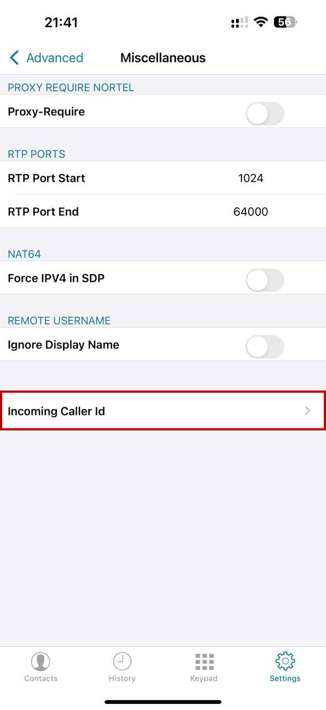
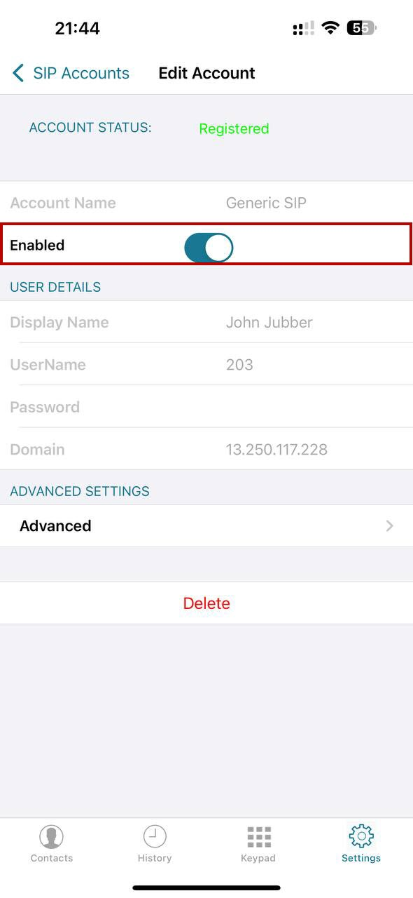
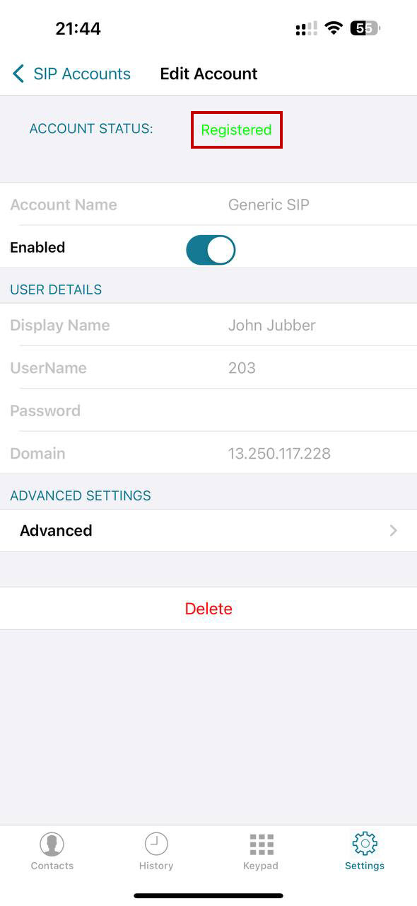
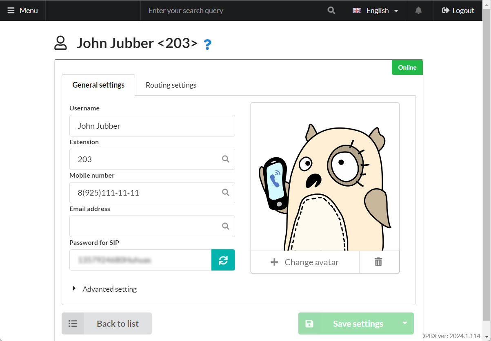

# Sessiontalk

## Sessiontalk Setup

1.  Download and open the SessionTalk app on your smartphone. You will be prompted to create an account:

    Select "**Generic SIP**"

<figure><figcaption>
"Generic SIP"
</figcaption></figure>

2. Enter the following details:

* "**Account Name**" - any name of your choice
* "**Display Name**" - your full name
* "**UserName**" - the internal extension number from the employee configuration section
* "**Password**" - SIP password from the employee configuration section
* "**Domain**" - MikoPBX server address

<figure><figcaption></figcaption></figure>

<figure><figcaption>
Data for SIP connection 
</figcaption></figure>

3. In the "**Advanced**" section, set the priority for "**WiFi Codecs**" and "**Mobile Codecs**"

<figure><figcaption>
Audio Codecs Section
</figcaption></figure>

4. In "**Advanced**" → "**Miscellaneous**" → "**Incoming Caller Id**", select "**P-Asserted-Identify**"

<figure><figcaption>
"Incoming Caller Id" section
</figcaption></figure>

5. Switch the checkbox "**Enabled**" to "**On**" and wait for the registration to complete.

<figure><figcaption></figcaption></figure>

Successful registration will be indicated by the message "<mark style="color:green;">Registered</mark>" in the app interface, as well as "<mark style="color:green;">Online</mark>".

<figure><figcaption></figcaption></figure>

<figure><figcaption></figcaption></figure>
