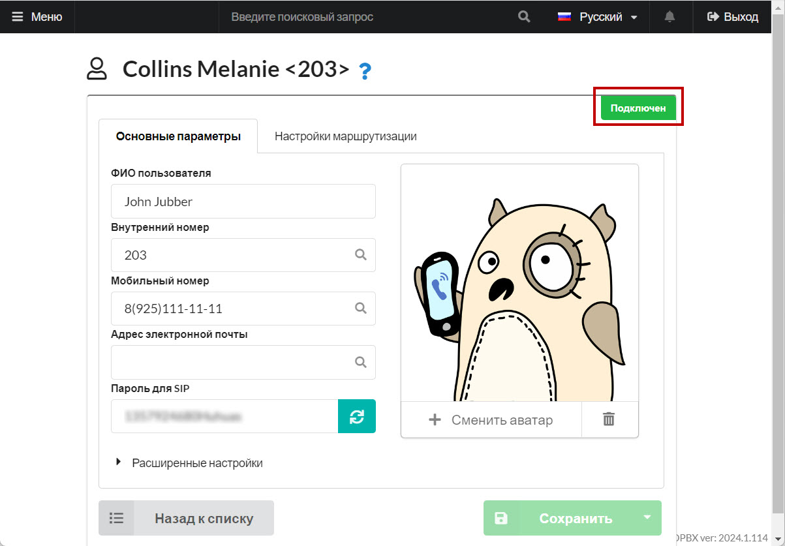

# Sessiontalk

1. Скачайте и откройте приложение SessionTalk на смартфоне, будет предложено создать аккаунт:

Выберите «**Generic SIP**»

<figure><figcaption>
"Generic SIP"
</figcaption></figure>

2. Укажите:

* произвольное «**Account Name**»
* «**Display Name**» - укажите свое имя и фамилию
* «**UserName**» - внутренний номер из раздела конфигурации сотрудника&#x20;
* Укажите «**Password**» - пароль для SIP из раздела конфигурации сотрудника&#x20;
* Заполните поле «**Domain**» - адрес сервера MikoPBX

<figure><figcaption></figcaption></figure>

<figure><figcaption>
Данные для SIP подключения 
</figcaption></figure>

3. В разделе «**Advanced**» задайте приоритет для «**WiFi Codecs**» и «**Mobile Codecs**»

<figure><figcaption>
Аудио кодеки
</figcaption></figure>

4. В «**Advanced**» - «**Miscellaneous**» - «**Incoming Caller Id**» укажите «**P-Asserted-Identify**»

<figure><figcaption>
Секция "Incoming Caller Id"
</figcaption></figure>

5. Переведите checkbox «**Enabled**» в положение «**On**» и дождитесь окончания регистрации.

<figure><figcaption></figcaption></figure>

Об успешной регистрации будет свидетельствовать надпись "<mark style="color:green;">Registered</mark>" в интерфейсе программы, а так же надпись "<mark style="color:green;">Подключен</mark>"

<figure><figcaption></figcaption></figure>

<figure><figcaption></figcaption></figure>
