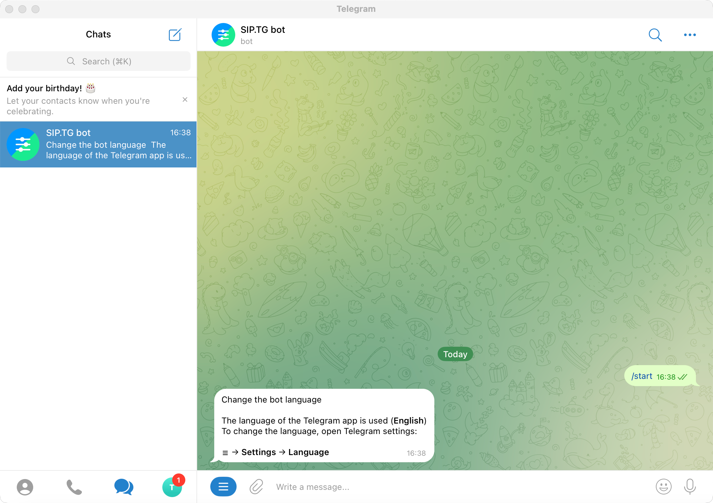
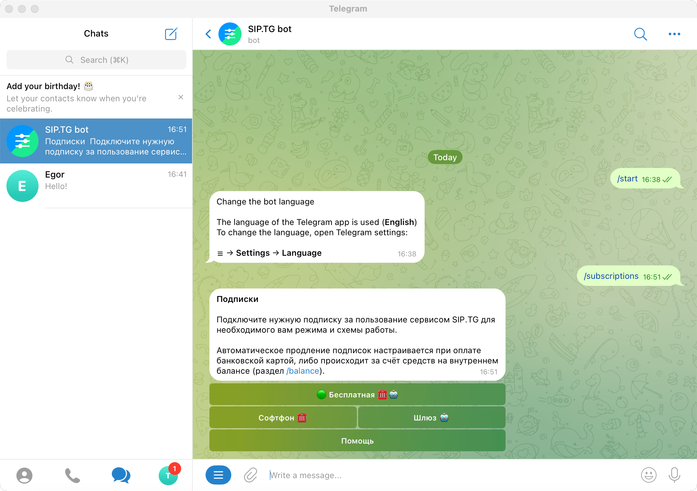
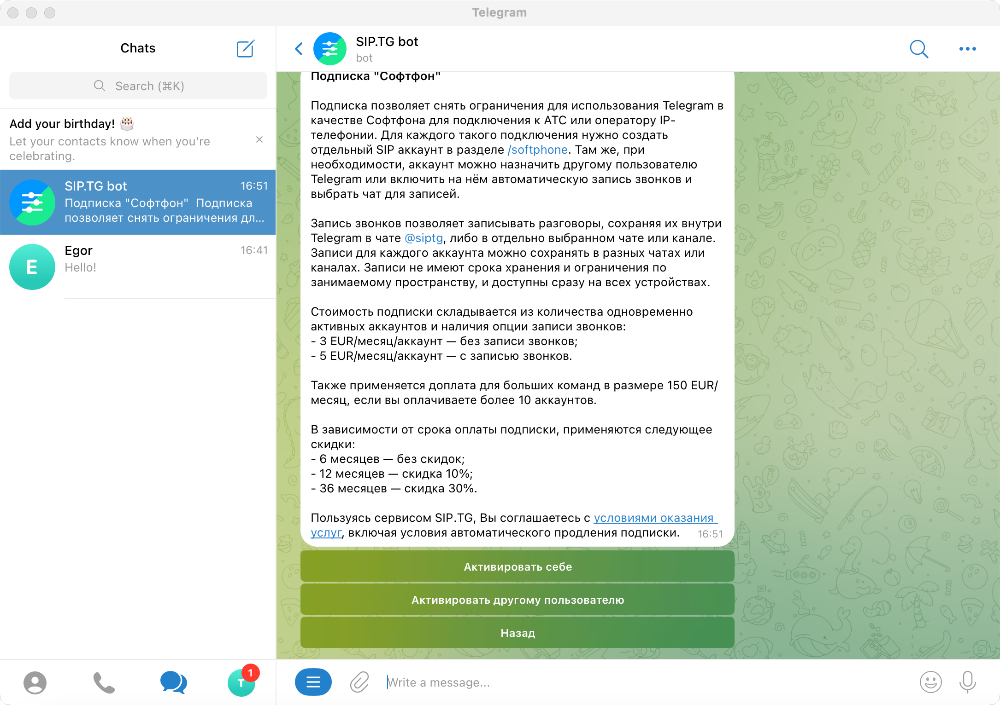
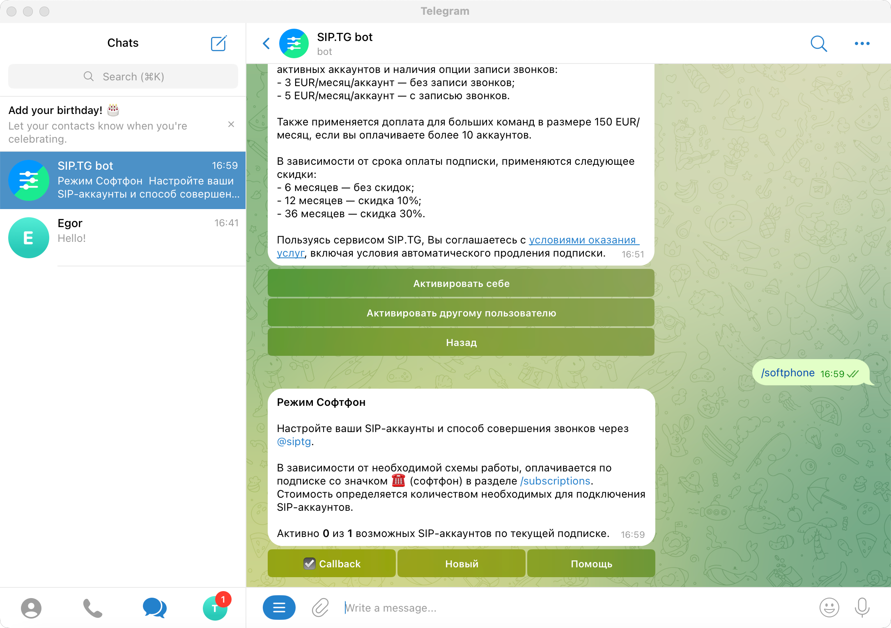
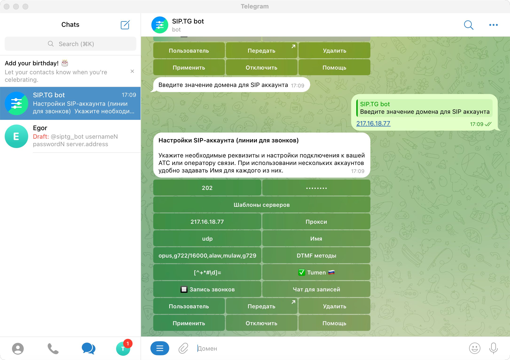
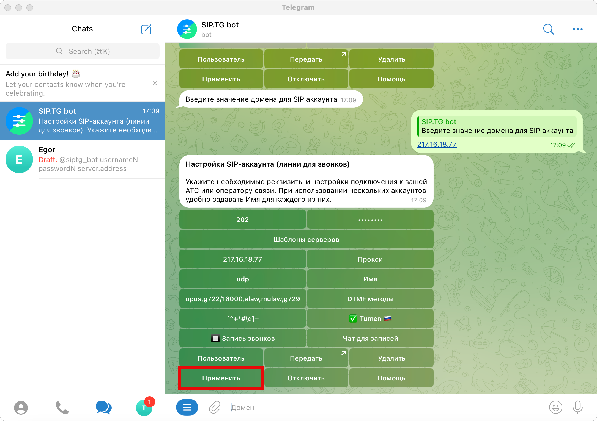
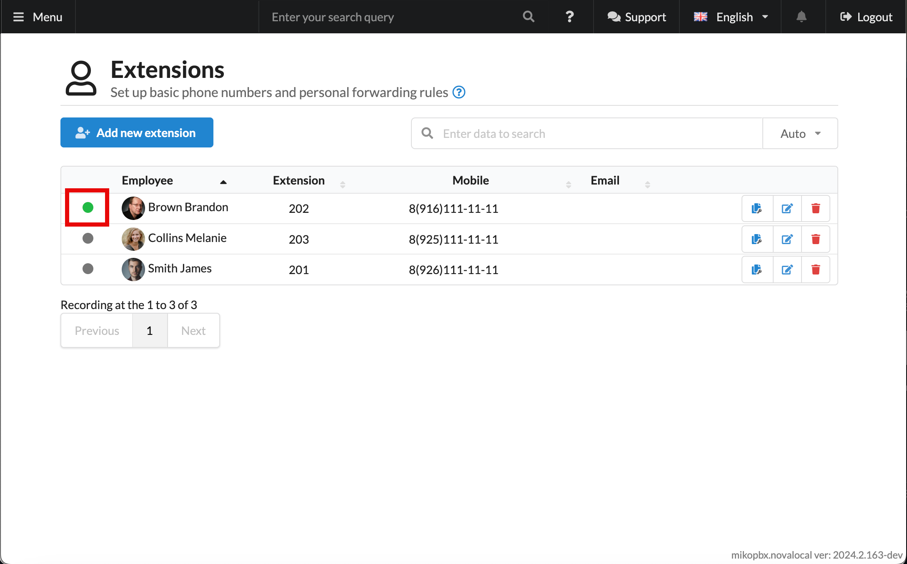
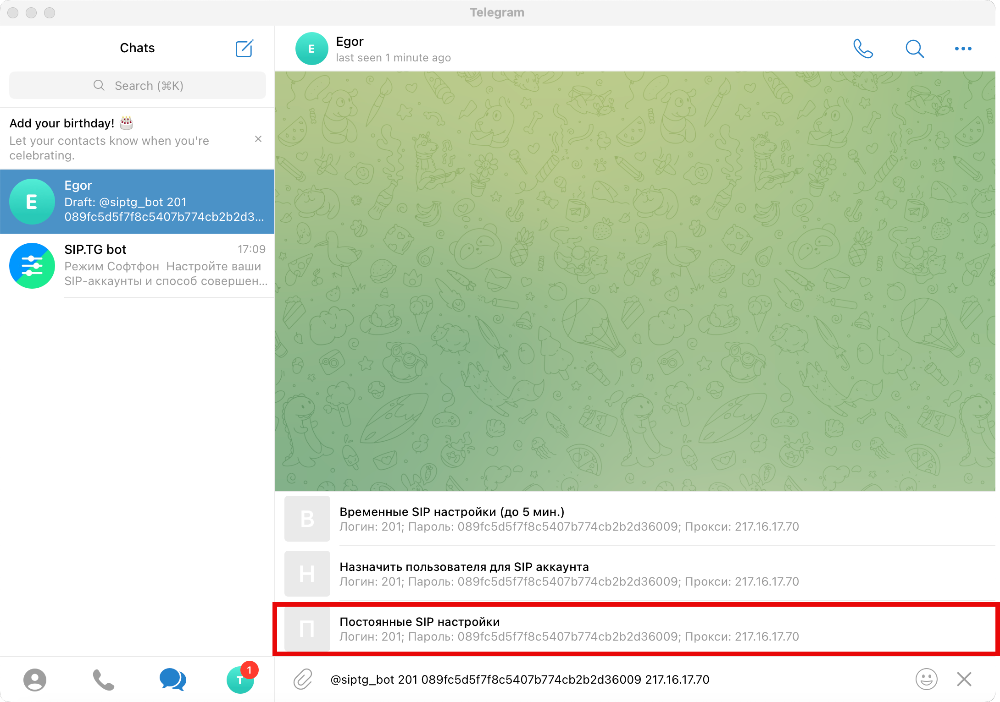
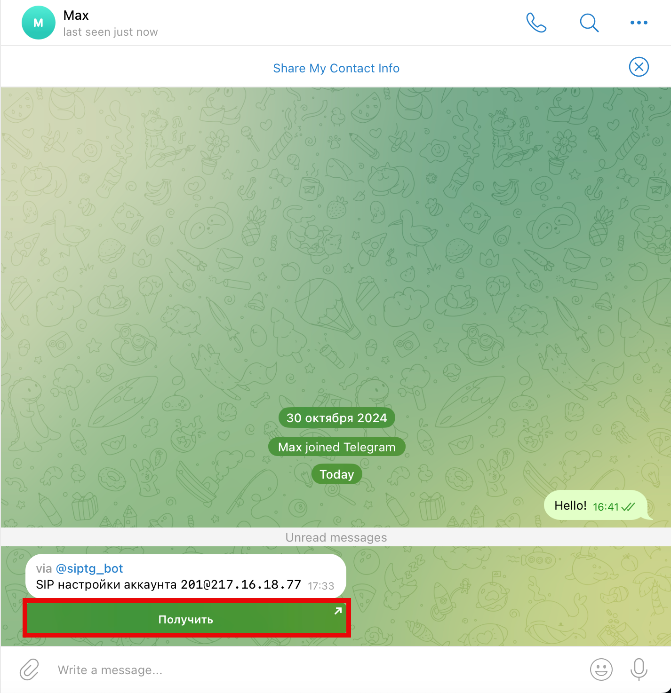
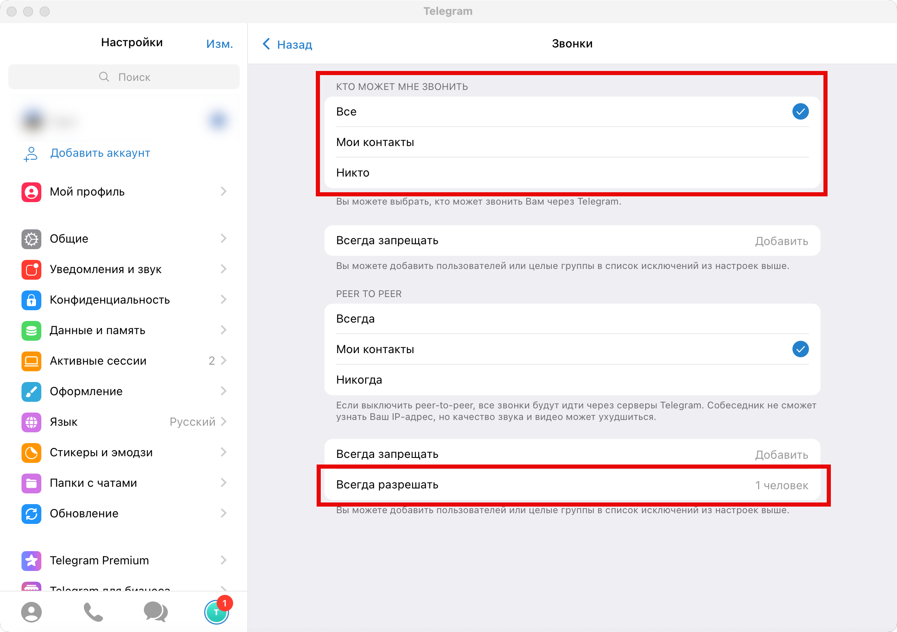

# SIP.tg (Telegram)

Возможности платформы SIP.tg существенно упрощают настройку и использование офисной телефонии при удалённой работе сотрудников. Платформа работает как при использовании облачного решения поставщика услуг связи, так и при наличии виртуальной АТС в офисе.

## Подписки и оплата


Существует бесплатная версия продукта "**Softphone**" с некоторыми ограничениями. Для их снятия необходимо оформить подписку. Есть возможность оформить подписку другому сотруднику со своего аккаунта Telegram.


1. Перейдите в переписку с ботом **@siptg\_bot**. Нажмите "**Start**".

<figure><figcaption><p>Начало диалога для настройки</p></figcaption></figure>

2. Введите/выберите команду `/subscriptions`:

<figure><figcaption><p>Команда /subscriptions</p></figcaption></figure>

3. Выберите "**Софтфон**". Далее будет предложено оплатить подписку на свой аккаунт, или аккаунт другого пользователя.

<figure><figcaption><p>Опции подписки</p></figcaption></figure>

Следуйте дальнейшним инструкциям бота для оплаты подписки.

## Подключение софтфона на свой аккаунт

1. Введите/выберите команду `/softphone`.

<figure><figcaption><p>Команда softphone</p></figcaption></figure>

2. Нажмите "**Новый**". Заполните все необходимые данные:

* **Логин** - внутренний номер сотрудника.
* **Пароль** - пароль для SIP-подключения из карточки сотрудника в MikoPBX.
* **Домен** - IP-адрес Вашей станции MikoPBX

<figure><figcaption><p>Параметры подключения</p></figcaption></figure>

3. Нажмите "**Применить**":

<figure><figcaption><p>Кнопка "<strong>Применить</strong>"</p></figcaption></figure>

Произойдет SIP-подключение. Понять, что оно успешно, можно по зеленому индикатору в интерфейсе MikoPBX:

<figure><figcaption><p>Индикатор успешного подключения</p></figcaption></figure>

## Подключение другого пользователя

Перед подключением софтфона убедитесь, что Вы со своего аккаунта оформили подписку для другого пользователя. О том, как это сделать - писано в начале этой статьи ([ссылка](sip-tg.md#podpiski-i-oplata)).

1. Сформируйте шаблон вида

```
@siptg_bot Username SIPpassword serverAddress
```

Где:

* **Username** - внутренний номер пользователя.
* **SIPpassword** - пароль для SIP-подключения из карточки сотрудника.
* **serverAddress** - IP-адрес Вашей MikoPBX.

2. Отправьте данный шаблон в переписку с пользователем, в появившемся меню выберите "Постоянные SIP настройки"

<figure><figcaption><p>Предоставление доступа другому пользователю</p></figcaption></figure>

3. Пользователю придет сообщение следующего вида, ему необходимо нажать "**Получить**":

<figure><figcaption><p>Элемент "Получить"</p></figcaption></figure>

С этого момента сотрудник может совершать исходящие звонки через офисную телефонию, отправляя телефонные номера боту _@siptg_ в виде обычного сообщения.

## Настройка входящих звонков

В большинстве случаев настройки конфиденциальности Telegram запрещают входящие звонки. Чтобы убедиться в правильности настроек, сотрудник должен открыть **Меню → Настройки → Конфиденциальность → Голосовые звонки** и выбрать вариант **Все** (либо добавить в раздел **Всегда разрешать** пользователя **@siptg**).

<figure><figcaption><p>Настройки конфиденциальности для совершения звонков</p></figcaption></figure>

## Особенности в работе <a href="#osobennosti_v_rabote" id="osobennosti_v_rabote"></a>

1. Если к вашей виртуальной АТС нет доступа из внешней сети Интернет, то потребуется развернуть сервер Worker'а в локальной сети и предоставить доступ к произвольному его TCP порту из сети Интернет. SIP аккаунт для каждого сотрудника нужно будет создавать обычным способом, далее изменять активный Worker и только после этого передавать аккаунт сотруднику.
2. Вы не сможете подключить пользователя, если приватность его аккаунта того не позволяет. Чтобы убедиться в правильности настроек, сотрудник должен открыть **Меню → Настройки → Конфиденциальность → Пересылка сообщений** и выбрать вариант **Все** (либо добавить в раздел **Всегда разрешать** Ваш аккаунт). После подключения, данную настройку конфиденциальности можно вернуть в прежнее состояние.

Остались вопросы? Мы всегда на связи и постараемся помочь в кратчайшие сроки. Пишите нам в Telegram: _@siptg\_support_
