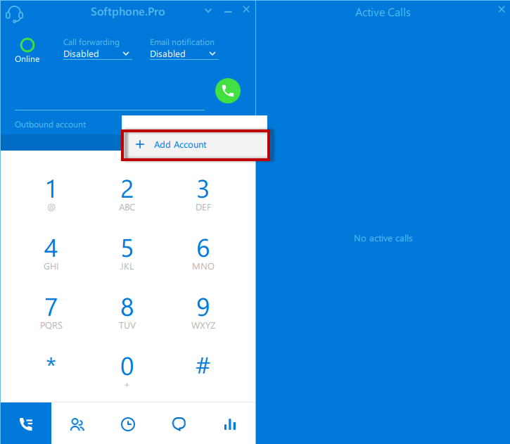
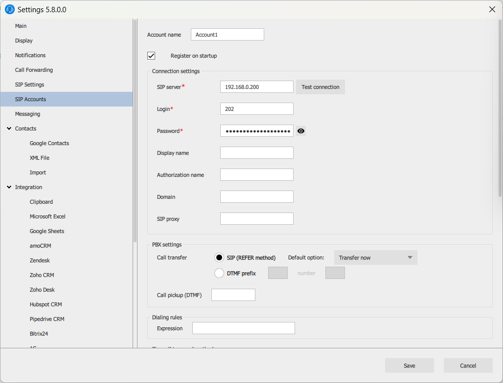

# Softphone.pro

1. Скачайте инсталлятор софтфона с официального сайта по [ссылке](https://ru.softphone.pro/). Установите его, следуя инструкциям инсталлятора.
2. В интерфейсе создайте новый аккаунт.

<figure><figcaption>
Создание нового аккаунта
</figcaption></figure>

3. Заполните адрес сервера (**IP-адрес вашей MikoPBX**), логин (**внутренний номер сотрудника**), пароль (**SIP пароль из настроек сотрудника**)

<figure><figcaption></figcaption></figure>

<figure><figcaption>
Параметры для софтфона
</figcaption></figure>

Об успешной авторизации свидетельствует зеленый флажок слева от текущего аккаунта. Также на АТС у данного внутреннего номера должен отобразиться статус <mark style="color:green;">Подключен</mark>**.**

<figure><figcaption>
Статус подключения
</figcaption></figure>
