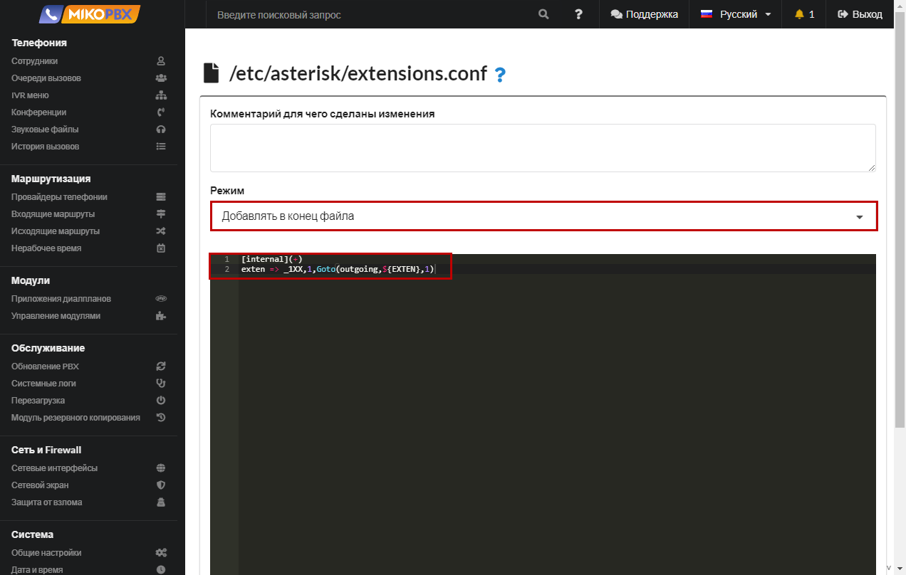

# Zoiper

1. Download the softphone installer from the official website using the [link](https://www.zoiper.com/en/voip-softphone/download/current). Install it following the instructions of the installer.
2. Launch the installed softphone. You will see the following window. It prompts you to enter **login** and **password**.

.png>)

3\. Login into Zoiper

**login** - \<extension number>@\<PBX Address>

**password** - internal number password.

Go to the PBX web interface.

Go to the employees section, select the desired internal number and copy the necessary data.

<figure><figcaption></figcaption></figure>

<figure><figcaption></figcaption></figure>

Click **Login**.

4\. On the offer **Fill In your hostname and select provider from the list**, make sure that the address of your PBX is inserted in the field and click Next.

<figure><figcaption></figcaption></figure>

On the option **Authentication and Outbound proxy** without cocking the checkbox, click **Skip.**

<figure><figcaption></figcaption></figure>

On the configuration testing page, without waiting for the end, click **Next**. Agree to the warning.

Successful authorization is indicated by a **green flag** to the left of the current account.&#x20;

<figure><figcaption></figcaption></figure>

Also, the status **Online** should be displayed on the PBX for this internal number.

