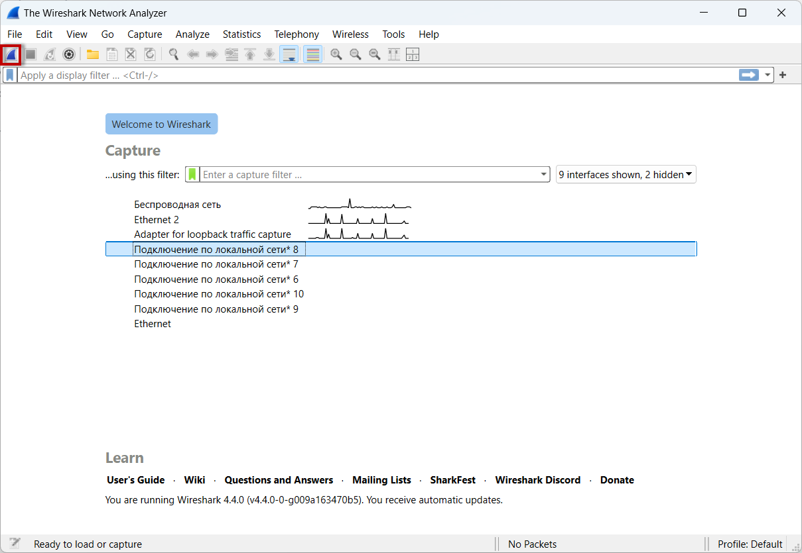
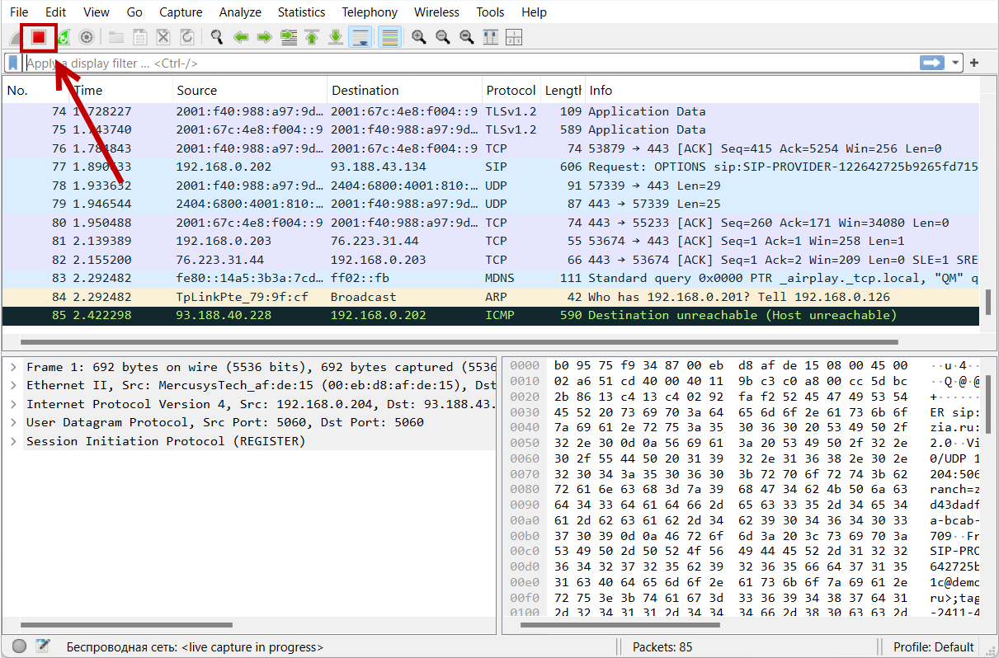

# Capturing Logs from PBX using Wireshark

**Wireshark** is a program for capturing and analyzing network traffic. It provides a user-friendly graphical interface for viewing and closely inspecting packets, making it useful for diagnosing and resolving network issues.

1. Download _Wireshark_ from [this link](https://www.wireshark.org/). Install it with the default settings.
2. Launch _Wireshark_. Select the network you will use to analyze traffic by left-clicking on it, then press the blue shark icon to start capturing traffic.

<figure><figcaption></figcaption></figure>

3. Reproduce the issue by making a test call.
4. To stop the capture, click on the red stop icon:

<figure><figcaption></figcaption></figure>
